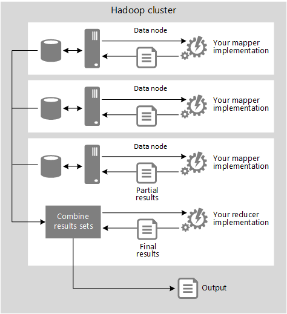
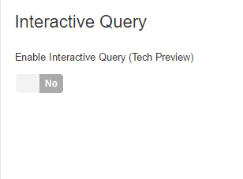

# Achieving Batch & Interactive with Hadoop & Spark

Hadoop and Spark on HDInsight provide various data processing options, from [real-time stream processing](hdinsight-streaming-at-scale-overview.md), to complicated batch processing that can take from tens of minutes to days to complete. Interactive querying means querying batch data at "human" interactive speeds, meaning results are ready in time frames measured in seconds to minutes. The purpose of this article is to introduce batch and interactive query processing concepts, and how Hadoop and Spark help you achieve those goals.

## Batch processing in HDInsight

Batch processing is used for a variety of scenarios, from creating an [Extract, Transform, and Load (ETL) pipeline](hdinsight-etl-deep-dive.md), to working with very large data sets where computation takes a significant amount of time. When defined in terms of latency, batch processing are queries or programs that take tens of minutes, hours, or days to complete.

A common example of batch processing is transforming large inbound data, consisting of flat, unstructured files, into a schematized format that can be used for further querying. This is often referred to as _schema on read_, where the schema is applied while loading the data from disk, typically converting the flat file format to a binary format, allowing you to work with the data in an easier, more performant manner.

Another tenet of batch processing is the use of _external_ or _managed_ (internal) tables for schema on read. The difference between the two being the authority granted to the batch processing solution over the data. With external tables, the underlying data is typically shared between the batch processing solution and other systems, whereas managed tables are owned by the batch processing solution, which effectively controls the lifecycle of the data.

There are three general use cases and corresponding models, described below, that are appropriate for the typical batch processing workloads on an HDInsight cluster. Understanding these use cases will help you to start making decisions on how best to integrate HDInsight with your organization, and with your existing tools.

### Iterative exploration

This model is typically chosen for experimenting with data sources to discover if they can provide useful information, and for handling data that you cannot process using existing systems. For example, you might collect feedback from customers through email, web pages, or external sources such as social media sites, then analyze it to get a picture of user sentiment for your products. You might be able to combine this information with other data, such as demographic data that indicates population density and characteristics in each city where your products are sold. See [Iterative data exploration](hdinsight-iterative-data-exploration.md) for more information.

### Data warehouse on demand

Hadoop-based big data systems such as HDInsight allow you to store both the source data and the results of queries executed over this data. You can also store schemas (or, to be precise, metadata) for tables that are populated by the queries you execute. These tables can be indexed, although there is no formal mechanism for managing key-based relationships between them. However, you can create data repositories that are robust and reasonably low cost to maintain, which is especially useful if you need to store and manage huge volumes of data. See [Data warehouse on demand](hdinsight-data-warehouse-on-demand.md) for more information.

### ETL automation

Hadoop-based big data systems such as HDInsight can be used to extract and transform data before you load it into your existing databases or data visualization tools. Such solutions are well suited to performing categorization and normalization of data, and for extracting summary results to remove duplication and redundancy. This is typically referred to as an Extract, Transform, and Load (ETL) process. Refer to the [ETL deep dive](hdinsight-etl-deep-dive.md) for detailed information.

---

Batch processing in HDInsight can be achieved using several available services:

### Batch processing using Apache Hadoop MapReduce

The MapReduce programming model is a traditional batch processing method, designed for processing big data sets in parallel. Input data is split into independent chunks, which are then processed in parallel across the nodes in your cluster. A MapReduce job consists of two functions:

* **Mapper**: Consumes input data, analyzes it (usually with filter and sorting operations), and emits tuples (key-value pairs)
* **Reducer**: Consumes tuples emitted by the Mapper and performs a summary operation that creates a smaller, combined result from the Mapper data

Apache Hadoop MapReduce implements the MapReduce programming model by splitting data into subsets to be processed in a parallel map phase, followed by reducing the mapped data in aggregate to yield the desired result.

You can implement MapReduce code in Java (which is the native language for MapReduce jobs in all Hadoop distributions), or in a number of other supported languages including JavaScript, Python, C#, and F# through Hadoop Streaming.

#### Creating map and reduce components

The following code sample shows a commonly referenced JavaScript map/reduce example that counts the words in a source that consist of unstructured text data.

```javascript
var map = function (key, value, context) {
  var words = value.split(/[^a-zA-Z]/);
  for (var i = 0; i < words.length; i++) {
    if (words[i] !== "") {
      context.write(words[i].toLowerCase(), 1);
    }
  }
};

var reduce = function (key, values, context) {
  var sum = 0;
  while (values.hasNext()) {
    sum += parseInt(values.next());
  }
  context.write(key, sum);
};
```

The map function splits the contents of the text input into an array of strings using anything that is not an alphabetic character as a word delimiter. Each string in the array is then used as the key of a new key/value pair with the value set to 1.

Each key/value pair generated by the map function is passed to the reduce function, which sums the values in key/value pairs that have the same key. Working together, the map and reduce functions determine the total number of times each unique word appeared in the source data, as shown here:

```
Aardvark 2
About    7
Above    12
Action   3
...
```

#### Using Hadoop streaming

The Hadoop core within HDInsight supports a technology called Hadoop Streaming that allows you to interact with the MapReduce process and run your own code outside of the Hadoop core as a separate executable process. The below diagram shows a high-level overview of the way that streaming works.



> This diagram shows how streaming executes the map and reduce components as separate processes. The schematic does not attempt to illustrate all of the standard map/reduce stages, such as sorting and merging the intermediate results or using multiple instances of the reduce component.

When using Hadoop Streaming, each node passes the data for the map part of the process to a separate process through the standard input (`stdin`), and accepts the results from the code through the standard output (`stdout`), instead of internally invoking a map component written in Java. In the same way, the node(s) that execute the reduce process pass the data as a stream to the specified code or component, and accept the results from the code as a stream, instead of internally invoking a Java reduce component.

Streaming has the advantage of decoupling the map/reduce functions from the Hadoop core, allowing almost any type of components to be used to implement the mapper and the reducer. The only requirement is that the components must be able to read from and write to the standard input and output.

Using the streaming interface does have a minor impact on performance. The additional movement of the data over the streaming interface can marginally increase query execution time. Streaming tends to be used mostly to enable the creation of map and reduce components in languages other than Java. It is quite popular when using Python, and also enables the use of .NET languages such as C# and F# with HDInsight.

For more information, see [Hadoop Streaming](http://hadoop.apache.org/docs/r1.2.1/streaming.html).

For more information on using Hadoop MapReduce on HDInsight, see [Use MapReduce in Hadoop on HDInsight](hdinsight-use-mapreduce.md)

For examples of using Hadoop streaming with HDInsight, see the following documents:
* [Develop C# MapReduce jobs](hdinsight-hadoop-dotnet-csharp-mapreduce-streaming.md)
* [Develop Python MapReduce jobs](hdinsight-hadoop-streaming-python.md)

### Batch processing using Hive

Hive uses tables to impose a schema on data, and to provide a query interface for client applications. The key difference between Hive tables and those in traditional database systems, such as SQL Server, is that Hive adopts a "schema on read" (as mentioned earlier in the article) approach that enables you to be flexible about the specific columns and data types that you want to project onto your data.

> Hive supports most of the data types you would expect (`bigint`, `binary`, `boolean`, `char`, `decimal`, `double`, `float`, `int`, `smallint`, `string`, `timestamp`, and `tinyint`), but also has specialized support for arrays, maps, and structs.

You can create multiple tables with different schemas from the same underlying data, depending on how you want to use that data. You can also create views and indexes over Hive tables, and partition tables. Moving data into a Hive-controlled namespace is usually an instantaneous operation.

You can use the Hive command line on the HDInsight cluster to work with Hive tables, and build an automated solution that includes Hive queries by using the HDInsight .NET SDKs and with a range of Hadoop-related tools such Oozie and WebHCat. You can also use the Hive ODBC driver to connect to Hive from any ODBC-capable client application.

In addition to its more usual use as a querying mechanism, Hive can be used to create a simple data warehouse containing table definitions applied to data that you have already processed into the appropriate format. Azure storage is relatively inexpensive, and so this is a good way to create a commodity storage system when you have huge volumes of data.

Hive queries are written in HiveQL (see [HiveQL language reference](https://cwiki.apache.org/confluence/display/Hive/LanguageManual)), which is a query language similar to SQL. Here are a few example queries for different scenarios:

#### Creating a table

You create tables by using the HiveQL `CREATE TABLE` statement, which in its simplest form looks similar to the equivalent statement in Transact-SQL. You specify the schema in the form of a series of column names and types, and the type of delimiter that Hive will use to delineate each column value as it parses the data. You can also specify the format for the files in which the table data will be stored if you do not want to use the default format (where data files are delimited by an ASCII code 1 (Octal \001) character, equivalent to Ctrl + A). For example, the following code creates a table named **mytable** and specifies that the data files for the table should be tab-delimited.

```SQL
CREATE TABLE mytable (col1 STRING, col2 INT)
ROW FORMAT DELIMITED
FIELDS TERMINATED BY '\t';
```

Hive tables are simply metadata definitions imposed on data in underlying files. By default, Hive stores table data in the **user/hive/warehouse/**_table_name_ path in storage (the default path is defined in the configuration property `hive.metastore.warehouse.dir`), so the previous code sample will create the table metadata definition and an empty folder at **user/hive/warehouse/mytable**. When you delete the table by executing the `DROP TABLE` statement, Hive will delete the metadata definition from the Hive database and it will also remove the **user/hive/warehouse/mytable** folder and its contents.

However, you can specify an alternative path for a table by including the `LOCATION` clause in the `CREATE TABLE` statement. The ability to specify a non-default location for the table data is useful when you want to enable other applications or users to access the files outside of Hive. This allows data to be loaded into a Hive table simply by copying data files of the appropriate format into the folder, or downloaded directly from storage. When the table is queried using Hive, the schema defined in its metadata is automatically applied to the data in the files.

An additional benefit of specifying the location is that this makes it easy to create a table for data that already exists in that location (perhaps the output from a previously executed map/reduce job or Pig script). After creating the table, the existing data in the folder can be retrieved immediately with a HiveQL query.

However, one consideration for using managed tables is that, when the table is deleted, the folder it references will also be deleted — even if it already contained other data files when the table was created. If you want to manage the lifetime of the folder containing the data files separately from the lifetime of the table, you must use the `EXTERNAL` keyword in the `CREATE TABLE` statement to indicate that the folder will be managed externally from Hive, as shown in the following code sample:

```SQL
CREATE EXTERNAL TABLE mytable (col1 STRING, col2 INT)
ROW FORMAT DELIMITED
FIELDS TERMINATED BY '\t'
STORED AS TEXTFILE LOCATION '/mydata/mytable';
```

In HDInsight the location shown in this example corresponds to **wasbs://**_[container-name]_**@**_[storage-account-name]_**.blob.core.windows.net/mydata/mytable** in Azure storage.

This ability to manage the lifetime of the table data separately from the metadata definition of the table means that you can create several tables and views over the same data, but each can have a different schema. For example, you may want to include fewer columns in one table definition to reduce the network load when you transfer the data to a specific analysis tool, but have all of the columns available for another tool.

As a general guide you should:

* Use `INTERNAL` tables (the default, commonly referred to as managed tables) when you want Hive to manage the lifetime of the table or when the data in the table is temporary; for example, when you are running experimental or one-off queries over the source data.
* Use `INTERNAL` tables and also specify the `LOCATION` for the data files when you want to access the data files from outside of Hive; for example, if you want to upload the data for the table directly into the Azure storage location.
* Use `EXTERNAL` tables when you want to manage the lifetime of the data, when data is used by processes other than Hive, or if the data files must be preserved when the table is dropped. However, notice that cannot use `EXTERNAL` tables when you implicitly create the table by executing a `SELECT` query against an existing table.

#### Querying tables with HiveQL

After you have created tables and loaded data files into the appropriate locations you can query the data by executing HiveQL `SELECT` statements against the tables. HiveQL `SELECT` statements are similar to SQL, and support common operations such as `JOIN`, `UNION`, `GROUP BY`, and `ORDER BY`. For example, you could use the following code to query the **mytable** table described earlier:

```SQL
SELECT col1, SUM(col2) AS total
FROM mytable
GROUP BY col1;
```

When designing an overall data processing solution with HDInsight, you may choose to perform complex processing logic in custom MapReduce components or Pig scripts and then create a layer of Hive tables over the results of the earlier processing, which can be queried by business users who are familiar with basic SQL syntax. However, you can use Hive for all processing, in which case some queries may require logic that is not possible to define in standard HiveQL functions.

In addition to common SQL semantics, HiveQL supports the use of:

* Custom MapReduce scripts embedded in a query through the `MAP` and `REDUCE` clauses.
* Custom user-defined functions (UDFs) that are implemented in Java, or that call Java functions available in the existing installed libraries.]
* XPath functions for parsing XML data using XPath.

This extensibility enables you to use HiveQL to perform complex transformations on data as it is queried. To help you decide on the right approach, consider the following guidelines:

* If the source data must be extensively transformed using complex logic before being consumed by business users, consider using custom MapReduce components or Pig scripts to perform most of the processing, and create a layer of Hive tables over the results to make them easily accessible from client applications.
* If the source data is already in an appropriate structure for querying and only a few specific but complex transforms are required, consider using MapReduce scripts embedded in HiveQL queries to generate the required results.
* If queries will be created mostly by business users, but some complex logic is still regularly required to generate specific values or aggregations, consider encapsulating that logic in custom UDFs because these will be simpler for business users to include in their HiveQL queries than a custom MapReduce script.

---

For more information on Hive and HiveQL, see [What is Apache Hive and HiveQL on Azure HDInsight?](hdinsight-use-hive.md).


### Batch processing using Pig

Pig Latin syntax has some similarities to LINQ, and encapsulates many functions and expressions that make it easy to create a sequence of complex data transformations with just a few lines of simple code. Pig Latin is a good choice for creating relations and manipulating sets, and for working with unstructured source data. You can always create a Hive table over the results of a Pig Latin query if you want table format output. However, the syntax of Pig Latin can be complex for non-programmers to master. Pig Latin is not as familiar or as easy to use as HiveQL, but Pig can achieve some tasks that are difficult, or even impossible, when using Hive.

You can run Pig Latin statements interactively in the Hadoop command line window or in a command line Pig shell named Grunt. You can also combine a sequence of Pig Latin statements in a script that can be executed as a single job, and use user-defined functions you previously uploaded to HDInsight. The Pig Latin statements are used by the Pig interpreter to generate jobs, but the jobs are not actually generated and executed until you call either a `DUMP` statement (which is used to display a relation in the console, and is useful when interactively testing and debugging Pig Latin code) or a `STORE` statement (which is used to store a relation as a file in a specified folder).

Pig scripts generally save their results as text files in storage, where they can easily be viewed on demand, perhaps by using the Hadoop command line window. However, the results can be difficult to consume or processes in client applications unless you copy the output files and import them into client tools such as Excel.

#### Executing a Pig script

As an example of using Pig, suppose you have a tab-delimited text file containing source data similar to the following:

```
Value1 1
Value2 3
Value3 2
Value1 4
Value3 6
Value1 2
Value2 8
Value2 5
```

You could process the data in the source file with the following simple Pig Latin script:

```
A = LOAD '/mydata/sourcedata.txt' USING PigStorage('\t') AS (col1, col2:long);
B = GROUP A BY col1;
C = FOREACH B GENERATE group, SUM(A.col2) as total;
D = ORDER D BY total;
STORE D INTO '/mydata/results';
```

This script loads the tab-delimited data into a relation named **A**, imposing a schema that consists of two columns: **col1**, which uses the default byte array data type, and **col2**, which is a long integer. The script then creates a relation named **B**, in which the rows in **A** are grouped by **col1**, and then creates a relation named **C**, in which the **col2** value is aggregated for each group in **B**.

After the data has been aggregated, the script creates a relation named **D**, in which the data is sorted based on the total that has been generated. The relation **D** is then stored as a file in the **/mydata/results** folder, which contains the following text:

```
Value1 7
Value3 8
Value2 16
```

---

For more information about the Pig Latin syntax, see [Pig Latin Reference Manual 1](http://pig.apache.org/docs/r0.7.0/piglatin_ref1.html) and [Pig Latin Reference Manual 2](http://pig.apache.org/docs/r0.7.0/piglatin_ref2.html).

See [Use Pig with Hadoop on HDInsight](hdinsight-use-pig.md) for more information on using Pig on HDInsight.


### Batch processing using Spark

Apache Spark running on HDInsight provides another avenue for batch processing. Spark is a unified framework, meaning that you can use the same code for both batch processing and realtime [stream processing](hdinsight-streaming-at-scale-overview.md). The underlying components of Spark are Spark Core and the RDD API, which let you perform parallel operations on Spark's distributed data. Atop this sits the Spark SQL module, which provides the DataFrame API and DataSet API as well as support for issuing SQL queries directly against the DataFrame API.

A DataFrame is a distributed collection of data organized into named columns. It is important to note that the columns are named only, not typed. DataFrames are conceptually equivalent to a table in a relational database or a data frame in R/Python, but with richer optimizations under the hood. They can be constructed from a wide array of sources such as: structured data files, tables in Hive, external databases, or existing RDDs. The DataFrame API is available in Scala, Java, and Python.

DataFrames and DataSets are higher-level abstractions that improve batch processing efforts due to their expressiveness and higher performance over raw RDD APIs.

Learn more about using [Spark with HDInsight](hdinsight-spark-with-hdinsight.md), including for batch processing.


## Interactive querying in HDInsight

As opposed to batch processing, as described earlier in this article as data processing that takes tens of minutes to days to complete, interactive querying means querying batch data at human interactive speeds. In other words, you want to explore your data by executing multiple queries, but expect a result in seconds or even minutes. In this way, you are interacting with your data in such a way that it is possible to quickly distill its meaning or discover ways in which you can further interact with it through custom programs or BI reports.

### Interactive querying using Hive and Tez

Hive is considered the de facto standard for interactive SQL queries over petabytes of data using Hadoop. When you provision a new Hive cluster in HDInsight, it comes preconfigured with settings that optimize Hive for interactive queries, such as storing data in the ORC file format, using vectorized SQL execution, and using the Apache Tez application framework.

Please see [Changing configs via Ambari](hdinsight-changing-configs-via-ambari.md) for specific Hive performance tuning steps that will help ensure the minimal latency for interactive queries.

Generally speaking, here are a few ways to optimize Hive for better interactive query performance:

#### Indexes

Hive uses indexes to increase the performance of read queries. Index data for a table is stored in a separate table. Here's a sample `CREATE INDEX` query:

```SQL
SET hive.execution.engine=tez;
CREATE INDEX index_total_sales ON TABLE staging_weblogs(purchasetype,paymentamount)
AS 'COMPACT' WITH DEFERRED REBUILD LOCATION '/index_total_sales/';
```

The query creates an index on the `purchasetype` and `paymentamount` columns. The `CompactIndexHandler` is the Java class that implements indexing. The `WITH DEFERRED REBUILD` statement creates an empty index. It has to be rebuilt later.

To manually populate the index, execute the following, using the `ALTER INDEX` and `REBUILD` statements:

```SQL
ALTER INDEX index_total_sales on staging_weblogs REBUILD;
```

Note: The above query populates the index_total_sales with data. To verify, navigate to your Azure Storage account on the Azure Portal, and search index_total_sales in the bookstore container.

Indexes are also automatically created when using the ORC file format, as recommended earlier. The ORC file format is a column-oriented storage format that is an optimized version of RC file format. It provides much better compression and faster query performance than the RC file format. ORC file format groups row data into stripes, with stripe metadata stored in a file footer. The default stripe size is 250 MB.

The file footer contains a list of stripes, number of rows per stripe, and column data type. It also contains lightweight indexes with column-level aggregations `sum`, `max`, `min`, and `count`. At the end of the file, a postscript contains compression parameters and size of the compressed footer.

#### Partitioning

Hive allows for splitting data into two or more horizontal partitions based on column values. This improves queries that filter data on specific column values. This, in effect, also helps you to prune large data sets, resulting in faster query times. The reason for this, is that when you partition your data, the ORC files are stored in the filesystem under the partition's respective name. For example, if you partition by **state**, then queries for "California" search within that state's directory, ignoring all of the other directories' worth of data files during the query processing step.

```SQL
SET hive.exec.dynamic.partition = true;
SET hive.exec.dynamic.partition.mode=non-strict;

CREATE TABLE IF NOT EXISTS partitioned_orc_weblogs(
	transactionid varchar (50),
	transactiondate varchar(50) ,
	customerid varchar(50) ,
	bookid varchar(50) ,
	purchasetype varchar(50) ,
	orderid varchar(50) ,
	bookname varchar(50) ,
	categoryname varchar(50) ,
	quantity varchar(50) ,
	shippingamount varchar(50) ,
	invoicenumber varchar(50) ,
	invoicestatus varchar(50) ,
	paymentamount varchar(50)
) 
PARTITIONED BY (
state varchar(10),
city varchar(50)
)
STORED AS ORC LOCATION '/partitionedorc/' tblproperties ("orc.create.index"="true");
```

The above query creates an ORC format table partitioned on the state and city columns. With dynamic partitioning enabled, Hive automatically creates partitions based on the specified column values. The setting `hive.exec.dynamic.partition.mode = non-strict` indicates there are no static partitions and all partitions are dynamic. If a table has both dynamic and static partitions, `hive.exec.dynamic.partition.mode` should be set to `strict`.

#### Configuring YARN queues

For Hadoop, a single interactive queue is recommended. However, there may be cases where two queues are better. If one type of query takes 5 seconds to run, and another type takes around a minute, the shorter-running queries will have to wait for the longer-running queries to complete. The longer-running query types should be in a different queue.

See [Key Scenarios to Monitor](hdinsight-key-scenarios-to-monitor.md) for more information on configuring YARN queues in Ambari.

#### Hive on Tez + LLAP

Live Long and Process (LLAP) added to Hive 2.0, is a hybrid execution model that consists of a long-lived daemon, that promises to bring subsecond query performance to Hive. The daemon processes functionalities such as caching, pre-fetching, and access control. Small or short queries are processed by the daemon whereas heavy queries are processed by the YARN containers.

LLAP is not an execution engine, rather it’s an enhancement over the existing execution engine. This is available as Tech Preview in HDInsight 3.5+.

There are two ways to use LLAP at this point. The first way is to provision a new HDInsight cluster, selecting the **Interactive Hive (Preview)** cluster type. See [Use Interactive Hive in HDInsight (Preview)](hdinsight-hadoop-use-interactive-hive.md) for more information.

The other way is to enable LLAP on an existing Hive cluster. To do this, perform the following steps:

1. Open the [Azure portal](https://portal.azure.com) and select the HDInsight cluster. On the cluster pane, select **dashboard** from the menu. This will open the Ambari UI in a new tab.
2. In Ambari, select **Hive** from the left menu. In the resulting window, navigate to the **Configs** tab. 
3. LLAP is enabled by switching on the **Interactive query** option. This is disabled by default.
 
  

4. Click on the toggle switch to enable the Interactive Query. Click **Save** on the version control bar to save the changes made.

> Please note, this feature is currently in preview and is not officially supported.


### Interactive querying using Spark SQL

Like Hive LLAP, Spark executes against an in-memory data cache, potentially returning results within seconds, instead of minutes or hours in order to achieve interactivity. To achieve interactive-level response times, Spark SQL and the DataFrame API support high-performance columnar formats like Parquet and ORC. This enables pruning large data sets at query processing time through table partitioning (as detailed under "Interactive querying using Hive and Tez", above) and predicate pushdown. Through these and in-memory computing, Spark is extremely fast, particularly when the cluster is large enough to hold all of the data in memory. HDFS is optimized for batch processing, focusing on high throughput vs. fast random access to different areas of files, as is required for interactive processing. Spark overcomes this by loading the data in-memory, keeping the working sets in memory, saving a significant amount of time on disk I/O. For datasets that can fit into a cluster's memory, Spark is fast enough to allow data scientists to interact and explore big data from an interactive shell. This can be performed by using Zeppelin or Jupyter notebooks, an interactive shell, or custom Spark applications that use the same API.

Every Spark for Azure HDInsight cluster has Jupyter and Zeppelin notebooks included. This allows users to do interactive and exploratory analysis in Scala, Python or SQL.

* See [Kernels for Jupyter notebook on Spark clusters in Azure HDInsight](hdinsight-apache-spark-jupyter-notebook-kernels.md)
* See [Use Zeppelin notebooks with Apache Spark cluster on Azure HDInsight](hdinsight-apache-spark-zeppelin-notebook.md)

> Spark SQL enables you to run unmodified Hive queries on existing data. It reuses the Hive frontend and metastore, giving users full compatibility with existing Hive data, queries, and UDFs.

#### Indexes

Spark SQL does not yet support indexes, at this time. This includes Hive table indexes, meaning if you use a `HiveContext` in Spark to query a Hive table that has explicit indexes, they will not be used in the query processing. However, as with Hive, you can take advantage of the automatically created inline indexes generated by ORC files when you save your data in that format.

#### Partitions

Partitioning in Spark SQL works in the same way as with Hive (as detailed under "Interactive querying using Hive and Tez" above), creating subfolders named after the column partition with the related values stored within. This effectively prunes the data by excluding entire directories-worth of data when querying by partition. You can partition your DataFrame by using the `partitionBy` method prior to invoking the `save` method:

```scala
mydataframe.write.format("orc").partitionBy("state").save("mydata")
```

The `partitionBy` method accepts a list of column names by which to partition the data. In this case, we're partitioning by the "state" column.


## Next steps

In this article, we covered the various options by which we can perform batch processing and interactive querying, using Hadoop and Spark on HDInsight. Learn more about the batch and interactive processing by following the links below:

* Batch processing through [Iterative data exploration](hdinsight-iterative-data-exploration.md)
* Batch processing with [Data warehouse on demand](hdinsight-data-warehouse-on-demand.md)
* Learn more about ETL with the [ETL deep dive](hdinsight-etl-deep-dive.md) and [ETL at scale](hdinsight-etl-at-scale.md)
* Batch processing with [MapReduce in Hadoop on HDInsight](hdinsight-use-mapreduce.md)
* More about [Hive and HiveQL on Azure HDInsight](hdinsight-use-hive.md)
* [Use Pig with Hadoop on HDInsight](hdinsight-use-pig.md) for batch processing
* Overview of [Spark on HDInsight](hdinsight-spark-with-hdinsight.md)
* See [Changing configs via Ambari](hdinsight-changing-configs-via-ambari.md) for recommended performance settings
* See [Use Interactive Hive in HDInsight (Preview)](hdinsight-hadoop-use-interactive-hive.md) for LLAP
* Learn more about Apache Spark with [Spark scenarios](hdinsight-spark-scenarios.md), [Spark SQL with HDInsight](hdinsight-spark-sql-with-hdinsight.md), and Spark-specific performance enhancements with [Spark settings](hdinsight-spark-settings.md)