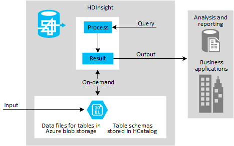

# Data Warehouse on Demand

Hadoop-based big data solutions such as HDInsight can provide a robust, high performance, and cost-effective data storage and parallel job processing mechanism. Data is replicated in the storage system, and jobs are distributed across the nodes for fast parallel processing. In the case of HDInsight, the data is saved in Azure blob storage or Azure Data Lake Store, which is also replicated three times.

This combination of capabilities means that you can use HDInsight as a basic data warehouse. The low cost of storage when compared to most relational database mechanisms that have the same level of reliability also means that you can use it simply as a commodity storage mechanism for huge volumes of data, even if you decide not to transform the data into Hive tables.

> If you need to store vast amounts of data, irrespective of the format of that data, an HDInsight Hadoop-based solution can reduce administration overhead and save money by minimizing the need for the high performance database servers and storage clusters used by traditional relational database systems. With HDInsight, you can also reduce the administration overhead and running costs compared to on-premises deployment of a Hadoop-based cluster.

## Use case and model overview
The diagram below shows an overview of the use case and model for a data warehouse on demand solution using HDInsight. The source data files may be obtained from external sources, but are just as likely to be internal data generated by your business processes and applications. For example, you might decide to use this model instead of using a locally installed data warehouse based on the traditional relational database model.

In this scenario, you can store the data both as the raw source data and as Hive tables. Hive provides access to the data in a familiar row and column format that is easy to consume and visualize in most BI tools. The data for the tables is stored in Azure blob storage, and the table definitions can be maintained by [HCatalog](https://cwiki.apache.org/confluence/display/Hive/HCatalog/) (a feature of [Hive](hdinsight-use-hive.md)).

In this model, when you need to process the stored data, you create an HDInsight Hadoop-based cluster that uses the Azure blob storage container holding that data. When you finish processing the data you can tear down the cluster without losing the original archived data (see [Using external metadata stores](hdinsight-using-external-metadata-stores.md) for information about preserving or recreating metadata such as Hive table definitions when you tear down and then recreate an HDInsight cluster).

You might also consider storing partly processed data where you have performed some translation or summary of the data, but it is still in a relatively raw form that you want to keep in case it is useful in the future. For example, you might use a stream capture tool to allocate incoming positional data from a fleet of vehicles into separate categories or areas, add some reference keys to each item, and then store the results ready for processing at a later date. Stream data may arrive in rapid bursts, and typically generates very large files, so using HDInsight to capture and store the data helps to minimize the load on your existing data management systems.

This model is also suitable for use as a data store where you do not need to implement the typical data warehouse capabilities. For example, you may just want to minimize storage cost when saving large tabular format data files for use in the future, large text files such as email archives or data that you must keep for legal or regulatory reasons but you do not need to process, or for storing large quantities of binary data such as images or documents. In this case you simply load the data into the storage associated with cluster, without creating Hive tables for it.

You might, as an alternative, choose to use just an [HBase](hdinsight-hbase-overview.md) cluster in this model. HBase can be accessed directly from client applications through the Java APIs and the REST interface. You can load data directly into HBase and query it using the built-in mechanisms.

## When to choose this model
The data warehouse on demand model is typically suited to the following scenarios:

* Storing data in a way that allows you to minimize storage cost by taking advantage of cloud-based storage systems, and minimizing runtime cost by initiating a cluster to perform processing only when required.

* Exposing both the source data in raw form, and the results of queries executed over this data in the familiar row and column format, to a wide range of data analysis tools. The processed results can use a range of data types that includes both primitive types (including timestamps) and complex types such as arrays, maps, and structures.

* Storing schemas (or, to be precise, metadata) for tables that are populated by the queries you execute, and partitioning the data in tables based on a clustered index so that each has a separate metadata definition and can be handled separately.

* Creating views based on tables, and creating functions for use in both tables and queries.

* Creating a robust data repository for very large quantities of data that is relatively low cost to maintain compared to traditional relational database systems and appliances, where you do not need the additional capabilities of these types of systems.

* Consuming the results directly in business applications through interactive analytical tools such as Excel, or in corporate reporting platforms such as SQL Server Reporting Services.

## Data sources
Data sources for this model are typically data collected from internal and external business processes. However, it may also include reference data and datasets obtained from other sources that can be matched on a key to existing data in your data store so that it can be used to augment the results of analysis and reporting processes. Some examples are:

* Data generated by internal business processes, websites, and applications.

* Reference data and data definitions used by business processes.

* Datasets obtained from Azure Marketplace and other commercial data providers.

If you adopt this model simply as a commodity data store rather than a data warehouse, you might also load data from other sources such as social media data, log files, and sensors; or streaming data that is captured, filtered, and processed through a suitable tool or framework (see [Upload data for Hadoop jobs in HDInsight](hdinsight-upload-data.md)).

## Output targets
The main intention of this model is to provide the equivalent to a data warehouse system based on the traditional relational database model, and expose it as Hive tables. You can use these tables in a variety of ways, such as:

* Combining the datasets for analysis, and using the result to generate reports and business information.

* Generating ancillary information such as “related items” or recommendation lists for use in applications and websites.

* Providing external access to the results through web applications, web services, and other services.

* Powering information systems such as SharePoint server through web parts and the Business Data Connector (BDC).

If you adopt this model simply as a commodity data store rather than a data warehouse, you might use the data you store as an input for any of the models described here.

The data in an HDInsight data warehouse can be analyzed and visualized directly using any tools that can consume Hive tables. Typical examples are:

* SQL Server Reporting Services

* SQL Server Analysis Services

* Interactive analytical tools such as Excel, Power Query, Power Pivot, Power View, and Power Map

* Custom or third party analysis and visualization tools

## Considerations
There are some important points to consider when choosing the data warehouse on demand model:

* This model is typically used when you want to:

    * Create a central point for analysis and reporting by multiple users and tools.
    * Store multiple datasets for use by internal applications and tools.
    * Host your data in the cloud to benefit from reliability and elasticity, to minimize cost, and to reduce administration overhead.
    * Store both externally collected data and data generated by internal tools and processes.
    * Refresh the data at scheduled intervals or on demand.

* You can use Hive to:

    * Define tables that have the familiar row and column format, with a range of data types for the columns that includes both primitive types (including timestamps) and complex types such as arrays, maps, and structures.
    * Load data from storage into tables, save data to storage from tables, and populate tables from the results of running a query.
    * Create indexes for tables, and partition tables based on a clustered index so that each has a separate metadata definition and can be handled separately.
    * Rename, alter and drop tables, and modify columns in a table as required.
    * Create views based on tables, and create functions for use in both tables and queries.

> The main limitation of Hive tables is that you cannot create constraints such as foreign key relationships that are automatically managed. For more details of how to work with Hive tables, see [Hive Data Definition Language](http://cwiki.apache.org/confluence/display/Hive/LanguageManual%20DDL) on the Apache Hive website.

* You can store the Hive queries and views within HDInsight so that they can be used to extract data on demand in much the same way as the stored procedures in a relational database. However, to minimize response times you will probably need to pre-process the data where possible using queries within your solution, and store these intermediate results in order to reduce the time-consuming overhead of complex queries. Incoming data may be processed by any type of query, not just Hive, to cleanse and validate the data before converting it to table format.

* You can use the Hive ODBC connector in SQL Server with HDInsight to create linked servers. This allows you to write Transact-SQL queries that join tables in a SQL Server database to tables stored in an HDInsight data warehouse.

* If you want to be able to delete and restore the cluster, as is typically the case for this model, there are additional considerations when creating a cluster. See [Using external metadata stores](hdinsight-using-external-metadata-stores.md) for more information.

## Next steps

* [HDInsight Architecture](hdinsight-architecture.md)
* [Iterative Data Exploration](hdinsight-iterative-data-exploration)
* [Upload data for Hadoop jobs in HDInsight](hdinsight-upload-data.md)
* [Using external metadata stores](hdinsight-using-external-metadata-stores.md)