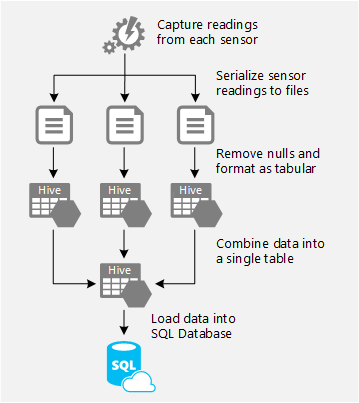
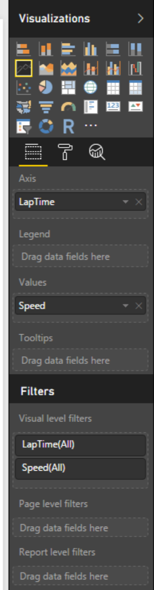
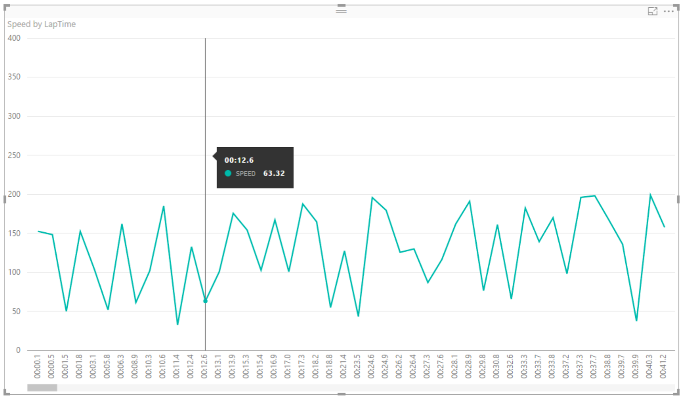

# ETL at Scale

In this scenario, HDInsight is used to perform an Extract, Transform, and Load (ETL) process that filters and shapes the source data, and then uses it to populate a database table. Specifically, this scenario describes:

* Introduction to racecar telemetry
* ETL process goals and data sources
* The ETL workflow
* Encapsulating the ETL tasks in an Oozie workflow
* Automating the ETL workflow
* Analyzing the loaded data

The scenario demonstrates how you can:

* Use the .NET Library for Avro to serialize data for processing in HDInsight.
* Use the classes in the .NET API for Hadoop WebClient package to upload files to Azure storage.
* Use an Oozie workflow to define an ETL process that includes Pig, Hive, and Sqoop tasks.
* Use the classes in the .NET API for Hadoop WebClient package to automate execution of an Oozie workflow.

## Introduction to racecar telemetry

This scenario is based on a fictitious motor racing team that captures and monitors real-time telemetry from sensors on a racecar as it is driven around a racetrack. To perform further analysis of the telemetry data, the team plans to use HDInsight to filter and shape the data before loading it into Azure SQL Database, from where it will be consumed and visualized in Excel. Loading the data into a database for analysis enables the team to decommission the HDInsight server after the ETL process is complete, and makes the data easily consumable from client applications that have the ability to connect to a SQL Server data source.

In this simplified example, the racecar has three sensors that are used to capture telemetry readings at one second intervals: a global positioning system (GPS) sensor, an engine sensor, and a brake sensor. The telemetry data captured from the sensors on the racecar includes:

* From the GPS sensor:
    * The date and time the sensor reading was taken.
    * The geographical position of the car (its latitude and longitude coordinates).
    * The current speed of the car.
* From the engine sensor:
    * The date and time the sensor reading was taken.
    * The revolutions per minute (RPM) of the crankshaft.
    * The oil temperature.
* From the brake sensor:
    * The date and time the sensor reading was taken.
    * The temperature of the brakes.

The sensors used in this scenario are deliberately simplistic. Real racecars include hundreds of sensors emitting thousands of telemetry readings at sub-second intervals.

## ETL process goals and data sources

Motor racing is a highly technical sport, and analysis of how the critical components of a car are performing is a major aspect of how teams refine the design of the car, and how drivers optimize their driving style. The data captured over a single lap consists of many telemetry readings, which must be analyzed to find correlations and patterns in the car’s performance.

In this scenario, an application has produced a text file.  We're going to upload that text file to Azure Blob Storage and simulate an actual ETL pipeline.

The file contains captured sensor readings as objects. Note that the Position property of the GpsReading class is based on the Location struct.
C# (Program.cs in RaceTracker project)

[See File Here](./media/hdinsight-deep-dive-etl/sensor.csv)

As part of the ETL processing workflow in HDInsight, the captured readings must be filtered to remove any null values caused by sensor transmission problems. At the end of the processing the data must be restructured to a tabular format that matches the following Azure SQL Database table definition.
Transact-SQL (Create LapData Table.sql)
CREATE TABLE [LapData]
(
  [LapTime] [varchar](25) NOT NULL PRIMARY KEY CLUSTERED,
  [Lat] [float]  NULL,
  [Lon] [float]  NULL,
  [Speed] [float] NULL,
  [Revs] [float]  NULL,
  [OilTemp] [float]  NULL,
  [BrakeTemp] [float]  NULL,
);

The workflow and its individual components are described in The ETL workflow.

## The ETL workflow

The key tasks that the ETL workflow for the racecar telemetry data must perform are:
* Uploading them to Azure storage.
* Filtering the data to remove readings that contain null values, and restructuring it into tabular format.
* Take sensor and create a single table.
* Loading the sensor readings data into the table in Windows Azure SQL Database.

Figure 1 shows this workflow.  We will only use one file for simplicity.

The team wants to integrate these tasks into the existing console application so that, after a test lap, the telemetry data is loaded into the database for later analysis.

## Serializing and uploading the sensor readings
The first challenge in implementing the ETL workflow is to serialize each list of captured sensor reading objects into a file, and upload the files to Azure blob storage. There are numerous serialization formats that can be used to achieve this objective, but the team decided to use a CSV. 

After the data for each sensor has been serialized to a file, the program must upload the files to the Azure blob storage container used by the HDInsight cluster. 

To accomplish this the developer imported the Microsoft .NET API for Hadoop WebClient package and added using statements that reference the Microsoft.Hadoop.WebHDFS and Microsoft.Hadoop.WebHDFS.Adapters namespaces. The developer can then use the WebHDFSClient class to connect to Azure storage and upload the files. The following code shows how this technique is used to upload the file containing the GPS sensor readings.
[Solution for Uploading Sensor File](./media/hdinsight-deep-dive-etl/LoadSensorData/)

Notice that the settings used by the WebHDFSClient object are retrieved from the App.Config file. These settings include the credentials required to connect to the Azure storage account used by HDInsight and the path for the folder to which the files should be uploaded. In this scenario the InputDir configuration settings has the value input, so the sensor data file will be saved as /users/admin/sensor/sensor.csv.

## Filtering and restructuring the data

After the data has been uploaded to Azure storage, HDInsight can be used to process the data and upload it to Azure SQL Database. 

To read the data in these files the developers decided to use Hive because of the simplicity it provides when querying tabular data structures. The first stage in this process was to create a script that builds Hive tables over the input records from the race car sensors. For example, the following HiveQL code defines a table over the filtered sensor data.
HiveQL (createtables.hql)
DROP TABLE IF EXISTS sensor;

CREATE EXTERNAL TABLE sensor
(laptime STRING, lat DOUBLE, lon DOUBLE, speed FLOAT) 
COMMENT 'from csv file' 
ROW FORMAT DELIMITED FIELDS TERMINATED BY ',' STORED AS TEXTFILE LOCATION '/user/admin/input/';

Sometimes the sensor data malfuctions and we get nulls in the value.  We want to use Hive to clean the records before loading it into our data warehouse.  We'll use a query like this:

INSERT OVERWRITE DIRECTORY '/user/admin/output/' 
ROW FORMAT DELIMITED FIELDS TERMINATED BY ',' 
SELECT * FROM sensor
WHERE LapTime IS NOT NULL;

## Loading the combined data to SQL Database
After the ETL process has filtered the data, it loads it into the LapData table in Azure SQL Database.  To accomplish this the developers used Sqoop to copy the data from the folder on which the lap Hive table is based and transfer it to the database. The following command shows an example of how Sqoop can be used to perform this task.  For more information on creating an Azure SQL Database, [see here](https://docs.microsoft.com/en-us/azure/sql-database/sql-database-get-started-portal).

Command Line
    sqoop export  --connect "jdbc:sqlserver://{yourserver}.database.windows.net:1433;databaseName=deepdiveetl;username={YourUserAccount};password={yourpassword};logintimeout=30" --table LapData --export-dir /user/admin/output/ --input-fields-terminated-by ,  --input-null-non-string \N

Now that each of the tasks for the workflow have been defined, they can be combined into a workflow definition. 

## Using Power BI

Now that your data is in the final resting place, we can use Power BI to create visualizations.

You can download [Power BI here.](https://powerbi.microsoft.com/en-us/downloads/)

You can see detailed instructions on how to use it [here:](https://powerbi.microsoft.com/en-us/blog/using-power-bi-to-visualize-and-explore-azure-sql-databases/)

To see the speed of the car over time, follow these steps:

1.  Open up Power BI Desktop.

2.  On the top bar, click Get Data.

3.  In the Get Data window, click Azure on the left.  Then click Azure SQL Database.

4.  Type the full name of your server, for instance: deepdiveetl.database.windows.net.

5.  Fill in your database name, for instance deepdiveetl.  Click OK.

6.  Fill in your Azure security credentials on the database credentials pane.  Click OK.

7.  In the Visualizations pane, click Line Chart.

8.  Drag lap time over to the Axis and speed over to the Values section of the chart.

9.  You should have a visualization that looks like this:

