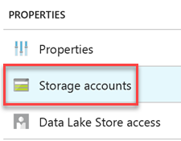

# Use Apache Phoenix with Linux-based HBase clusters in HDInsight
Learn how to use [Apache Phoenix](http://phoenix.apache.org/) in HDInsight, and how to use SQLLine. For more information about Phoenix, see [Phoenix in 15 minutes or less](http://phoenix.apache.org/Phoenix-in-15-minutes-or-less.html). For the Phoenix grammar, see [Phoenix Grammar](http://phoenix.apache.org/language/index.html).

Learn more about [Phoenix in HDInsight](hdinsight-phoenix-in-hdinsight).

> [!NOTE]
> For the Phoenix version information in HDInsight, see [What's new in the Hadoop cluster versions provided by HDInsight?](hdinsight-component-versioning.md).
>
>

## Use SQLLine to create a new HBase table
[SQLLine](http://sqlline.sourceforge.net/) is a command-line utility to execute SQL.

### Prerequisites
Before you can use SQLLine, you must have the following:

* **An HBase cluster in HDInsight**. For information on provisioning an HBase cluster, see [Get started with Apache HBase in HDInsight][hdinsight-hbase-get-started].
* **Connect to the HBase cluster via the remote desktop protocol**. For instructions, see [Manage Hadoop clusters in HDInsight by using the Azure portal][hdinsight-manage-portal].

When you connect to an HBase cluster, you need to connect to one of the Zookeepers. Each HDInsight cluster has three Zookeepers.

**To find out the Zookeeper host name**

1. Open Ambari by browsing to **`https://<ClusterName>.azurehdinsight.net`**.
2. Enter the HTTP (cluster) username and password to login.
3. Click **ZooKeeper** from the left menu. You see three **ZooKeeper Servers** listed.
4. Click one of the **ZooKeeper Servers** listed. On the Summary pane, find the **Hostname**. It is similar to `zk1-jdolehb.3lnng4rcvp5uzokyktxs4a5dhd.bx.internal.cloudapp.net`.

To highlight how you can efficiently leverage HDInsight HBase and Phoenix to analyze big data stores, this walkthrough shows you how to use HBase Phoenix to do sales analysis of an imaginary online book store.

### Bulk Load data into HBase using Phoenix

Phoenix provides two ways to bulk load into HBase. The `PSQL` command line utility, which is a single-threaded client loading tool, and a MapReduce bulk loading utility. PSQL is suited for gigabytes of data, whereas MapReduce is used for much larger data volumes.

To bulk upload data into HBase using the Phoenix PSQL command line tool, perform the following actions:

1. Browse to the HBase HDInsight cluster on the Azure portal.

2. On the left-hand menu, select **Storage accounts**.

    

3. Select your Azure Blob Storage or Azure Data Lake Store account listed in the Storage accounts pane.

4. Browse to the `/example/data` folder.

  * If using Azure Blob Storage, the `/example/data` folder will be located within your cluster's container.
  * In Azure Data Lake Store, use the data explorer to navigate to `/clusters/hbase/example/data`.

5. **TODO: ADD LINK TO CSV FILE** Upload the [sample weblogs.csv]() file to this location.

6. SSH into your HBase cluster. For more information, see [Use SSH with HDInsight](hdinsight-hadoop-linux-use-ssh-unix.md).

7. From SSH, run the following commands to run **SQLLine**:

    ```bash
    cd /usr/hdp/current/phoenix-client/bin
    ./sqlline.py <ZooKeeperHostname>:2181:/hbase-unsecure
    ```
8. Run the following command to create the weblogs table.

    ```sql
    CREATE TABLE weblogs (
      transactionid varchar(500) Primary Key,
      "t1".transactiondate Date NULL,
      "t1".customerid varchar(50) NULL,
      "t1".bookid varchar(50) NULL,
      "t1".purchasetype varchar(50) NULL,
      "t1".orderid varchar(50) NULL,
      "t1".bookname varchar(50) NULL,
      "t1".categoryname varchar(50) NULL,
      "t1".invoicenumber varchar(50) NULL,
      "t1".invoicestatus varchar(50) NULL,
      "t1".city varchar(50) NULL,
      "t1".state varchar(50) NULL,
      "t2".paymentamount DOUBLE NULL,
      "t2".quantity INTEGER NULL,
      "t2".shippingamount DOUBLE NULL);
    ```

    > Note: The above query creates a weblogs table with two column families, t1 and t2. Column families are stored separately in different HFiles, thus it makes sense to have a separate column family for data which is queried often. The paymentamount, quantity, and shippingamount columns will be queried often, so they are in a different column family.

9. Run the following command in a **new** Hadoop command line window.

    ```bash
    cd /usr/hdp/current/phoenix-client/bin
    ```

10. Now, let's copy the weblogs.csv file from our storage acount via `hdfs` to our local temp directory.

    ```bash
    hdfs dfs -copyToLocal /example/data/weblogs.csv /tmp/
    ```

11. Finally, we'll use PSQL to bulk insert the rows into our new HBase table.

    ```bash
    ./psql.py -t WEBLOGS [The FQDN of one of the Zookeepers] /tmp/weblogs.csv
    ```

The above code executes the PSQL client utility to bulk upload data into the weblogs table. It takes three parameters: table name (-t), zookeeper fqdn, and the path of the csv file to bulk load from.

Once the PSQL operation is complete, you should have an output on your command window similar to the following:

```
CSV Upsert complete. 278972 rows upserted
Time: 64.549 sec(s)
```

## Perform data retrieval queries with SQLLine

Close the extra Hadoop command line window you opened to run the PSQL script, and switch back over to the one running SQLLine. If you closed it, please follow the steps to once again open SQLLine.

Execute the following query to select the book name and quantity sold of books purchased between January and March:

```sql
SELECT bookname, sum(quantity) AS QuantitySold from WEBLOGS
WHERE Purchasetype='Purchased' and Month(transactiondate)>=1 and Month(transactiondate)<=3
GROUP BY bookname;
```

You should see an output similar to the following:

```
+---------------------------------------+---------------+
|               BOOKNAME                | QUANTITYSOLD  |
+---------------------------------------+---------------+
| Advances in school psychology         | 90233         |
| History of political economy          | 93772         |
| New Christian poetry                  | 90467         |
| Science in Dispute                    | 92221         |
| Space  fact and fiction               | 95544         |
| THE BOOK OF WITNESSES                 | 93753         |
| The adventures of Arthur Conan Doyle  | 93710         |
| The voyages of Captain Cook           | 94207         |
| Understanding American politics       | 91119         |
+---------------------------------------+---------------+
9 rows selected (21.942 seconds)
```

For more information, see [SQLLine manual](http://sqlline.sourceforge.net/#manual) and [Phoenix Grammar](http://phoenix.apache.org/language/index.html).


## Next steps
In this article, you have learned how to use Apache Phoenix in HDInsight.  To learn more, see:

* [HDInsight HBase overview][hdinsight-hbase-overview]:
  HBase is an Apache, open-source, NoSQL database built on Hadoop that provides random access and strong consistency for large amounts of unstructured and semistructured data.
* [Provision HBase clusters on Azure Virtual Network][hdinsight-hbase-provision-vnet]:
  With virtual network integration, HBase clusters can be deployed to the same virtual network as your applications so that applications can communicate with HBase directly.
* [Configure HBase replication in HDInsight](hdinsight-hbase-replication.md): Learn how to configure HBase replication across two Azure datacenters.
* [Analyze Twitter sentiment with HBase in HDInsight][hbase-twitter-sentiment]:
  Learn how to do real-time [sentiment analysis](http://en.wikipedia.org/wiki/Sentiment_analysis) of big data by using HBase in a Hadoop cluster in HDInsight.

[azure-portal]: https://portal.azure.com
[vnet-point-to-site-connectivity]: https://msdn.microsoft.com/library/azure/09926218-92ab-4f43-aa99-83ab4d355555#BKMK_VNETPT

[hdinsight-hbase-get-started]: hdinsight-hbase-tutorial-get-started.md
[hdinsight-manage-portal]: hdinsight-administer-use-management-portal.md#connect-to-clusters-using-rdp
[hdinsight-hbase-provision-vnet]: hdinsight-hbase-provision-vnet.md
[hdinsight-hbase-overview]: hdinsight-hbase-overview.md
[hbase-twitter-sentiment]: hdinsight-hbase-analyze-twitter-sentiment.md

[hdinsight-hbase-phoenix-sqlline]: ./media/hdinsight-hbase-phoenix-squirrel/hdinsight-hbase-phoenix-sqlline.png
[img-certificate]: ./media/hdinsight-hbase-phoenix-squirrel/hdinsight-hbase-vpn-certificate.png
[img-vnet-diagram]: ./media/hdinsight-hbase-phoenix-squirrel/hdinsight-hbase-vnet-point-to-site.png
[img-squirrel-driver]: ./media/hdinsight-hbase-phoenix-squirrel/hdinsight-hbase-squirrel-driver.png
[img-squirrel-alias]: ./media/hdinsight-hbase-phoenix-squirrel/hdinsight-hbase-squirrel-alias.png
[img-squirrel]: ./media/hdinsight-hbase-phoenix-squirrel/hdinsight-hbase-squirrel.png
[img-squirrel-sql]: ./media/hdinsight-hbase-phoenix-squirrel/hdinsight-hbase-squirrel-sql.png
