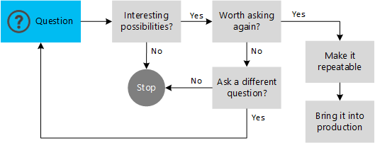

# Iterative Data Exploration

Traditional data storage and management systems such as data warehouses, data models, and reporting and analytical tools provide a wealth of information on which to base business decisions. However, while traditional BI works well for business data that can easily be structured, managed, and processed in a dimensional analysis model, some kinds of analysis require a more flexible solution that can derive meaning from less obvious sources of data such as log files, email messages, tweets, and more.
There's a great deal of useful information to be found in these less structured data sources, which often contain huge volumes of data that must be processed to reveal key data points. This kind of data processing is what big data solutions such as HDInsight were designed to handle. It provides a way to process extremely large volumes of unstructured or semi-structured data, often by performing complex computation and transformation batch processing of the data, to produce an output that can be visualized directly or combined with other datasets.

If you do not intend to reuse the information from the analysis, but just want to explore the data, you may choose to consume it directly in an analysis or visualization tool such as Microsoft Excel.

## Use case and model overview
The image below shows an overview of the use case and model for a standalone iterative data exploration and visualization solution using HDInsight. The source data files are loaded into the cluster, processed by one or more queries within HDInsight, and the output is consumed by the chosen reporting and visualization tools. The cycle repeats using the same data until useful insights have been found, or it becomes clear that there is no useful information available from the data — in which case you might choose to restart the process with a different source dataset.

Text files and compressed binary files can be loaded directly into the cluster storage, while stream data will usually need to be collected and handled by a suitable stream capture mechanism (see [Upload data for Hadoop jobs in HDInsight](hdinsight-upload-data.md) for more information). The output data may be combined with other datasets within your visualization and reporting tools to augment the information and to provide comparisons, as you will see later in this topic.

When using HDInsight for iterative data exploration, you will often do so as an interactive process. For example, you might use the Power Query add-in for Excel to submit a query to an HDInsight cluster and wait for the results to be returned, usually within a few seconds or even a few minutes. You can then modify and experiment with the query to optimize the information it returns.

However, keep in mind that these are batch operations that are submitted to all of the servers in the cluster for parallel processing, and queries can often take minutes or hours to complete when there are very large volumes of source data. For example, you might use Pig to process an input file, with the results returned in an output file some time later—at which point you can perform the analysis by importing this file into your chosen visualization tool.

### The decision flow
One of the typical uses of a big data solution such as HDInsight is to explore data that you already have, or data you collect speculatively, to see if it can provide insights into information that you can use within your organization. The decision flow shown below is an example of how you might start with a guess based on intuition, and progress towards a repeatable solution that you can incorporate into your existing BI systems. Or, perhaps, to discover that there is no interesting information in the data, but the cost of discovering this has been minimized by using a "pay for what you use" mechanism that you can set up and then tear down again very quickly and easily.

## When to choose this model
The iterative exploration model is typically suited to the following scenarios:

* Handling data that you cannot process using existing systems, perhaps by performing complex calculations and transformations that are beyond the capabilities of existing systems to complete in a reasonable time.

* Collecting feedback from customers through email, web pages, or external sources such as social media sites, then analyzing it to get a picture of customer sentiment for your products.

* Combining information with other data, such as demographic data that indicates population density and characteristics in each city where your products are sold.

* Dumping data from your existing information systems into HDInsight so that you can work with it without interrupting other business processes or risking corruption of the original data.

* Trying out new ideas and validating processes before implementing them within the live system.

> Combining your data with datasets available from Azure Marketplace or other commercial data sources can reveal useful information that might otherwise remain hidden in your data.

## Data sources
The input data for this model typically includes the following:

* Social data, log files, sensors, and applications that generate data files.

* Datasets obtained from Azure Marketplace and other commercial data providers.

* Internal data extracted from databases or data warehouses for experimentation and one-off analysis.

* Streaming data that is captured, filtered, and pre-processed through a suitable tool or framework (see [Upload data for Hadoop jobs in HDInsight](hdinsight-upload-data.md)).

Notice that, as well as externally obtained data, you might process data from within your organization's existing database or data warehouse. HDInsight is an ideal solution when you want to perform offline exploration of existing data in a sandbox. For example, you may join several datasets from your data warehouse to create large datasets that act as the source for some experimental investigation, or to test new analysis techniques. This avoids the risk of interrupting existing systems, affecting performance of your data warehouse system, or accidently corrupting the core data.

The capability to store schema-less data, and apply a schema only when processing the data, may also simplify the task of combining information from different systems because you do not need to apply a schema beforehand, as you would in a traditional data warehouse.

> Often you need to perform more than one query on the data to get the results into the form you need. It's not unusual to base queries on the results of a preceding query; for example, using one query to select and transform the required data and remove redundancy, a second query to summarize the data returned from the first query, and a third query to format the output as required. This iterative approach enables you to start with a large volume of complex and difficult to analyze data, and get it into a structure that you can consume directly from an analytical tool such as Excel, or use as input to a managed BI solution.

## Output targets
The results from your exploration processes can be visualized using any of the wide range of tools that are available for analyzing data, combining it with other datasets, and generating reports. Typical examples for the iterative exploration model are:

* Interactive analytical tools such as Excel, Power Query, Power Pivot, Power View, and Power Map.

* SQL Server Reporting Services using Report Builder.

* Custom or third party analysis and visualization tools.

## Considerations
There are some important points to consider when choosing the iterative exploration model:

* This model is typically used when you want to:
    * Experiment with new types or sources of data.
    * Generate one-off reports or visualizations of external or internal data.
    * Monitor a data source using visualizations to detect changes or to predict behavior.
    * Combine the output with other data to generate comparisons or to augment the information.

* You will usually choose this model when you do not want to persist the results of the query after analysis, or after the required reports have been generated. It is typically used for one-off analysis tasks where the results are discarded after use; and so differs from the other models described in this guide in which the results are stored and reused.

* Very large datasets are likely to preclude the use of an interactive approach due to the time taken for the queries to run. However, after the queries are complete you can connect to the cluster and work interactively with the data to perform different types of analysis or visualization.

* Data arriving as a stream, such as the output from sensors on an automated production line or the data generated by GPS sensors in mobile devices, requires additional considerations. A typical technique is to capture the data using a stream processing technology such as Storm or StreamInsight and persist it, then process it in batches or at regular intervals. The stream capture technology may perform some pre-processing, and might also power a real time visualization or rudimentary analysis tool, as well as feeding it into an HDInsight cluster. A common technique is micro-batch processing, where incoming data is persisted in small increments, allowing near real-time processing by the big data solution.

* You are not limited to running a single query on the source data. You can follow an iterative pattern in which the data is passed through the cluster multiple times, each pass refining the data until it is suitably prepared for use in your analytical tool. For example, a large unstructured file might be processed using a Pig script to generate a smaller, more structured output file. This output could then be used as the input for a Hive query that returns aggregated data in tabular form.

## Next steps

* [HDInsight Architecture](hdinsight-architecture.md)
* [Data Warehouse on Demand](hdinsight-data-warehouse-on-demand)
* [Upload data for Hadoop jobs in HDInsight](hdinsight-upload-data.md)