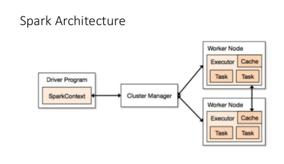
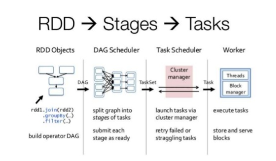
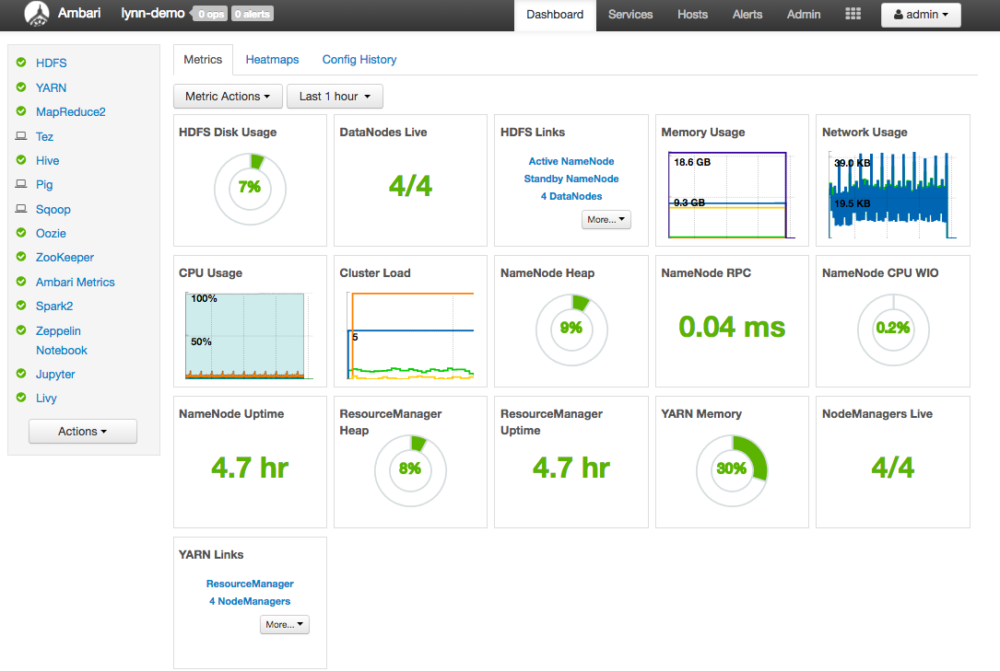

# Optimizing and configuring Spark Jobs for Performance

A Spark cluster is an installation of the Apache Spark library onto a HDInsight Hadoop cluster.  Each HDInsight cluster includes default configuration parameters for your Spark cluster at the top level and also at the level of Spark services and service instances in your Spark cluster.  A Spark Job is a set of multiple tasks executed via parallel computation. Spark Jobs are generated in response to a Spark actions (such as 'collect' or 'save').  Spark uses a threadpool of tasks for parallel execution rather than a pool of JVM resources (used by MapReduce).

A key aspect of managing a HDInsight Hadoop cluster is monitoring all jobs on the cluster to make sure they are running in a predictable manner.  This application monitoring includes Apache Spark job monitoring and optimization.   The diagram below shows the core Spark Architecture.  It is important to consider the execution objects when determining how to optimize Spark Jobs.  The objects show in the the diagram are the Driver Program and it's associated Spark Context, the Cluster Manager, and the n-number of Worker Nodes.  Each Worker Node includes it's own Executor, Cache and n-number of Task instances.

The diagram below shows the core Spark Job workflow stages.  As above, it's important to review Job workflow objects when optimizing Spark Jobs.  In the diagram the data is represented by the low-level RDD Objects.  The next step is the DAG Scheduler. The DAG Scheduler interacts with the Task Scheduler to schedule, submit, launch and retry tasks.  These two schedulers interact with the worker instances.  Worker instances host threads and also make use of a Block Manager.  The Block Manager stores and serves blocks of data to the workflow.

----
## Viewing Cluster Configuration Settings

It is common practice when performing performance optimization on an HDInsight cluster to begin by verifying cluster configuration settings.  To do this for not only your particular Apache Spark configuration, but also other services that you may have installed, you launch the HDInsight Dashboard from the Azure Portal by clicking the 'Dashboard' link on the Spark cluster blade. 

You will be prompted to login with the username and password that you specified when you setup the HDInsight cluster.  After you enter your administrator cluster credentials, then you'll be presented with the Ambari Web UI.  This UI provides a dashboard view of the key cluster resource utilitization metrics.  

An example Ambari HDInsight Dashboard is shown below.

In addition to viewing the top level cluster metrics, you can also view cluster configuration information.  To see configuration values for Apache Spark, click on the 'Configs' tab, then click on the 'Spark2' (or 'Spark' depending on the version of Spark that you've installed on your cluster) service link in the service list.  

You will be presented with a list of configuration values for your cluster as shown below.

To view Spark configuration values, click the one of the links labeled with the word 'spark' in the link title.  Configurations for Spark include the following both custom and advanced configuration values include these configuration categories:
* Custom Spark2-defaults
* Custom Spark2-metrics-properties
* Advanced Spark2-defaults
* Advanced Spark2-env
* Advanced spark2-hive-site-override

After you click one of these links you can view and also update configuration values.  If you create a non-default set of configuration values, then you can see a history of any configuration updates you've performed in this UI as well.  This configuration history can be helpful if you wish to verify a non-default configuration is in use for performance optimization.

Note: If you only wish to verify common Spark configuration settings, you can also click on the 'Environment' tab on the top level Spark Job UI interface.  In this view, you can view, but not change, cluster configuration values.  The Spark Job UI is described in the next section of this article.

----

## Track an application in the Spark UI

When working on Spark Job performance, it's important to to start by understanding how to get visibility into Job performance via the various HDInsight job monitoring tools.  To understand how these tools work, it's best to generate a sample workload.  A simple way to generate sample Spark Jobs is by runnning one or more of the included Jupyter demo notebook(s).  Click on the Jupyter blade on your HDInsight instance in the portal and then continue clicking to open and run all cells from one or more sample notebooks.

After your sample workload has completed, from the cluster blade, click 'Cluster Dashboard', and then click 'YARN' to launch the YARN UI.
Because you started the Spark job using Jupyter notebooks, the application in the log has the name **remotesparkmagics**. Click the application ID against the application name to get more information about the job. This launches the application view.

For such applications that are launched from the Jupyter notebooks, the status is always RUNNING until you exit the notebook.
From the application view, you can drill down further to find out the containers associated with the application and the logs (stdout/stderr). 
You can also launch the Spark UI by clicking the link next to the Tracking URL (in this case 'Application Master'), as shown below. 

Clicking the Tracking URL link will open the Spark Jobs UI.  After the Spark Jobs UI renders, you can drill down to view specific implementation details for the Spark jobs that have been spawned by the application workload(s) that you started prior to navigating here.  You can review detailed information about jobs, stages, storage, environment, executors and Spark SQL via this UI.    

The default view is open to the **Jobs** tab.  The Jobs tab lists recently run Spark jobs, ordered by Job Id.  It provides a high-level view of the status of Job workflow execution outcome by displaying the Job Id, job description, data and time that the job was submitted, job execution duration, job stage and task status. An example of the Spark Jobs UI is shown below.

As mentioned, there are a number of views available in the Spark Jobs UI.  They allow you to review detailed execution information about the Spark Jobs that have been run on your cluster.  This information is key when monitoring and optimizing Spark Job executions.  It is especially important that you review the job stages and tasks using the DAG view and understand the overhead of each job stage so that you can verify that your Spark Job is performing as expected.

* Click the **Executors** tab to see processing and storage information for each executor. In this tab, you can also retrieve the call stack by clicking on the Thread Dump link.
* Click the **Stages** tab to see the stages associated with your Spark Job
    * Each job stage can have multiple job tasks for which you can view detailed execution statistics
    * From the stage details page, you can launch the DAG Visualization by clicking the link at the top of the page to expand the DAG visualizetion view.  The DAG (Direct Aclyic Graph) represents the different stages in the application. Each blue box in the graph represents a Spark operation invoked from the application.
    * From the stage details page, you can also launch the application timeline view. Expand the Event Timeline link at the top of the page to view a visualiaztion of the job event execution details.

TIP: You can also use the Spark History Server to access details about Spark jobs executions that have previously completed.

---

## Spark Job Optimization Techniques

Listed below are a set of common Spark Job optimization challenges, considerations and recommended actions to improve results.

### 1. Use Memory Efficiently

Because Spark operates by placing data in memory, appropriately managing memory resources is a key aspect of optimizing the execution of Spark Jobs.  There are several techniques that you can use to use your cluster's memory efficiently.  These include the following: 

* Prefer smaller data partitions, account for data size, types and distribution in your partitioning strategy
* Consider the newer, more efficient Kyro data Serialization, rather than the default Java Serialization
* Prefer to use YARN, as it separates spark-submit per batch
* Monitor and tune Spark configuration settings

For reference the Spark memory structure and some key executor memory parameters are shown below. 

#### Spark Memory allocation details 

* The value spark.executor.memory defines the TOTAL amount of memory available for the executor
* The value spark.storage.memoryFraction (default ~ 60%) defines the amount available for storing persisted RDDs
* The value spark.shuffle.memoryFraction (default ~ 20%) deinfes the amount reserved for shuffle
* Avoid using spark.storage.unrollFraction/safetyFraction (~30% of total memory)

If you are using YARN, then YARN controls the maximum sum of memory used by the containers on each Spark node.  The graphic below shows the key objects and relationship between them.

Here are set of common practices you can try if you are addressing 'out of memory' messages:

* Review DAG Management Shuffles -> reduce by map-side reducting, pre-partition (or bucketize) source data, maximize single shuffle, reduce the amount of data sent
* Prefer 'ReduceByKey'(has fixed memory limit) to 'GroupByKey'(more powerful, i.e. aggregations, windowing, etc.. but, has unbounded memory limit)
* Prefer 'TreeReduce'(does more work on the executors or partitions) to 'Reduce'(does all work on the driver)
* Leverage DataFrame rather than the lower-level RDD object 
* Create ComplexTypes which encapsulate actions, such as 'Top N', various aggregations or windowing ops

### 2. Optimize Data Serialization

Because Spark Job are distributed, appropriate data serialization is key to best Spark Job performance.  There are two serialization options for Spark.  Java serialization is the default.  There is a new serialization library, Kyro, available.  Kyro serialization can result in faster and more compact serialization than that of Java.  Kyro serialization is a newer format and it does not yet support all Serializable types.  Also it requires that you register the classes in your program.

### 3. Fix slow Joins/Shuffles

If you have slow jobs on Join/Shuffle, for example it may take 20 seconds to run a map job, but 4 hrs when running a job where the data is joined or shuffled, the cause is probably data skew.  Data skew is defined as asymmetry in your job data.  To fix data skew, you should salt the entire key, or perform an isolated salt (meaning apply the salt to only some subset of keys).  If you are using the 'isolated salt' technique, you should further filter to isolate your subset of salted keys in map joins.

Additionally, to manage parallelism, specifically to fight Cartesian Joins, you can adding nested structures, windowing and/or skip step(s) in your Spark Job.

### 4. Spark Cluster Custom Configuration

Depending on your Spark workload, you may determine that a non-default Spark configuration would result in more optimized Spark Job executions.  You should perform benchmark testing with key workloads to validate any non-default cluster configurations.  Some of the common parameters that you may consider adjusting are listed below with associated parameter notes.

* Executors                (--num-executors)
    - set the appropriate number of executors
* Cores for each executor  (--executor-cores)
    - have middle-sized executors, as other processed will consume some portion of the available memory
* Memory for each executor (--executor-memory) 
    - controls heap size on YARN, you'll need to leave some memory for execution overhead

### 5. Optimize to Speed Up Job execution

* Cache, but do it wisely.  If you use the data twice, then cache it.
* Broadcast variables, then they are visible to all executors.  They are only serialized once.  Results in very fast lookups.
* Threading - use thread pool on driver.  Results in fast operation, with many tasks.

-----
## Conclusion

There are a number of core considerations you need to pay attention to make sure your Spark Jobs run in a predictable and performant way.  It's key for you to focus on using the best Spark cluster configuration for your particular workload.  Along with that, you'll need to monitor the execution of long-running and/or high resource consuming Spark Job executions.  The most common challenges center around memory pressure due to improper configurations (particularly wrong-sized executors), long-running operations and tasks which result in cartesian operations.  Using caching judiciously can significantly speed up jobs.  Finally, it's important to adjust for data skew in your job tasks.

## See also

* [Debug Spark jobs running on Azure HDInsight](https://docs.microsoft.com/en-us/azure/hdinsight/hdinsight-apache-spark-job-debugging)
* [Manage resources for a Spark cluster on HDInsight](https://docs.microsoft.com/en-us/azure/hdinsight/hdinsight-apache-spark-resource-manager)
* [Use the Spark REST API to submit remote jobs to a Spark cluster](https://docs.microsoft.com/en-us/azure/hdinsight/hdinsight-apache-spark-livy-rest-interface)
* [Tuning Spark](https://spark.apache.org/docs/latest/tuning.html)
* [How to Actually Tune Your Spark Jobs So They Work](https://www.slideshare.net/ilganeli/how-to-actually-tune-your-spark-jobs-so-they-work)
* [Kyro Serialization](https://github.com/EsotericSoftware/kryo)

