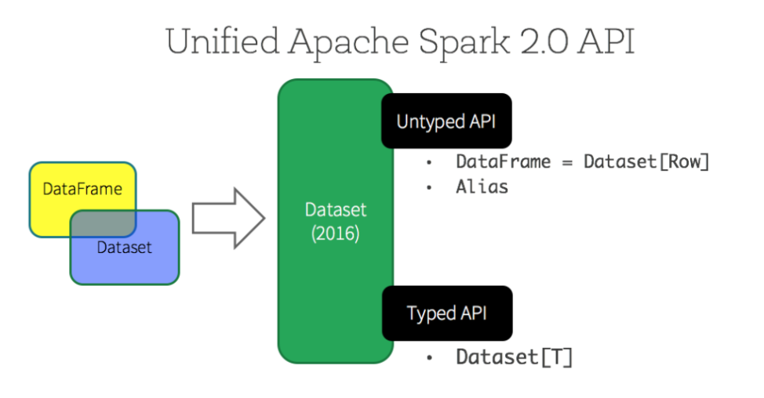
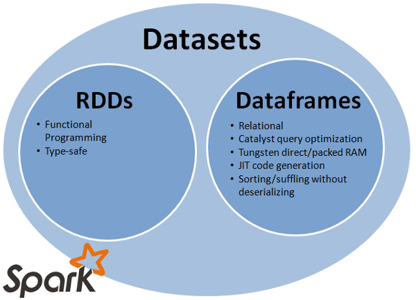

# Choosing between RDD, DataFrame, and Dataset for Spark

## What is an RDD?

Big Data applications rely on iterative, distributed computing for faster processing of large data sets. To distribute data processing over multiple jobs, the data is typically reused or shared across jobs. To share data between  existing distributed computing systems you need to store data in some intermediate stable distributed store such as HDFS. This makes the overall computations of jobs slower.

**Resilient Distributed Datasets** (RDDs) address this by enabling fault-tolerant, distributed, in-memory computations. [(RDDs)](http://spark.apache.org/docs/latest/programming-guide.html#resilient-distributed-datasets-rdds) are the baseline data abstractions in Spark. They are fault-tolerant collections of elements stored in-memory or on-disk that can be operated on in parallel. An RDD can hold many kinds of source data. RDDs are created by loading an external dataset or distributing a collection from the Spark driver program.

An RDD can be persisted in-memory across operations. When an RDD is persisted, each node stores any partitions of it that it computes in-memory and then reuses them in other actions on the data set. You can mark an RDD as persistent just by calling the `persist()` or `cache()` method. You can also specify the storage level: on-disk or in-memory as a serialized Java object. Cached, or persistent, RDDs are fault-tolerant without replication.

Each RDD maintains its lineage (for example, the sequence of transformations that resulted in the RDD). If an RDD is lost because a node crashed, it can be reconstructed by replaying the sequence of operations.

----------

## What are RDD operations?
RDDs support two types of operations: transformations and actions.

* **Transformations** create a new dataset from an existing one. Transformations are lazy by default, meaning that no transformation is executed until you execute an action. This does not apply to persistent RDDs. Examples of transformations include: map, filter, sample, union, and more.

* **Actions** return a value to the driver program after running a computation on the dataset. Examples include: reduce, collect, count, first, foreach, etc.

The code sample below contains both transitions and actions.  It shows how to search through error messages in a log file that is stored in HDFS using Scala.  A source file is loaded, then filtered, cached and the rows in cache are counted.  Next an additional filter is applied to the cached rows.  Row are again counted and finally returned via the collect method.

```Scala
    val file = spark.textFile("hdfs://...")
    val errors = file.filter(line => line.contains("ERROR"))
    errors.cache()               
    errors.count()               
    errors.filter(line => line.contains(“Web")).count()
    errors.filter(line => line.contains(“Error")).collect()
```

-----


### An Evolving API

The Apache Spark API as a whole is evolving at a rapid pace, including changes and additions to its core APIs. One of the most disruptive areas of change is around the representation of data sets. Although Spark 1.0 used the RDD API, two new alternative and incompatible APIs have been introduced. Spark 1.3 introduced the radically different DataFrame API and the Spark 1.6 release introduced a preview of the new Dataset API.

You may be wondering whether to jump from RDDs directly to the Dataset API, or whether to first move to the DataFrame API.

Currently, the DataFrame APIs offer the most performance. RDD APIs still exist in Spark 2.x for backwards compatibility, and should not be used. Going forward, only the DataFrame and Dataset APIs will be developed.

The main disadvantage to RDDs is that they don’t perform particularly well. Whenever Spark needs to distribute the data within the cluster, or write the data to disk, it does so using Java serialization by default (although it is possible to use Kryo as a faster alternative in most cases). The overhead of serializing individual Java and Scala objects is expensive and requires sending both data and structure between nodes (each serialized object contains the class structure as well as the values). There is also the overhead of garbage collection that results from creating and destroying individual objects.

----------

## DataFrame API

Spark 1.3 introduced a new DataFrame API to improve the performance and scalability of Spark. The DataFrame API introduced the concept of a schema to describe the data, allowing Spark to manage the schema and only pass data between nodes, in a much more efficient way than using Java serialization. There are also advantages when performing computations in a single process as Spark can serialize the data into off-heap storage in a binary format and then perform many transformations directly on this off-heap memory, avoiding the garbage-collection costs associated with constructing individual objects for each row in the data set. Because Spark understands the schema, there is no need to use Java serialization to encode the data.

The DataFrame API is radically different from the RDD API because it is an API for building a relational query plan that Spark’s Catalyst optimizer can then execute. The API is natural for developers who are familiar with building query plans, but not natural for the majority of developers. The query plan can be built from SQL expressions in strings or from a more functional approach using a fluent-style API.

Example: Filter by attribute with DataFrame in Scala

```Scala
    //SQL Style
    df.filter("age > 21");

    //Expression builder style:
    df.filter(df.col("age").gt(21));
```
Because the code is referring to data attributes by name, it is not possible for the compiler to catch any errors. If attribute names are incorrect then the error will only detected at runtime, when the query plan is created.

### How do I make a dataframe?

You can load a dataframe directly from an input data source. See the following notebooks included with your HDInsight Spark cluster for more information.

* Read and write data from Azure Storage Blobs (WASB)
* Read and write data from Hive tables

-------
## Spark SQL and dataframes

You can run SQL queries over dataframes once you register them as temporary tables within the SQL context. 

The HDInsight Spark kernel supports easy inline SQL queries. Simply type `%sql` followed by a SQL query to run a SQL query on a dataframe.

See [Spark SQL and DataFrame Guide](https://spark.apache.org/docs/2.0.0/sql-programming-guide.html#datasets-and-dataframes) for more information.

-------


## Dataset API

The Dataset API, released as an API preview in Spark 1.6 (and as generally available in Spark 2.x), aims to provide the best of both worlds; the familiar object-oriented programming style and compile-time type-safety of the RDD API but with the performance benefits of the Catalyst query optimizer. Datasets also use the same efficient off-heap storage mechanism as the DataFrame API.

When it comes to serializing data, the Dataset API has the concept of encoders which translate between JVM representations (objects) and Spark’s internal binary format. Spark has built-in encoders which are very advanced in that they generate byte code to interact with off-heap data and provide on-demand access to individual attributes without having to de-serialize an entire object. Spark does not yet provide an API for implementing custom encoders, but that is planned for a future release.



### Example: Creating Dataset from a list of objects

```Scala
    val sc = new SparkContext(conf)
    val sqlContext = new SQLContext(sc)
    import sqlContext.implicits._
    val sampleData: Seq[ScalaPerson] = ScalaData.sampleData()
    val dataset = sqlContext.createDataset(sampleData)
```
Transformations with the Dataset API look very much like the RDD API and deal with the Person class rather than an abstraction of a row.

Example: Filter by attribute with Dataset
```Scala
    dataset.filter(_.age < 21);
```

Despite the similarity with RDD code, this code is building a query plan, rather than dealing with individual objects, and if age is the only attribute accessed, then the rest of the the object’s data will not be read from off-heap storage.

With the release of Spark 2.x, there are really only two programmatic APIs now; RDD and Dataset. For backwards compatibility, DataFrame still exists but is just a synonym for a Dataset.

CSV support is now built-in and based on the DataBricks spark-csv project, making it easy to create Datasets from CSV data with little coding.

Spark 2.0 is a major release, and there are some breaking changes that mean you may need to rewrite some of your code. Here are some things we ran into when updating our apache-spark-examples.

For Scala users, SparkSession replaces SparkContext and SQLContext as the top-level context, but still provides access to SQLContext and SQLContext for backwards compatibility

DataFrame is now a synonym for Dataset[Row] and you can use these two types interchangeably,  although we recommend using the latter. Performing a map() operation on a Dataset now returns a Dataset rather than an RDD, reducing the need to keep switching between the two APIs, and improving performance.

Some Java functional interfaces, such as FlatMapFunction, have been updated to return Iterator<T> rather than Iterable<T>.

### RDD vs. Dataset 2.0
Both the RDD API and the Dataset API represent data sets of a specific class. For instance, you can create an RDD[Person] as well as a Dataset[Person] so both can provide compile-time type-safety. Both can also be used with the generic Row structure provided in Spark for cases where classes might not exist that represent the data being manipulated, such as when reading CSV files.

RDDs can be used with any Java or Scala class and operate by manipulating those objects directly with all of the associated costs of object creation, serialization and garbage collection.

Datasets are limited to classes that implement the Scala Product trait, such as case classes. There is a very good reason for this limitation. Datasets store data in an optimized binary format, often in off-heap memory, to avoid the costs of deserialization and garbage collection. Even though it feels like you are coding against regular objects, Spark is really generating its own optimized byte-code for accessing the data directly.

The Scala code examples below show working with RDDs, Dataframes and Datasets.

```Scala
// RDD raw object manipulation
val rdd: RDD[Person] = …
val rdd2: RDD[String] = rdd.map(person => person.lastName)
// Dataset optimized direct access to memory without deserializing objects
val ds: Dataset[Person] = …
val ds2: Dataset[String] = ds.map(person => person.lastName)

// Create SparkSession (start point for a Spark driver program in 2x)
val spark = SparkSession.builder
      .master("local[*]")
      .appName("Example")
      .getOrCreate()
// Access (legacy) SparkContext and SQLContext 
spark.sparkContext
spark.sqlContext

// Create a Dataset from a collection
var ds: Dataset[String] = spark.createDataset(List("one","two","three"))

// Convert an RDD to a Dataset
// Use SparkSession createDataset method to convert an RDD to a Dataset 
// Import spark.implicits_ (spark is the name of the SparkSession variable)
// Import implicits so that Spark can infer types when creating Datasets
import spark.implicits._
val rdd: RDD[Person] = ??? // assume this exists
val dataset: Dataset[Person] = spark.createDataset[Person](rdd)

// Convert a DataFrame (which is really a Dataset[Row]) to a Dataset
// Convert to a Dataset of a specific class by performing a map() operation
// Read a text file into a DataFrame a.k.a. Dataset[Row]
var df: Dataset[Row] = spark.read.text("people.txt")

// Use map() to convert to a Dataset of a specific class
var ds: Dataset[Person] = spark.read.text("people.txt")
      .map(row => parsePerson(row))
def parsePerson(row: Row) : Person = ??? // fill in parsing logic here

// Read a CSV directly as a Dataset (CSV must container a header row)
val ds: Dataset[Person] = spark.read
    .option("header","true")
    .csv("people.csv")
    .as[Person]
```

## Conclusion

Currently, the DataFrame APIs offer the most performance. RDD APIs still exist in Spark 2.x for backwards compatibility, and should not be used. Going forward, only the DataFrame and Dataset APIs will be developed.

The Spark Dataset API is very performant and provides a more natural way to code than using the more low-level RDD abstraction. Given the rapid evolution of Spark it is likely that this API will mature and become the de-facto API for developing new applications.

The Spark API is moving from unstructured computation (RDDs) towards structured computation (Datasets) because of the many performance optimizations that the latter allows. DataFrames were a step in direction of structured computation but lacked developer-desired features such as compile time safety and lambda functions. The Spark Dataset API unifies both Dataframes and RDDs.



## See also

* [Get started: Create an Apache Spark cluster in HDInsight and run interactive Spark SQL queries](https://docs.microsoft.com/en-us/azure/hdinsight/hdinsight-apache-spark-jupyter-spark-sql)
* [Spark SQL, DataFrames and Datasets Guide](https://spark.apache.org/docs/2.0.0/sql-programming-guide.html#datasets-and-dataframes)
* [RDDs, DataFrames and Datasets video](https://www.youtube.com/watch?v=pZQsDloGB4w)


