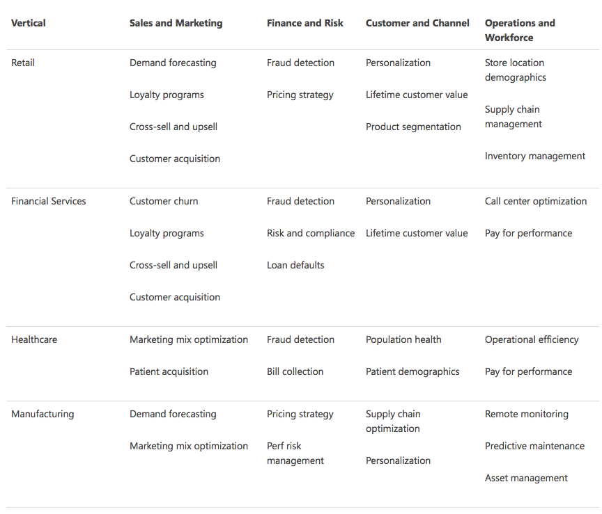
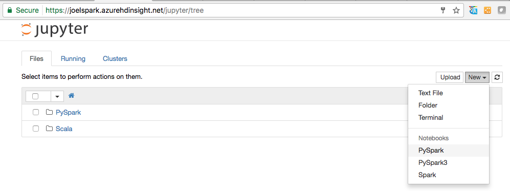
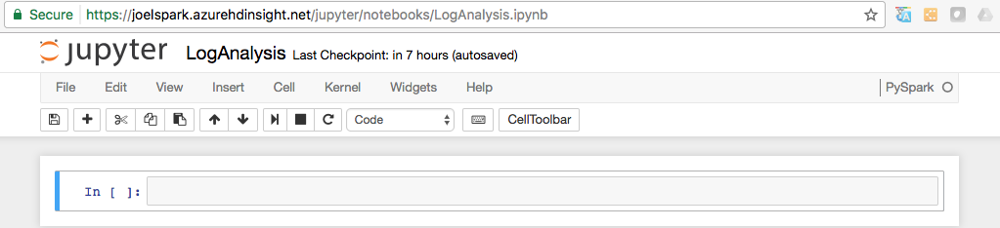
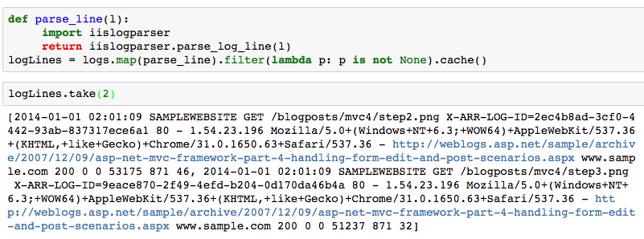
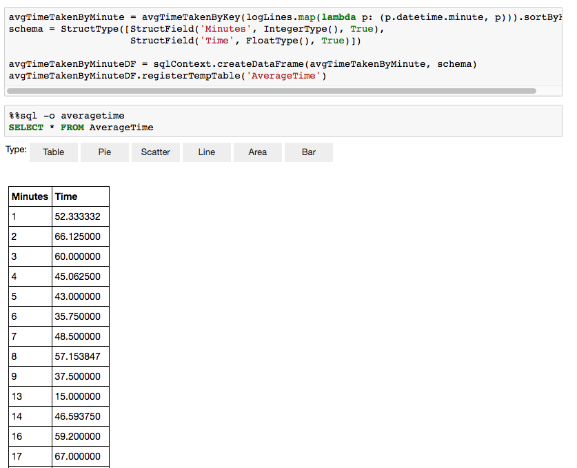
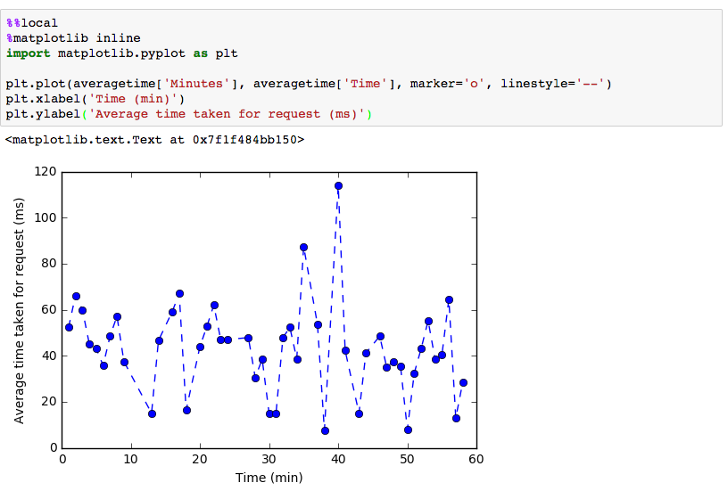

# Spark Scenarios - Build high-speed scalable data pipelines

## What is Apache Spark?

Apache Spark is an open-source processing framework that runs large-scale data analytics applications. Spark is built on an in-memory compute engine, which enables high-performance querying on big data. It takes advantage of a parallel data-processing framework that persists data in-memory and disk if needed. This allows Spark to deliver 100-times faster speed and a common execution model for tasks such as extract, transform, load (ETL), batch, interactive queries and others on data in an Apache Hadoop Distributed File System (HDFS). Azure makes Apache Spark easy and cost effective to deploy with no hardware to buy, no software to configure, a full notebook experience for authoring compelling narratives and integration with partner business intelligence tools.

Spark includes an integrated set of APIs which allows for many different types of interaction, processing and query of associated data.  These include SparkSQL, SparkML and others.  Shown below is the Spark architecture for reference.


---
## Example data pipeline use cases for Spark on HDInsight
Spark clusters in HDInsight enable a large number of high-volume data pipeline scenarios.  Below are just a few of the common example scenarios.

### 1. Interactive data analysis and BI

Apache Spark in HDInsight stores data in Azure Storage or Azure Data Lake Store. Business experts and key decision makers can analyze and build reports over that data and use Microsoft Power BI to build interactive reports from the analyzed data. Analysts can start from unstructured/semi structured data in cluster storage, define a schema for the data using notebooks, and then build data models using Microsoft Power BI. Spark clusters in HDInsight also support a number of third party BI tools such as Tableau making it an ideal platform for data analysts, business experts, and key decision makers. [Look at a tutorial for this scenario](https://docs.microsoft.com/en-us/azure/hdinsight/hdinsight-apache-spark-use-bi-tools).

### 2. Spark streaming and real-time data analysis

Spark clusters in HDInsight offer a rich support for building real-time analytics solutions. While Spark already has connectors to ingest data from many sources like Kafka, Flume, Twitter, ZeroMQ, or TCP sockets, Spark in HDInsight adds first-class support for ingesting data from Azure Event Hubs. Event Hubs are the most widely used queuing service on Azure. Having an out-of-the-box support for Event Hubs makes Spark clusters in HDInsight an ideal platform for building real time analytics pipeline. [Look at a tutorial for this scenario.](https://docs.microsoft.com/en-us/azure/hdinsight/hdinsight-apache-spark-eventhub-streaming)

### 3. Spark Machine Learning

Apache Spark comes with MLlib, a machine learning library built on top of Spark that you can use from a Spark cluster in HDInsight. Spark cluster on HDInsight also includes Anaconda, a Python distribution with a variety of packages for machine learning. Couple this with a built-in support for Jupyter and Zeppelin notebooks, and you have a top-of-the-line environment for creating machine learning applications. Look at a tutorial for this scenario -- [Predict building temperatures uisng HVAC data.](https://docs.microsoft.com/en-us/azure/hdinsight/hdinsight-apache-spark-ipython-notebook-machine-learning)  Look at a tutorial for this scenario -- [Predict food inspection results.](https://docs.microsoft.com/en-us/azure/hdinsight/hdinsight-apache-spark-machine-learning-mllib-ipython)  

Additionally, some of the common applications of machine learning scenarios with Spark on Azure are shown in the chart below.



For even more scenarios, see [Eight scenarios with Apache Spark on Azure](https://blogs.technet.microsoft.com/dataplatforminsider/2016/08/29/eight-scenarios-with-apache-spark-on-azure-that-will-transform-any-business/)

---
## Building with HDInsight and Spark by example - Analyze weblogs 

This example uses a Jupyter notebook and demonstrates how to analyze website log data using a custom library with Spark on HDInsight. The custom library we use is a Python library called `iislogparser.py`.

### Create and use a Jupyter Notebook

Create a HDInsight cluster of type Apache Spark
Click the `Cluster Dashboards` blade in the Azure portal for your HDInsight instance to open that page
On the `Cluster Dashboards` page, click the link to `Jupyter Notebook` to open that page

On the `Jupyter Notebook` page, click the `New->PySpark` link to create a new PySpark Jupyter notebook
  
At the top of the new notebook, click to rename the notebook from `Untitled` to `Log Analysis` 


### Load Data into Spark using PySpark

You'll use this notebook to run jobs that process your raw sample data and save it as a Hive table. The sample data is a .csv file (hvac.csv) available on all clusters by default. Once your data is saved as a Hive table, in the next section we will connect to the Hive table using BI tools such as Power BI and Tableau. Because you created a notebook using the PySpark kernel, you do not need to create any contexts explicitly. The Spark and Hive contexts will be automatically created for you when you run the first code cell. You can start by importing the types that are required for this scenario. Paste the following snippet in an empty cell, and then press SHIFT + ENTER.

In the first cell of the notebook, enter the python code shown below and press SHIFT + ENTER to execute the code.

```python
    from pyspark.sql import Row
    from pyspark.sql.types import *
```

You should see output showning that the SparkContext and HiveContext objects are not available, as shown in the example below.  
  

Create an RDD using the sample log data already available on the cluster. You can access the data in the default storage account associated with the cluster at `\HdiSamples\HdiSamples\WebsiteLogSampleData\SampleLog\909f2b.log`.

```python
    logs = sc.textFile('wasbs:///HdiSamples/HdiSamples/WebsiteLogSampleData/SampleLog/909f2b.log')
```
Retrieve a sample log set to verify that the previous step completed successfully.  You should see output similiar to the following example shown below.

```python
    logs.take(5)
```
  

### Analyze Data using a custom Python library

In the output above, the first couple lines include the header information and each remaining line matches the schema described in that header. Parsing such logs could be complicated. So, we use a custom Python library `iislogparser.py` that makes parsing such logs much easier. By default, this library is included with your Spark cluster on HDInsight at `/HdiSamples/HdiSamples/WebsiteLogSampleData/iislogparser.py`. Because this library is not in the `PYTHONPATH` we must distribute it to all the worker nodes by running the `addPyFile` command on the `SparkContext`.  Use the command shown below to do this.

```python
    sc.addPyFile('wasbs:///HdiSamples/HdiSamples/WebsiteLogSampleData/iislogparser.py')
```

The `iislogparser`provides a function `parse_log_line` that returns `None` if a log line is a header row, and returns an instance of the `LogLine` class if it encounters a log line. Use the `LogLine` class to extract only the log lines from the RDD. Use the command shown below to do this.

```python
    def parse_line(l):
        import iislogparser
        return iislogparser.parse_log_line(l)
    logLines = logs.map(parse_line).filter(lambda p: p is not None).cache()
```

Verify successful completion using the command shown below.  Your processed output should look similiar to the image shown after the command.

```python
    logLines.take(2)
```
  

The `LogLine` class, in turn, has some useful methods, like `is_error()`, which returns whether a log entry has an error code. Use this to compute the number of errors in the extracted log lines, and then log all the errors to a different file.

```python
    errors = logLines.filter(lambda p: p.is_error())
    numLines = logLines.count()
    numErrors = errors.count()
    print 'There are', numErrors, 'errors and', numLines, 'log entries'
    errors.map(lambda p: str(p)).saveAsTextFile('wasbs:///HdiSamples/HdiSamples/WebsiteLogSampleData/SampleLog/909f2b-2.log')
```
You can also use `Matplotlib` to construct a visualization of the data. For example, if you want to isolate the cause of requests that run for a long time, you might want to find the files that take the most time to serve on average. The snippet below retrieves the top 25 resources that took most time to serve a request.

```python
def avgTimeTakenByKey(rdd):
    return rdd.combineByKey(lambda line: (line.time_taken, 1),
                            lambda x, line: (x[0] + line.time_taken, x[1] + 1),
                            lambda x, y: (x[0] + y[0], x[1] + y[1]))\
              .map(lambda x: (x[0], float(x[1][0]) / float(x[1][1])))

avgTimeTakenByKey(logLines.map(lambda p: (p.cs_uri_stem, p))).top(25, lambda x: x[1])
```
You can also present this information in the form of plot. As a first step to create a plot, let us first create a temporary table AverageTime. The table groups the logs by time to see if there were any unusual latency spikes at any particular time.  You can then use the `%%sql` command to be able to run the following SparkSQL query to get all the records in the AverageTime table and to persist the output locally as a Pandas dataframe by adding the `-o averagetime` parameter to the SQL query.  Results will be as similiar to those shown in the screenshot below.


```python
    avgTimeTakenByMinute = avgTimeTakenByKey(logLines.map(lambda p: (p.datetime.minute, p))).sortByKey()
    schema = StructType([StructField('Minutes', IntegerType(), True),StructField('Time', FloatType(), True)])
    avgTimeTakenByMinuteDF = sqlContext.createDataFrame(avgTimeTakenByMinute, schema)
    avgTimeTakenByMinuteDF.registerTempTable('AverageTime')
```
```python
    %%sql -o averagetime
    SELECT * FROM AverageTime
```

  

You can now use `Matplotlib`, a library used to construct visualization of data, to create a plot. Because the plot must be created from the locally persisted averagetime dataframe, the code snippet must begin with the `%%local` magic. This ensures that the code is run locally on the Jupyter server.  You'll see output as shown in the screenshot below.

```python
    %%local
    %matplotlib inline
    import matplotlib.pyplot as plt

    plt.plot(averagetime['Minutes'], averagetime['Time'], marker='o', linestyle='--')
    plt.xlabel('Time (min)')
    plt.ylabel('Average time taken for request (ms)')
```

  

After you have finished running the application, you should shutdown the notebook to release the resources. To do so, from the File menu on the notebook, click Close and Halt. This will shutdown and close the notebook.

NOTE: The complete [`Log Analysis`](./media/hdinsight-spark-scenarios/LogAnalysis.ipynb) notebook is also available as a Jupyter notebook that you can upload and run on your HDInsight-Spark cluster. 

---

## Next steps
In this article, you learned about the large number of scalable data pipeline scenario that are possible using Apache Spark on HDInsight.  You also saw a complete example running in a Jupyter PySpark notebook. The flexibility of both HDInsight and the Spark ecosystem allow for building a wide variety of data pipelines that can address many business needs.

For more information, see:

* [Introductions to Spark on HDInsight](https://docs.microsoft.com/en-us/azure/hdinsight/hdinsight-apache-spark-overview)
* [Build Apache Spare machine learning applications on Azure HDInsight](https://docs.microsoft.com/en-us/azure/hdinsight/hdinsight-apache-spark-ipython-notebook-machine-learning)
*[Use Spark MlLib to build a machine learning application and analyze a dataset](https://docs.microsoft.com/en-us/azure/hdinsight/hdinsight-apache-spark-machine-learning-mllib-ipython)


