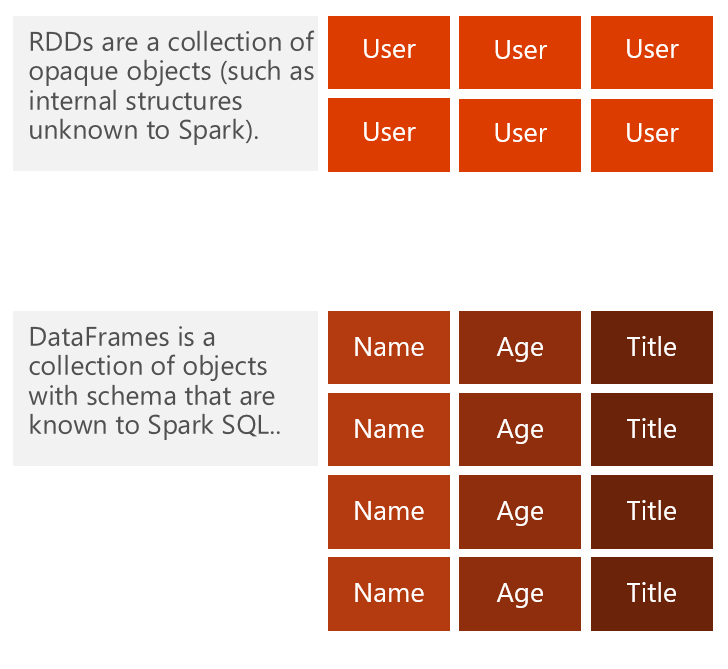

# Use Spark SQL with HDInsight

SQL (Structured Query Language) is the most common and widely used language for querying and defining data. Having been developed since the 1970s, and officially ANSI-standardized in 1986, SQL has had its foothold in the industry long enough for data analysts to turn to it as a natural way think about breaking down complex problems and define data relationships. The founders of Spark sought to harness this knowledge, opening up the well-known data querying language to a wider audience of analysts who wish to work with data that lives on Hadoop Distributed File System (HDFS).

Spark SQL is that offering. It functions as an extension to [Spark](https://docs.microsoft.com/azure/hdinsight/hdinsight-apache-spark-overview) for processing structured data, using the familiar SQL syntax. It has been part of the core distribution since Spark 1.0 (April 2014), and is a distributed SQL query engine. It also functions as a general purpose distributed data processing API. It acn be used in conjunction with the Spark core API within a single application.

To use Spark SQL, first create an Azure storage account, which HDInsight uses to store data within a blob container. Alternately, you can use an Azure Data Lake Store account. Next, HDInsight will make Apache Spark available as a service in the cloud. Using this service, we can run Spark SQL statements against our stored data by using notebooks.

## Spark SQL data sources

Spark SQL supports both SQL and HiveQL as query languages. Its capabilities include binding in Python, Scala, and Java. With it, you can query data stored in many locations, such as external databases, structured data files (example: JSON), and Hive tables.

There are many built-in data sources that come prepackaged with the Spark distribution. The Data Sources API provides an integration point for external developers to add support for custom data sources. Visit [spark-packages.org](https://spark-packages.org/) to find custom data sources contributed by the community.

## SparkSession

The entry point into all functionality in Spark SQL is the `SparkSession` class. Use the `SparkSession.builder()` method to create a basic `SparkSession` object:

    import org.apache.spark.sql.SparkSession

    val spark = SparkSession
    .builder()
    .appName("Spark SQL basic example")
    .config("spark.some.config.option", "some-value")
    .getOrCreate()

    // For implicit conversions like converting RDDs to DataFrames
    import spark.implicits._

`SparkSession` is new to Spark 2.0. In earlier versions, you have the choice between a `SQLContext` and a `HiveContext`. These two older contexts are kept for backward compatibility.

`SparkSession` also allows you to:
* Write using the more complete HiveQL parser
* Gain access to Hive UDFs
* Read data from Hive Tables

You do not need to have an existing Hive setup to write HiveQL queries with `SparkSession`.

### Working with DataFrames

A DataFrame is a distributed collection of data organized into named columns. It is conceptually equivalent to a table in a relational database or a data frame in R/Python, but with richer optimizations under the hood. DataFrames can be constructed from a wide array of sources such as: structured data files, tables in Hive, external databases, or existing RDDs. The DataFrame API is available in Scala, Java, and Python.

Once built, DataFrames provide a domain-specific language for distributed data manipulation. You can also incorporate Spark SQL while working with DataFrames. Data scientists are employing increasingly sophisticated techniques that go beyond joins and aggregations. To support this, DataFrames can be used directly in the MLlib machine learning pipeline API. In addition, programs can run arbitrarily complex user functions on DataFrames.

### Creating DataFrames from data sources

A Spark data source can read in data to create DataFrames, which has a schema that Spark understands. Examples include: JSON files, JDBC source, Parquet, and Hive tables. 

    >>> val df = spark.read.json("somejsonfile.json")       //from JSON file
    >>> val df = spark.read.parquet("someparquetsource")    //from a parquet file
    >>> val df = spark.read
            .format("jdbc")
            .option("url", "UrlToConnect")
            .option("dbtable", "schema.tablename)
            .option("user", "username")
            .option("password", "pass")
            .load()                                         //from JDBC source
    >>> val spark = SparkSession
            .builder()
            .appName("Spark Hive Application")
            .config("spark.sql.warehouse.dir", "spark-warehouse")
            .enableHiveSupport()
            .getOrCreate()
    >>> import spark.implicits._
    >>> import spark.sql
    >>> val sqlDF = sql("SELECT key, value FROM src WHERE key < 10 ORDER BY key") //from a Hive Table

The DataFrame interface makes it possible to operate on a variety of data sources. A DataFrame can be operated on as a normal RDD and/or registered as a temporary table. Registering a DataFrame as a table allows you to run SQL queries over its data. Below is a list of the general methods for loading and saving data using the Spark data sources, with some specific options that are available for the built-in data sources.

Read the [Spark documentation](https://spark.apache.org/docs/latest/sql-programming-guide.html#data-sources) for the latest information on the various supported data sources and how to use them.

### Creating DataFrames from RDDs

You can create DataFrames from existing RDDs in two ways:

1. **Use reflection:** Infer the schema of an RDD that contains specific types of objects. This approach leads to more concise code, and enables you to construct DataFrames when the columns and their types are not known until runtime. One thing to watch out for, is that the data type for each field is inferred by evaluating the first record. Because of this, it's important to make sure the first record has no missing values and is a good representation of the dataset.
2. **Specify the schema programmatically:** Enables you to construct a schema then apply it to an existing RDD. Because this method is more verbose, it works well when you already know the schema while writing your Spark application. Despite the extra level of effort, explicitly defining a schema for your DataFrame in code is the preferred method. To create a schema, create a `StructType` object containing `StructField` objects with the field and data type information. This is supplied when creating the DataFrame.

### DataFrame operations

DataFrames provide a domain-specific language for structured data manipulation in Scala, Java, and Python. Below is a sample of various operations you can use:

    >>> val df = spark.read.json(”somejsonfile.json“)
    >>> df.show()				 	// Show the contents of the DataFrame
    >>> df.printSchema()				// Print the schema in a tree format
    >>> df.select(“name”).show()			// Select and show the name columns
    >>> df.select(df(”name”),df (“age”) +1).show() 	// Select all but increment the age by 1
    >>> df.filter(df(”age”) > 21).show()		// Select people older than 21
    >>> df.groupBy(“age”).count().show()		// Count people by age

Through certain DataFrame operations, you can use `SQLContext` to understand the construction and demographics of your data.

| Option | Description |
| -- | -- |
| `df.show()` | This operation shows the contents of the data you have selected |
| `df.printSchema()` | This operation prints your schema (table) in a tree format |
| `df.select(“name”).show()` | This operation will select and display the name you have selected for the columns you’ve specified |
| `df.select(dr(“name”),df(“age”) + 1).show()` | This operation example will select all your data as well as add one to each of the ages shown |
| `df.filter(df(“age”) > a21.show()` | This operation example will select all data that shows that the data is greater than 21 |
| `df.groupBy(“age”).count().show()` | This operation example will count the data you’ve selected by age and show you only the results that meet the criteria you’ve presented |

## See also

* Some overview link

### Scenarios

