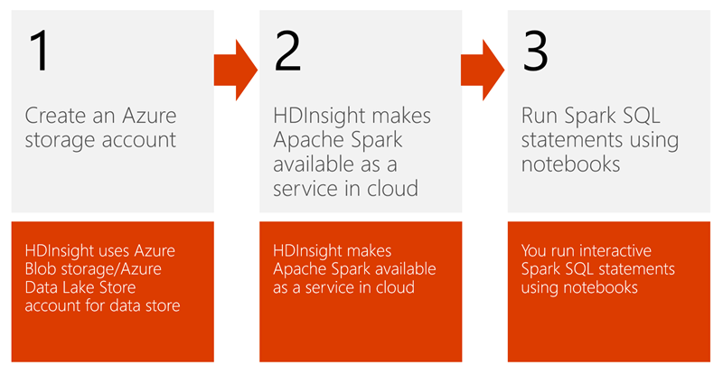
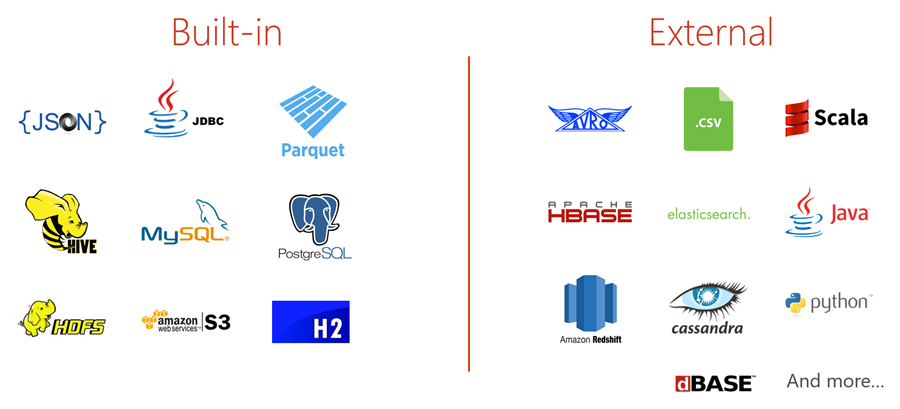

# Use Spark SQL with HDInsight

Spark SQL functions as an extension to [Spark](https://docs.microsoft.com/azure/hdinsight/hdinsight-apache-spark-overview) for processing structured data. It has been part of the core distribution since Spark 1.0 (April 2014), and is a distributed SQL query engine. It also functions as a general purpose distributed data processing API.

To use Spark SQL, first create an Azure storage account, which HDInsight uses to store data within a blob container. Alternately, you can use an Azure Data Lake Store account.
Next, HDInsight will make Apache Spark available as a service in the cloud. Using this service, we can run Spark SQL statements against our stored data by using notebooks.

## Spark SQL data sources

Spark SQL supports both SQL and HiveQL as query languages. Its capabilities include binding in Python, Scala, and Java. With it, you can query data stored in many locations, such as external databases, structured data files (example: JSON), and Hive tables.

There are many built-in data sources that come prepackaged with the Spark distribution. The Data Sources API provides an integration point for external developers to add support for custom data sources. Visit [spark-packages.org](https://spark-packages.org/) to find custom data sources contributed by the community.

## SparkSession

The entry point into all functionality in Spark SQL is the `SparkSession` class. Use the `SparkSession.builder()` method to create a basic `SparkSession` object:

    import org.apache.spark.sql.SparkSession

    val spark = SparkSession
    .builder()
    .appName("Spark SQL basic example")
    .config("spark.some.config.option", "some-value")
    .getOrCreate()

    // For implicit conversions like converting RDDs to DataFrames
    import spark.implicits._

`SparkSession` is new to Spark 2.0. In earlier versions, you have the choice between a `SQLContext` and a `HiveContext`. These two older contexts are kept for backward compatibility.

`SparkSession` also allows you to:
* Write using the more complete HiveQL parser
* Gain access to Hive UDFs
* Read data from Hive Tables

You do not need to have an existing Hive setup to write HiveQL queries with `SparkSession`.

## See also

* Some overview link

### Scenarios

