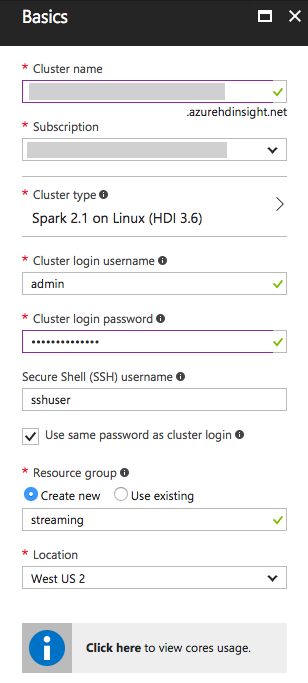
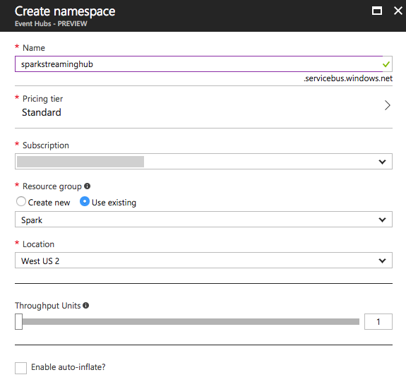
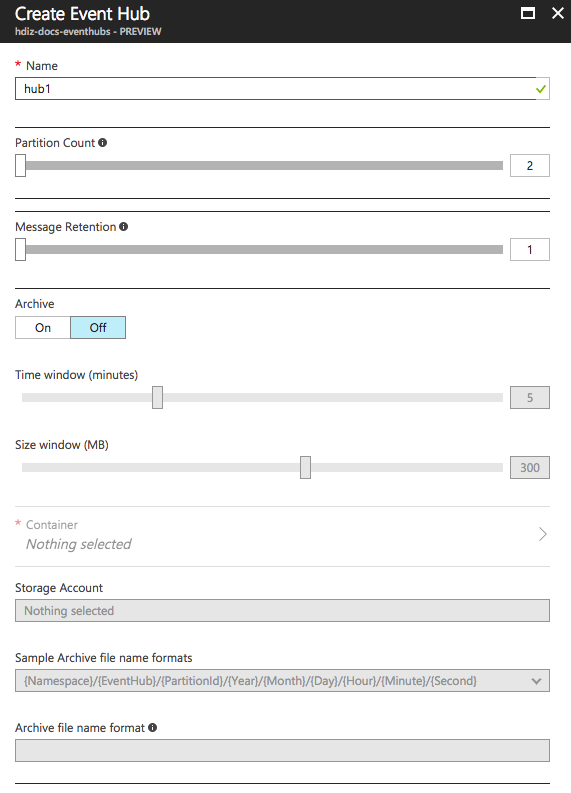
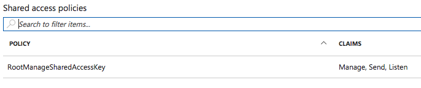
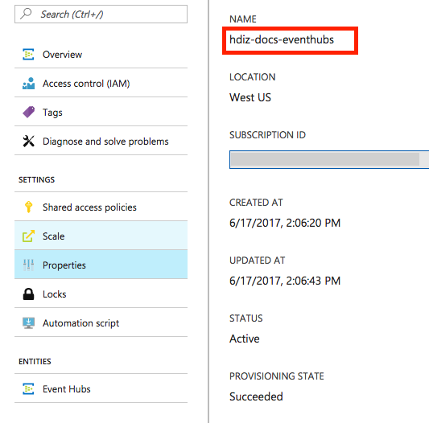

# Using Spark Structured Streaming on HDInsight to process events from Event Hubs

In this article you will learn to process real-time telemetry using Spark Structured Streaming. To accomplish this you will perform the following high-level steps:

1. Provision an HDInsight cluster with Spark 2.1.
2. Provision an Event Hubs instance.
3. Compile and run on your local workstation a sample Event Producer application that generates events to send to Event Hubs.
4. Use the [Spark Shell](hdinsight-spark-shell.md) to define and run a simple Spark Structured Streaming application.

## Prerequisites

* An Azure subscription. See [Get Azure free trial](https://azure.microsoft.com/documentation/videos/get-azure-free-trial-for-testing-hadoop-in-hdinsight/).

Make sure you have the following installed on the computer where you run Event Producer application:

* Oracle Java Development kit. You can install it from [here](http://www.oracle.com/technetwork/java/javase/downloads/jdk8-downloads-2133151.html).
* Apache Maven. You can download it from [here](https://maven.apache.org/download.cgi). Instructions to install Maven are available [here](https://maven.apache.org/install.html).

## Provision an HDInsight cluster with Spark 2.1
To provision your HDInsight Cluster, follow these steps:

1. Sign in to the [Azure Portal](https://portal.azure.com/).
2. Select + New, Data + Analytics, HDInsight.

    

3. On the basics blade, provide a unique name for your cluster.
4. Select the Subscription in which to create the cluster.
5. Select Cluster type.
6. On the Cluster configuration blade, select Cluster type of Spark and Version Spark 2.1.0 (HDI 3.6). Select select to apply the cluster type.

    

7. Leave the Cluster login username as "admin".
8. Provide a password for the Cluster login password. This will be the password used for both admin and the sshuser accounts. 
9. Leave the Secure Shell (SSH) username as "sshuser".
10. Create a new Resource Group or select an existing one as your prefer.
11. Choose a Location in which to deploy your cluster.

    

12. Select Next.
13. On the Storage blade, leave Primary Storage type set to Azure Storage and Selection method set to My subscriptions.
14. Under Select a storage account, select Create new and provide a name for the new Storage Account. This account will act as the default storage for your cluster.
15. Enter a unique name for the new Storage Account.
16. Leave the remaining settings at their defaults and select Next.

    

17. On the Cluster summary blade, select Create. 

It will take about 20 minutes to provision your cluster. Continue on to the next section while the cluster provisons.

## Provison an Event Hubs namespace 
In this task you will provision the Event Hubs namespace that will ultimately contain your Event Hubs instance.

1. Continue in the [Azure Portal](https://portal.azure.com/).
2. Select + New, Internet of Things, Event Hubs.

    

3. On the Create namespace blade, provide a unique name for your Event Hubs namespace.
4. Leave the Pricing tier at Standard.
5. Choose a Subscription and Resource Group as appropriate.
6. For the Location, choose the same Location as you used for your HDInsight cluster.

    

7. Select Create.

## Provision an Event Hub 
In this task you will provison the Event Hub instance that will receive events from a sample application that generates random events, and that you will use as the source for events to process using Spark Structured Streaming. 

1. Once your Event Hubs namespace has provisioned, navigate to it in the [Azure Portal](https://portal.azure.com/).
2. At the top of the blade, select + Event Hub.

    

3. In the Create Event Hub blade, enter the name "hub1" for your Event Hub.
4. Leave the remaining settings at their defaults. Note that your Event Hub will have 2 partitions (as set in Partition Count). 

    

5. Select Create.
6. On your Event Hub namespace blade, select Shared access policies from the side menu.

    

7. In the list of Shared Access Policies, select the RootManageSharedAccessKey.

    

8. Copy the value under Primary Key and paste it into a temporary text file, this value is your Policy Key. Also, take note that the Policy Name is "RootManageSharedAccessKey". 

    

9. Close the Policy blade and select Properties from the side menu.

    

10. The value under Name is the your namespace, take note of this value along with your Policy Key and Name. Also, take note that the name of your Event Hub itself is "hub1". 

## Build, Configure and Run the Event Producer
In this task you will clone a sample application that creates random events and sends them to a configured Event Hub. This sample application is available in GitHub at [https://github.com/hdinsight/eventhubs-sample-event-producer](https://github.com/hdinsight/eventhubs-sample-event-producer).

1. Make sure you have the git tools installed. You can download from [GIT Downloads](http://www.git-scm.com/downloads). 
2. Open a command prompt or terminal shell and run the following command from the directory of your choice to clone the project.
        
        git clone https://github.com/hdinsight/eventhubs-sample-event-producer.git eventhubs-client-sample

3. This will create a new folder called eventhubs-client-sample. Within the shell or command prompt navigate into this folder.
4. Run Maven to build the application by using the following command.

          mvn package

5. Within the shell or command prompt, navigate into the target directory that is created and contains the file ``com-microsoft-azure-eventhubs-client-example-0.2.0.jar``.
6. Next, you will need to build up the command line to run the Event Producer against your Event Hub. Do this by replacing the values in the command as follows:

        java -cp com-microsoft-azure-eventhubs-client-example-0.2.0.jar com.microsoft.azure.eventhubs.client.example.EventhubsClientDriver --eventhubs-namespace "<namespace>" --eventhubs-name "hub1" --policy-name "RootManageSharedAccessKey" --policy-key "<policyKey>" --message-length 32 --thread-count 1 --message-count -1

7. For example, a complete command would look similar to the following:

        java -cp com-microsoft-azure-eventhubs-client-example-0.2.0.jar com.microsoft.azure.eventhubs.client.example.EventhubsClientDriver --eventhubs-namespace "sparkstreaming" --eventhubs-name "hub1" --policy-name "RootManageSharedAccessKey" --policy-key "2P1Q17Wd1rdLP1OZQYn6dD2S13Bb3nF3h2XZD9hvyyU=" --message-length 32 --thread-count 1 --message-count -1

8. The command will start up and if your configuration is correct in a few moments you will see output related to the events it is sending to your Event Hub, similar to the following:

        Map('policyKey -> 2P1Q17Wd1rdLP1OZQYn6dD2S13Bb3nF3h2XZD9hvyyU, 'eventhubsName -> hub1, 'policyName -> RootManageSharedAccessKey, 'eventhubsNamespace -> sparkstreaming, 'messageCount -> -1, 'messageLength -> 32, 'threadCount -> 1)
        Events per thread: -1 (-1 for unlimited)
        10 > Sun Jun 18 11:32:58 PDT 2017 > 1024 > 1024 > Sending event: ZZ93958saG5BUKbvUI9wHVmpuA2TrebS
        10 > Sun Jun 18 11:33:46 PDT 2017 > 2048 > 2048 > Sending event: RQorGRbTPp6U2wYzRSnZUlWEltRvTZ7R
        10 > Sun Jun 18 11:34:33 PDT 2017 > 3072 > 3072 > Sending event: 36Eoy2r8ptqibdlfCYSGgXe6ct4AyOX3
        10 > Sun Jun 18 11:35:19 PDT 2017 > 4096 > 4096 > Sending event: bPZma9V0CqOn6Hj9bhrrJT0bX2rbPSn3
        10 > Sun Jun 18 11:36:06 PDT 2017 > 5120 > 5120 > Sending event: H2TVD77HNTVyGsVcj76g0daVnYxN4Sqs

9. Leave the Event Producer running while you continue on to the steps.

## Run Spark Shell on your HDInsight cluster
In this task, you will SSH into the head node of your HDInsight cluster, launch the Spark Shell and run a Spark Streaming application that will retrieve and process the events from Event Hubs. 

By this point your HDInsight cluster should be ready. If not, you will need to wait until it finishes provisioning. Once it is ready, proceed with the following steps.

1. Navigate to your deployed HDInsight cluster in the [Azure Portal](https://portal.azure.com/).
2. Select Secure Shell.

    

3. Follow the instructions displayed for connecting to your cluster via SSH from your local environment. In general, this will mean running SSH as follows:

        ssh sshuser@<yourclustername>-ssh.azurehdinsight.net

4. Complete the login by providing the password you supplied when provisioning the cluster.
5. The application you will build requires the Spark Streaming Event Hubs package. To run the Spark Shell so that it automatically retrieves this depedency from [Maven Central](https://search.maven.org), be sure the supply the packages switch with the Maven coordinates as follows:

        spark-shell --packages "com.microsoft.azure:spark-streaming-eventhubs_2.11:2.1.0"

6. Once the Spark Shell is finished loading, you should see:

        Welcome to
            ____              __
            / __/__  ___ _____/ /__
            _\ \/ _ \/ _ `/ __/  '_/
        /___/ .__/\_,_/_/ /_/\_\   version 2.1.0.2.6.0.10-29
            /_/
                
        Using Scala version 2.11.8 (OpenJDK 64-Bit Server VM, Java 1.8.0_131)
        Type in expressions to have them evaluated.
        Type :help for more information.

        scala> 

7. Copy the following code snippet into a text editor and modify it so it has the Policy Key and Namespace set as appropriate for your Event Hub.

        val eventhubParameters = Map[String, String] (
            "eventhubs.policyname" -> "RootManageSharedAccessKey",
            "eventhubs.policykey" -> "<policyKey>",
            "eventhubs.namespace" -> "<namespace>",
            "eventhubs.name" -> "hub1",
            "eventhubs.partition.count" -> "2",
            "eventhubs.consumergroup" -> "$Default",
            "eventhubs.progressTrackingDir" -> "/eventhubs/progress",
            "eventhubs.sql.containsProperties" -> "true"
            )

8. Paste the modified snippet into the waiting scala> prompt and press return. You should see output similar to:

        scala> val eventhubParameters = Map[String, String] (
            |       "eventhubs.policyname" -> "RootManageSharedAccessKey",
            |       "eventhubs.policykey" -> "2P1Q17Wd1rdLP1OZQYn6dD2S13Bb3nF3h2XZD9hvyyU",
            |       "eventhubs.namespace" -> "sparkstreaming",
            |       "eventhubs.name" -> "hub1",
            |       "eventhubs.partition.count" -> "2",
            |       "eventhubs.consumergroup" -> "$Default",
            |       "eventhubs.progressTrackingDir" -> "/eventhubs/progress",
            |       "eventhubs.sql.containsProperties" -> "true"
            |     )
        eventhubParameters: scala.collection.immutable.Map[String,String] = Map(eventhubs.sql.containsProperties -> true, eventhubs.name -> hub1, eventhubs.consumergroup -> $Default, eventhubs.partition.count -> 2, eventhubs.progressTrackingDir -> /eventhubs/progress, eventhubs.policykey -> 2P1Q17Wd1rdLP1OZQYn6dD2S13Bb3nF3h2XZD9hvyyU, eventhubs.namespace -> hdiz-docs-eventhubs, eventhubs.policyname -> RootManageSharedAccessKey)

9. Next, you will begin to author a Spark Structured Streaming query be specifying the source. Paste the following into Spark Shell and press return.

        val inputStream = spark.readStream.
        format("eventhubs").
        options(eventhubParameters).
        load()

10. You should see output similar to:

        inputStream: org.apache.spark.sql.DataFrame = [body: binary, offset: bigint ... 5 more fields]

11. Next, author the query so that it writes its output to the Console. Do this by pasting the following into Spark Shell and pressing return.

        val streamingQuery1 = inputStream.writeStream.
        outputMode("append").
        format("console").start().awaitTermination()

12. You should see some batches start with output similar to the following

        -------------------------------------------
        Batch: 0
        -------------------------------------------
        [Stage 0:>                                                          (0 + 2) / 2]

13. This will be followed by the ouput results of the processing of each microbatch of events. 

        -------------------------------------------
        Batch: 0
        -------------------------------------------
        17/06/18 18:57:39 WARN TaskSetManager: Stage 1 contains a task of very large size (419 KB). The maximum recommended task size is 100 KB.
        +--------------------+------+---------+------------+---------+------------+----------+
        |                body|offset|seqNumber|enqueuedTime|publisher|partitionKey|properties|
        +--------------------+------+---------+------------+---------+------------+----------+
        |[7B 22 74 65 6D 7...|     0|        0|  1497734887|     null|        null|     Map()|
        |[7B 22 74 65 6D 7...|   112|        1|  1497734887|     null|        null|     Map()|
        |[7B 22 74 65 6D 7...|   224|        2|  1497734887|     null|        null|     Map()|
        |[7B 22 74 65 6D 7...|   336|        3|  1497734887|     null|        null|     Map()|
        |[7B 22 74 65 6D 7...|   448|        4|  1497734887|     null|        null|     Map()|
        |[7B 22 74 65 6D 7...|   560|        5|  1497734887|     null|        null|     Map()|
        |[7B 22 74 65 6D 7...|   672|        6|  1497734887|     null|        null|     Map()|
        |[7B 22 74 65 6D 7...|   784|        7|  1497734888|     null|        null|     Map()|
        |[7B 22 74 65 6D 7...|   896|        8|  1497734888|     null|        null|     Map()|
        |[7B 22 74 65 6D 7...|  1008|        9|  1497734888|     null|        null|     Map()|
        |[7B 22 74 65 6D 7...|  1120|       10|  1497734888|     null|        null|     Map()|
        |[7B 22 74 65 6D 7...|  1232|       11|  1497734888|     null|        null|     Map()|
        |[7B 22 74 65 6D 7...|  1344|       12|  1497734888|     null|        null|     Map()|
        |[7B 22 74 65 6D 7...|  1456|       13|  1497734888|     null|        null|     Map()|
        |[7B 22 74 65 6D 7...|  1568|       14|  1497734888|     null|        null|     Map()|
        |[7B 22 74 65 6D 7...|  1680|       15|  1497734888|     null|        null|     Map()|
        |[7B 22 74 65 6D 7...|  1792|       16|  1497734888|     null|        null|     Map()|
        |[7B 22 74 65 6D 7...|  1904|       17|  1497734888|     null|        null|     Map()|
        |[7B 22 74 65 6D 7...|  2016|       18|  1497734889|     null|        null|     Map()|
        |[7B 22 74 65 6D 7...|  2128|       19|  1497734889|     null|        null|     Map()|
        +--------------------+------+---------+------------+---------+------------+----------+
        only showing top 20 rows

14. As new events arrive from the Event Producer, they will be processed by this Structured Streaming query.
15. Be sure to delete your HDInsight cluster when you are finished running this sample.

## See also
This article showed how to author a Spark Streaming application that processed events from Event Hubs. 

* For more information on Spark Structured Streaming in HDInsight, see [Spark Structured Streaming Overview](hdinsight-spark-structured-streaming-overview.md)

