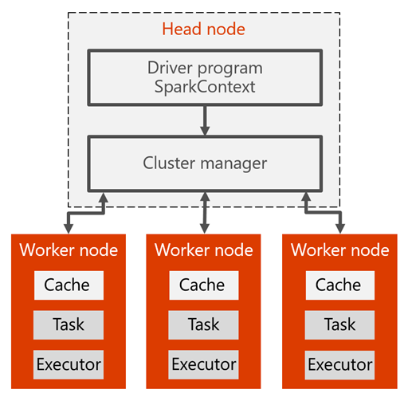

# Use Spark with HDInsight

[Spark on HDInsight](https://docs.microsoft.com/azure/hdinsight/hdinsight-apache-spark-overview) provides us with a unified framework for running large-scale data analytics applications that capitalizes on an in-memory compute engine at its core, for high performance querying on big data. It leverages a parallel data processing framework that persists data in-memory and disk if needed. This allows Spark to deliver both 100x faster speed and a common execution model to various tasks like extract, transform, load (otherwise known as ETL), batch, and interactive queries on data in Hadoop distributed file system (or, HDFS). One of the advantages Spark's unified framework gives us, is the ability to use the same code for both batch processing and realtime stream processing.

## Spark cluster architecture

Here is the Spark cluster architecture and how it works:

In the head node, we have the Spark master that manages the number of applications, the apps are mapped to the Spark driver. Every app is managed by Spark master in various way. Spark can be deployed on top of Mesos, Yarn, or the Spark cluster manager, which allocates worker node resources to an application. The resources in the cluster are managed by Spark master in the HDInsight. That means the Spark master has knowledge of which resources, like memory, are occupied or available on the worker node.

The driver runs the user's main function and executes the various parallel operations on the worker nodes. Then, the driver collects the results of the operations. The worker nodes read and write data from and to the Hadoop distributed file system (HDFS). The worker nodes also cache transformed data in-memory as Resiliant Distributed Datasets (RDDs).

## The Spark cluster architecture driver

The driver performs the following:

Once the app is created in the Spark master, the resources are allocated to the apps by Spark master, creating an execution called the Spark driver. The Spark driver basically creates the SparkContext. When it creates the SparkContext, it starts creating the RDDs. The metadata of the RDDs are stored on the Spark driver.

The Spark driver connects to the Spark master and is responsible for converting an application to a directed graph (DAG) of individual tasks that get executed within an executor process on the worker nodes. Each application gets its own executor processes, which stay up for the duration of the whole application and run tasks in multiple threads.

Submit [remote batch jobs](https://docs.microsoft.com/azure/hdinsight/hdinsight-apache-spark-livy-rest-interface) to an HDInsight Spark cluster.

## Batch processing in traditional MapReduce vs. Spark

What makes Spark fast? How is the architecture of Apache Spark different than traditional MapReduce, allowing it to offer better performance for data sharing?

Spark provides primitives for in-memory cluster computing. A Spark job can load and cache data into memory and query it repeatedly, much more quickly than disk-based systems. Spark also integrates into the Scala programming language to let you manipulate distributed data sets like local collections. There's no need to structure everything as map and reduce operations.

Data sharing between operations is faster, since data is in-memory. Hadoop shares data through HDFS, an expensive option. It also maintains three replicas. Spark stores data in-memory without any replication.

## See also

* Some overview link

### Scenarios

