# Streaming and Business Intelligence

As IoT (Internet of Things) devices, such as internet-connected sensors, appliances, business and consumer devices, continue to gain popularity, so does the need for businesses to act on this data in motion. Whether the device sending real-time data over the internet is a surgical robot, or one of hundreds of sensors on a race car, it is often necessary to rapidly collect and make sense of the data it produces.

Streaming data falls in the realm of real-time processing, which can be defined as processing a typically infinite stream of input data, whose time until results are ready is short - measured in milliseconds or seconds in the longest of cases. The sample in this article uses [Event Hubs](https://azure.microsoft.com/services/event-hubs/) to ingest simulated telemetry data from a temperature sensor. Another common entry point one might use for ingesting this type of data is [IoT Hub](https://azure.microsoft.com/services/iot-hub/), which offers bi-directional communication with billions of devices, and exposes an Event Hubs-compatible endpoint. Apache [Kafka](http://kafka.apache.org/) is yet another stream-ingestion broker one could use. We will be using Apache Spark [Structured Streaming](hdinsight-spark-structured-streaming-overview.md) to process the real-time telemetry data, and [HBase](hdinsight-hbase-overview.md) for long-term storage.

Collecting all of this raw data alone does not help business leaders make informed decisions, however. The data needs to be analyzed to detect anomalies, or other thresholds that trigger business rules. It also needs to be condensed down to manageable components so it can be visualized and made sense of. This end of the spectrum is known as Business Intelligence (BI).

The scenario we are using for this exercise, we are monitoring temperature readings from a ficticious Blue Yonders airport terminal. We have created a Node.js app to generate sample temperature telemetry and insert them into an Event Hubs instance. You will learn how to process this real-time data using Spark Structured Streaming. Data will be written to an HBase table as it is being processed, and visualized using [OpenTSDB](http://opentsdb.net/).

To accomplish these tasks, you will perform the following high-level steps:

1. Provision two HDInsight clusters, one with Spark 2.1, and the other with HBase.
2. Provision an Event Hubs instance.
3. Compile and run on your local workstation a sample Event Producer application that generates events to send to Event Hubs.
4. Use the [Spark Shell](hdinsight-spark-shell.md) to define and run a simple Spark Structured Streaming application.
5. Modify and compile a deployable Spark Structured Streaming application that writes processed data to HBase by sending event data to OpenTSDB through its HTTP API.
6. Configure and use OpenTSDB for BI reporting.

## Prerequisites

* An Azure subscription. See [Get Azure free trial](http://azure.microsoft.com/documentation/videos/get-azure-free-trial-for-testing-hadoop-in-hdinsight/).
  
  > [!IMPORTANT]
  > You do not need an existing HDInsight cluster. The steps in this document create the following resources:
  > 
  > * A Spark on HDInsight cluster (four worker nodes)
  > * An HBase on HDInsight cluster (four worker nodes)

* [Node.js](http://nodejs.org/): Used generate sample temperature event data from your local machine.
* [Maven](http://maven.apache.org/what-is-maven.html): Used to build and compile the project.
* [Git](http://git-scm.com/): Used to download the project from GitHub.
* An **SSH** client: Used to connect to the HDInsight clusters. For more information, see [Use SSH with HDInsight](hdinsight-hadoop-linux-use-ssh-unix.md).


## Provison an Event Hubs namespace 
In this task you will provision the Event Hubs namespace that will ultimately contain your Event Hubs instance.

1. Continue in the [Azure Portal](https://portal.azure.com/).
2. Select + New, Internet of Things, Event Hubs.

    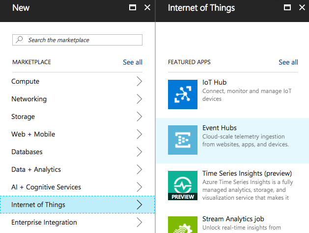

3. On the Create namespace blade, provide a unique name for your Event Hubs namespace.
4. Leave the Pricing tier at Standard.
5. Choose a Subscription and Resource Group as appropriate.
6. For the Location, choose the same Location as you used for your HDInsight cluster.

    

7. Select Create.

## Provision an Event Hub 
In this task you will provison the Event Hub instance that will receive events from a sample application that generates random events, and that you will use as the source for events to process using Spark Structured Streaming. 

1. Once your Event Hubs namespace has provisioned, navigate to it in the [Azure Portal](https://portal.azure.com/).
2. At the top of the blade, select + Event Hub.

    

3. In the Create Event Hub blade, enter the name "sensordata" for your Event Hub.
4. Leave the remaining settings at their defaults. Note that your Event Hub will have 2 partitions (as set in Partition Count). 

    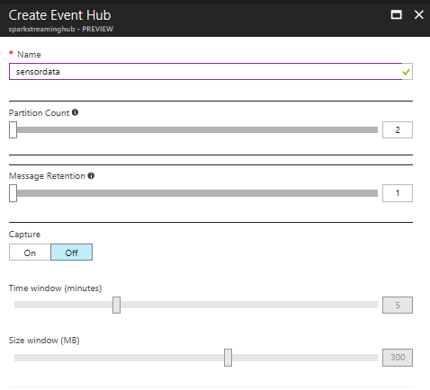

5. Select Create.
6. On your Event Hubs blade for your namespace, select **Event Hubs**. Select the **sensordata** entry.

7. Select **Shared access policies** from the side menu.

    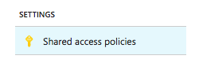

7. In the list of Shared Access Policies, click the **+ Add** link to add the following policies:

    | POLICY | CLAIMS |
	| ----- | ----- |
	| spark | Listen |
	| devices | Send |

8. Select both policies and copy the value under Primary Key for both, then paste them into a temporary text file. These values are your Policy Key for each policy. Also, take note that the Policy Names are "devices" and "spark". 

    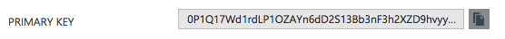

9. Close the Policy blade and select Properties from the side menu.

    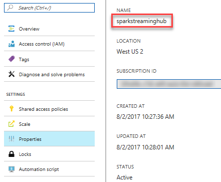

10. The value under Name is your namespace, take note of this value along with your Policy Keys and Names. Also, take note that the name of your Event Hub itself is "sensordata".


## Create an HBase cluster

The steps in this section use an [Azure Resource Manager template](../azure-resource-manager/resource-group-template-deploy.md) to create an Azure Virtual Network and a Spark and HBase cluster on the virtual network.

The Resource Manager template used in this document is located in the article's code repo located at (TODO: UPDATE URI HERE AND FOR BUTTON BELOW) **https://raw.githubusercontent.com/ZoinerTejada/hdinsight-docs/master/code/hdinsight-streaming-and-business-intelligence/create-hbase-cluster-with-opentsdb.json**.

1. Click the following button to sign in to Azure and open the Resource Manager template in the Azure portal.
   
    <a href="https://portal.azure.com/#create/Microsoft.Template/uri/https%3A%2F%2Fraw.githubusercontent.com%2FZoinerTejada%2Fhdinsight-docs%2Fmaster%2Fcode%2Fhdinsight-streaming-and-business-intelligence%2Fcreate-hbase-cluster-with-opentsdb.json" target="_blank"></a>

2. From the **Custom deployment** blade, enter the following values:
   
    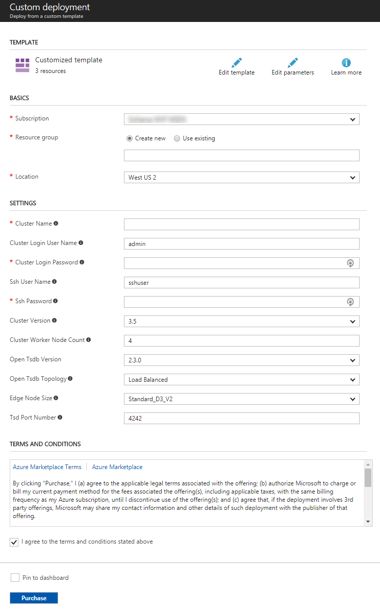
   
   * **Cluster Name**: This value (letters and numbers, no spaces) is used as the name of your provisioned HBase cluster. Be sure not to add any dashes or other special characters in the name.
   * **Cluster Login User Name**: The admin user name for the Spark and HBase clusters.
   * **Cluster Login Password**: The admin user password for the Spark and HBase clusters.
   * **SSH User Name**: The SSH user to create for the Spark and HBase clusters.
   * **SSH Password**: The password for the SSH user for the Spark and HBase clusters.
   * **Location**: The region that the clusters are created in.
   * **Open Tsdb Version**: The version of OpentTSDB you wish to install.
   * **Open Tsdb Topology**: The deployment topology for OpenTSDB on the cluster. 'Edge Node' installs 1 TSD instance on the edge node. 'Load Balanced' installs a TSD instance of every region server in the cluster and a load balancer on the edge node distributes traffic.
   * **Edge Node Size**: Size of the edge node that hosts the OpenTSDB application.
   * **Tsd Port Number**: The port number on which the TSD services should listen to requests.
     
     Click **OK** to save the parameters.

3. Use the **Basics** section to select the Resource Group you used for your Event Hub.
4. Read the terms and conditions, and then select **I agree to the terms and conditions stated above**.
5. Finally, check **Pin to dashboard** and then select **Purchase**. It takes about 20 minutes to create the cluster.

Once the resources have been created, you are redirected to a blade for the resource group that contains the cluster.

Make note of the cluster name for later.


## Provision an HDInsight cluster with Spark 2.1

To provision your HDInsight Spark cluster, follow these steps:

1. Sign in to the [Azure Portal](https://portal.azure.com/).
2. Select + New, Data + Analytics, HDInsight.

    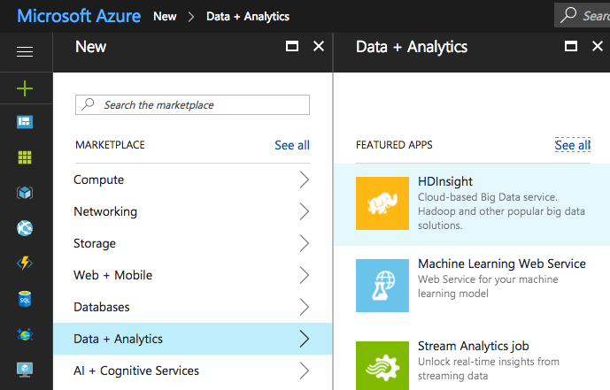

3. On the basics blade, provide a unique name for your cluster.
4. Select the Subscription in which to create the cluster.
5. Select Cluster type.
6. On the Cluster configuration blade, select Cluster type of Spark and Version Spark 2.1.0 (HDI 3.6). Click select to apply the cluster type.

    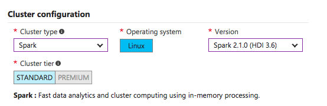

7. Leave the Cluster login username as "admin".
8. Provide a password for the Cluster login password. This will be the password used for both admin and the sshuser accounts. 
9. Leave the Secure Shell (SSH) username as "sshuser".
10. Select the same resource group you used when you created the HBase cluster.
11. Choose the same Location you selected for the HBase cluster, in which to deploy your Spark cluster.

    

12. Select Next.
13. On the Storage blade, leave Primary Storage type set to Azure Storage and Selection method set to My subscriptions.
14. Under Select a storage account, select Create new and provide a name for the new Storage Account. This account will act as the default storage for your cluster. Optionally, you can select the same storage account provisioned for the HBase cluster. Just be sure to enter a different container name.
15. Enter a unique name for the new Storage Account.
16. Leave the remaining settings at their defaults and select Next.

    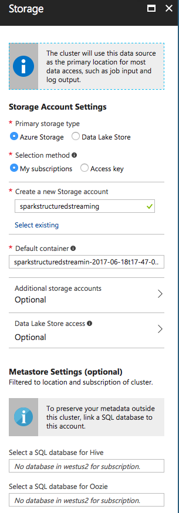

17. On the Cluster summary blade, select Create. 

It will take about 20 minutes to provision your cluster. Continue on to the next section while the cluster provisons.


## Download and configure the project

Use the following to [download the project from GitHub](./code/hdinsight-streaming-and-business-intelligence).

    git clone TODO: ENTER URI TO THE REPO

After the command completes, you have the following directory structure:

    hdinsight-streaming-and-business-intelligence/
        - SendAirportTempEvents/ <-- sends mock airport temperature sensor data to Event Hub.
        - BlueYonder/ <-- Apache Spark Structured Streaming app that processes the event data.
            -src/
                -main/
                    -resources/
                        -hive-config.xml
                    -scala/com/microsoft/examples
                        -BlueYonderMain
                        -HBaseSink
                        -OpenTSDBSink

> [!NOTE]
> This document does not go in to full details of the SendAirportTempEvents code included in this sample, but the code is fully commented. However, we will walk through the important aspects of the BlueYonder Structured Streaming app later on.

### Start generating data

1. Open a new command prompt, shell, or terminal, and change directories to **hdinsight-streaming-and-business-intelligence/SendAirportTempEvents/**. To install the dependencies needed by the application, use the following command:
   
        npm install

2. Open the **app.js** file in a text editor and add the Event Hub information you obtained earlier:
   
        // Event Hub Namespace
        var namespace = 'YOUR_NAMESPACE';
        // Event Hub Name
        var hubname ='sensordata';
        // Shared access Policy name and key (from Event Hub configuration)
        var my_key_name = 'devices';
        var my_key = 'YOUR_KEY';
   
   > [!NOTE]
   > This example assumes that you have used **sensordata** as the name of your Event Hub, and **devices** as the name of the policy that has a **Send** claim.

3. Use the following command to insert new entries in Event Hub:
   
        node app.js
   
    You will see several lines of output that contain the data sent to Event Hub:

    ```   
    ...
    ...
    {"TimeStamp":"2017-08-03T04:29:50Z","DeviceId":"3","Temperature":62}
    {"TimeStamp":"2017-08-03T04:30:00Z","DeviceId":"1","Temperature":65}
    {"TimeStamp":"2017-08-03T04:30:00Z","DeviceId":"2","Temperature":65}
    {"TimeStamp":"2017-08-03T04:30:00Z","DeviceId":"3","Temperature":62}
    {"TimeStamp":"2017-08-03T04:30:10Z","DeviceId":"1","Temperature":65}
    {"TimeStamp":"2017-08-03T04:30:10Z","DeviceId":"2","Temperature":65.05555555555556}
    {"TimeStamp":"2017-08-03T04:30:10Z","DeviceId":"3","Temperature":62}
    {"TimeStamp":"2017-08-03T04:30:20Z","DeviceId":"1","Temperature":65}
    {"TimeStamp":"2017-08-03T04:30:20Z","DeviceId":"2","Temperature":65.11111111111111}
    {"TimeStamp":"2017-08-03T04:30:20Z","DeviceId":"3","Temperature":62}
    {"TimeStamp":"2017-08-03T04:30:30Z","DeviceId":"1","Temperature":65}
    {"TimeStamp":"2017-08-03T04:30:30Z","DeviceId":"2","Temperature":65.16666666666667}
    {"TimeStamp":"2017-08-03T04:30:30Z","DeviceId":"3","Temperature":62}
    {"TimeStamp":"2017-08-03T04:30:40Z","DeviceId":"1","Temperature":65}
    {"TimeStamp":"2017-08-03T04:30:40Z","DeviceId":"2","Temperature":65.22222222222223}
    {"TimeStamp":"2017-08-03T04:30:40Z","DeviceId":"3","Temperature":62}
    {"TimeStamp":"2017-08-03T04:30:50Z","DeviceId":"1","Temperature":65}
    {"TimeStamp":"2017-08-03T04:30:50Z","DeviceId":"2","Temperature":65.27777777777779}
    {"TimeStamp":"2017-08-03T04:30:50Z","DeviceId":"3","Temperature":62}
    {"TimeStamp":"2017-08-03T04:31:00Z","DeviceId":"1","Temperature":65}
    {"TimeStamp":"2017-08-03T04:31:00Z","DeviceId":"2","Temperature":65.33333333333334}
    {"TimeStamp":"2017-08-03T04:31:00Z","DeviceId":"3","Temperature":62}
    {"TimeStamp":"2017-08-03T04:31:10Z","DeviceId":"1","Temperature":65}
    {"TimeStamp":"2017-08-03T04:31:10Z","DeviceId":"2","Temperature":65.3888888888889}
    {"TimeStamp":"2017-08-03T04:31:10Z","DeviceId":"3","Temperature":62}
    {"TimeStamp":"2017-08-03T04:31:20Z","DeviceId":"1","Temperature":65}
    {"TimeStamp":"2017-08-03T04:31:20Z","DeviceId":"2","Temperature":65.44444444444446}
    {"TimeStamp":"2017-08-03T04:31:20Z","DeviceId":"3","Temperature":62}
    {"TimeStamp":"2017-08-03T04:31:30Z","DeviceId":"1","Temperature":65}
    {"TimeStamp":"2017-08-03T04:31:30Z","DeviceId":"2","Temperature":65.50000000000001}
    {"TimeStamp":"2017-08-03T04:31:30Z","DeviceId":"3","Temperature":62}
    {"TimeStamp":"2017-08-03T04:31:40Z","DeviceId":"1","Temperature":65}
    {"TimeStamp":"2017-08-03T04:31:40Z","DeviceId":"2","Temperature":65.55555555555557}
    {"TimeStamp":"2017-08-03T04:31:40Z","DeviceId":"3","Temperature":62}
    {"TimeStamp":"2017-08-03T04:31:50Z","DeviceId":"1","Temperature":65}
    {"TimeStamp":"2017-08-03T04:31:50Z","DeviceId":"2","Temperature":65.61111111111113}
    {"TimeStamp":"2017-08-03T04:31:50Z","DeviceId":"3","Temperature":62}
    {"TimeStamp":"2017-08-03T04:32:00Z","DeviceId":"1","Temperature":65}
    {"TimeStamp":"2017-08-03T04:32:00Z","DeviceId":"2","Temperature":65.66666666666669}
    {"TimeStamp":"2017-08-03T04:32:00Z","DeviceId":"3","Temperature":62}
    {"TimeStamp":"2017-08-03T04:32:10Z","DeviceId":"1","Temperature":65}
    {"TimeStamp":"2017-08-03T04:32:10Z","DeviceId":"2","Temperature":65.72222222222224}
    {"TimeStamp":"2017-08-03T04:32:10Z","DeviceId":"3","Temperature":62}
    {"TimeStamp":"2017-08-03T04:32:20Z","DeviceId":"1","Temperature":65}
    {"TimeStamp":"2017-08-03T04:32:20Z","DeviceId":"2","Temperature":65.7777777777778}
    {"TimeStamp":"2017-08-03T04:32:20Z","DeviceId":"3","Temperature":62}
    {"TimeStamp":"2017-08-03T04:32:30Z","DeviceId":"1","Temperature":65}
    {"TimeStamp":"2017-08-03T04:32:30Z","DeviceId":"2","Temperature":65.83333333333336}
    ...
    ...
    ```

4. Leave the event generator running while you continue the following steps.

Sample data is loaded one at a time (8,640 * # of devices total) to simulate a data stream, for a period representing 24 hours of temperature data from an airport terminal. Rooms start at an ambient temperature (such as 65 F), and depending on the room, flights occur every 90 minutes between 5:00am and 12:00am. As people arrive 30 minutes prior to a flight, the temperature starts to rise (5 degrees or more, depending on number of people), due to warmth from bodies. 30 minutes after the flight arrives, people are boarded, and the temperature starts to drop towards ambient temperature.

If you wish to batch load the data to quickly insert the same amount of data 500 events at a time, execute the app using the `-batch` argument (`node app.js -batch`).


## Run Spark Shell on your HDInsight cluster

In this task, you will SSH into the head node of your HDInsight cluster, launch the Spark Shell and run a Spark Streaming application that will retrieve and process the events from Event Hubs. This step is to demonstrate viewing the generated data stream using Structured Streaming. You will deploy the full streaming app later on.

By this point your HDInsight cluster should be ready. If not, you will need to wait until it finishes provisioning. Once it is ready, proceed with the following steps.

1. Navigate to your deployed HDInsight Spark cluster in the [Azure Portal](https://portal.azure.com/).
2. Select Secure Shell.

    

3. Follow the instructions displayed for connecting to your cluster via SSH from your local environment. In general, this will mean running SSH as follows:

        ssh sshuser@<yourclustername>-ssh.azurehdinsight.net

4. Complete the login by providing the password you supplied when provisioning the cluster.
5. The application you will build requires the Spark Streaming Event Hubs package. To run the Spark Shell so that it automatically retrieves this depedency from [Maven Central](https://search.maven.org), be sure the supply the packages switch with the Maven coordinates as follows:

    ```
    spark-shell --packages "com.microsoft.azure:spark-streaming-eventhubs_2.11:2.1.0"
    ```

6. Once the Spark Shell is finished loading, you should see:

    ```
    Welcome to
        ____              __
        / __/__  ___ _____/ /__
        _\ \/ _ \/ _ `/ __/  '_/
    /___/ .__/\_,_/_/ /_/\_\   version 2.1.1.2.6.1.3-4
        /_/

    Using Scala version 2.11.8 (OpenJDK 64-Bit Server VM, Java 1.8.0_131)
    Type in expressions to have them evaluated.
    Type :help for more information.

    scala>
    ```

7. Copy the following code snippet into a text editor and modify it so it has the Policy Key and Namespace set as appropriate for your Event Hub.

    ```scala
    val eventhubParameters = Map[String, String] (
        "eventhubs.policyname" -> "spark",
        "eventhubs.policykey" -> "<policyKey>",
        "eventhubs.namespace" -> "<namespace>",
        "eventhubs.name" -> "sensordata",
        "eventhubs.partition.count" -> "2",
        "eventhubs.consumergroup" -> "$Default",
        "eventhubs.progressTrackingDir" -> "/eventhubs/progress",
        "eventhubs.sql.containsProperties" -> "true"
        )
    ```

8. Paste the modified snippet into the waiting scala> prompt and press return. You should see output similar to:

    ```
    scala> val eventhubParameters = Map[String, String] (
     |      "eventhubs.policyname" -> "spark",
     |      "eventhubs.policykey" -> "HgpaccWculGlB78BaYSKkhk3YZMogAKd5BJnLcVr/h8=",
     |      "eventhubs.namespace" -> "sparkstreaminghub",
     |      "eventhubs.name" -> "sensordata",
     |      "eventhubs.partition.count" -> "2",
     |      "eventhubs.consumergroup" -> "$Default",
     |      "eventhubs.progressTrackingDir" -> "/eventhubs/progress",
     |      "eventhubs.sql.containsProperties" -> "true"
     |      )
    eventhubParameters: scala.collection.immutable.Map[String,String] = Map(eventhubs.sql.containsProperties -> true, eventhubs.name -> sensordata, eventhubs.consumergroup -> $Default, eventhubs.partition.count -> 2, eventhubs.progressTrackingDir -> /eventhubs/progress, eventhubs.policykey -> HgpaccWculGlB78BaYSKkhk3YZMogAKd5BJnLcVr/h8=, eventhubs.namespace -> sparkstreaminghub, eventhubs.policyname -> spark)
    ```

9. Next, you will begin to author a Spark Structured Streaming query by specifying the source. Paste the following into Spark Shell and press return.

    ```scala
    val inputStream = spark.readStream.
    format("eventhubs").
    options(eventhubParameters).
    load()
    ```

10. You should see output similar to:

    ```
    inputStream: org.apache.spark.sql.DataFrame = [body: binary, offset: bigint ... 5 more fields]
    ```

11. As you can see in the previous output, the `body` is in binary format. To view our device data, we need to parse its contents. To do this, paste the following into Spark Shell and press return.

    ```scala
    var inputSelect = inputStream.select(get_json_object(($"body").cast("string"), "$.Temperature").alias("Temperature"), get_json_object(($"body").cast("string"), "$.TimeStamp").alias("TimeStamp"), get_json_object(($"body").cast("string"), "$.DeviceId").alias("DeviceId"))
    ```

12. You should see output similar to:

    ```
    inputSelect: org.apache.spark.sql.DataFrame = [Temperature: string, TimeStamp: string ... 1 more field]
    ```

11. Next, author the query so that it writes its output to the Console. Do this by pasting the following into Spark Shell and pressing return.

    ```scala
    val streamingQuery1 = inputSelect.writeStream.
    outputMode("append").
    format("console").start().awaitTermination()
    ```

12. You should see some batches start with output similar to the following

        -------------------------------------------
        Batch: 0
        -------------------------------------------
        [Stage 0:>                                                          (0 + 2) / 2]

13. This will be followed by the ouput results of the processing of each microbatch of events. 

    ```
    -------------------------------------------
    Batch: 0
    -------------------------------------------
    17/08/03 14:14:51 WARN TaskSetManager: Stage 1 contains a task of very large size (274 KB). The maximum recommended task size is 100 KB.
    +-----------------+--------------------+--------+
    |      Temperature|           TimeStamp|DeviceId|
    +-----------------+--------------------+--------+
    | 65.0277777777776|2017-08-04T21:18:10Z|       3|
    |  66.944444444444|2017-08-04T21:18:20Z|       1|
    |71.11111111111128|2017-08-04T21:18:20Z|       2|
    |65.05555555555537|2017-08-04T21:18:20Z|       3|
    |66.91666666666623|2017-08-04T21:18:30Z|       1|
    |71.16666666666684|2017-08-04T21:18:30Z|       2|
    |65.08333333333314|2017-08-04T21:18:30Z|       3|
    |66.88888888888846|2017-08-04T21:18:40Z|       1|
    | 71.2222222222224|2017-08-04T21:18:40Z|       2|
    |65.11111111111092|2017-08-04T21:18:40Z|       3|
    |66.86111111111069|2017-08-04T21:18:50Z|       1|
    |71.27777777777796|2017-08-04T21:18:50Z|       2|
    |65.13888888888869|2017-08-04T21:18:50Z|       3|
    |66.83333333333292|2017-08-04T21:19:00Z|       1|
    |71.33333333333351|2017-08-04T21:19:00Z|       2|
    |65.16666666666646|2017-08-04T21:19:00Z|       3|
    |66.80555555555515|2017-08-04T21:19:10Z|       1|
    |71.38888888888907|2017-08-04T21:19:10Z|       2|
    |65.19444444444423|2017-08-04T21:19:10Z|       3|
    |66.77777777777737|2017-08-04T21:19:20Z|       1|
    +-----------------+--------------------+--------+
    only showing top 20 rows
    ```

14. As new events arrive from the Event Producer, they will be processed by this Structured Streaming query.

15. End this process by entering `Ctrl+C` (Windows) / `Cmd+C` (Mac), since we will be deploying our processor app.


### Configure and build the Spark app

1. Open the BlueYonder project in your favorite scala IDE. In our case, we'll open it in [IntelliJ](https://www.jetbrains.com/idea/download/) Community edition.

2. Open the **BlueYonderMain.scala** file and add the Event Hub information you obtained earlier:
   
    ```scala
    // Set your event hub values here:
    val eventhubParameters = Map[String, String] (
      "eventhubs.policyname" -> "spark",
      "eventhubs.policykey" -> "YOUR_KEY",
      "eventhubs.namespace" -> "YOUR_NAMESPACE",
      "eventhubs.name" -> "sensordata",
      "eventhubs.partition.count" -> "2",
      "eventhubs.consumergroup" -> "$Default",
      "eventhubs.progressTrackingDir" -> "/eventhubs/progress",
      "eventhubs.sql.containsProperties" -> "true"
    )
    val openTSDB_URL = "https://YOUR_OPENTSDB_URL/api/put"  // "https://streamingbi-tdb.apps.azurehdinsight.net/api/put"
    val creds = "admin:YOUR_PASSWORD"
    ```
   
   > [!NOTE]
   > This example assumes that you have used **sensordata** as the name of your Event Hub, and **spark** as the name of the policy that has a **Listen** claim.

   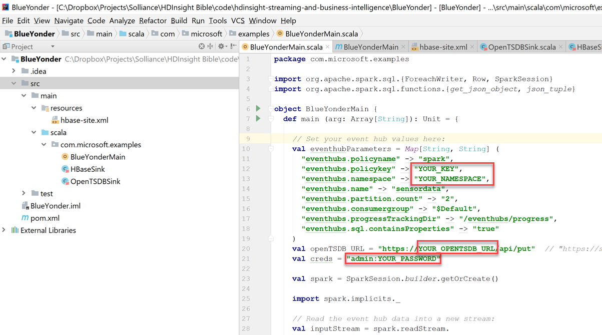

   Change the following:

   * **eventhubs.policykey**: Change "YOUR_KEY" to your listener policy's (such as _spark_) key.
   * **eventhubs.namespace**: Change "YOUR_NAMESPACE" to the Event Hubs namespace.
   * **val creds**: Change "admin:YOUR_PASSWORD" to the admin password you set when you provisioned your HBase cluster. Used for authenticating OpentTSDB POST requests.
   * **val openTSDB_URL**: Change "YOUR_OPENTSDB_URL" to the URL for your installed OpenTSDB app. To find this, go to your HBase cluster in the Azure Portal. Click **Applications** on the left-hand menu, then select the **opentsdb** application to view its properties. Copy its WEBPAGE URL. The `openTSDB_URL` value should be similar to `https://streamingbi-tdb.apps.azurehdinsight.net/api/put`. Make sure the URL ends with **`/api/put`**.

   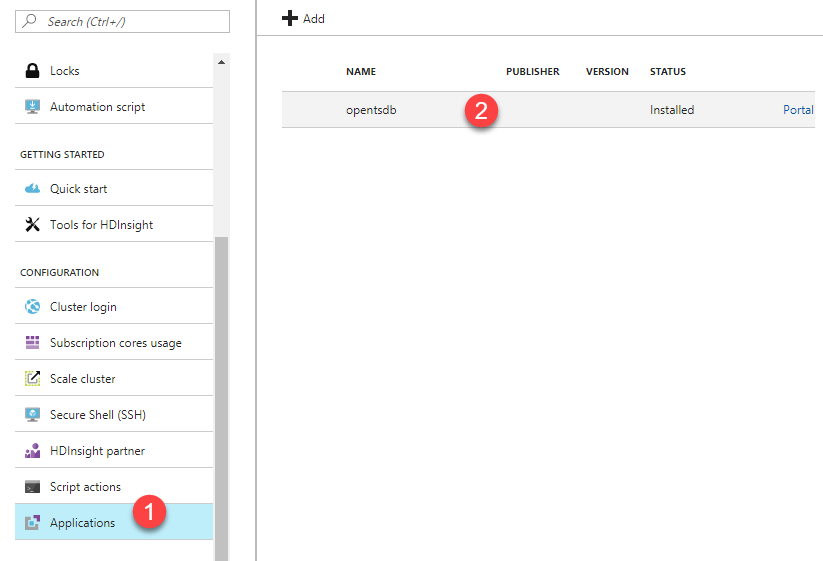

   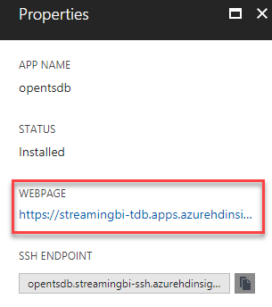

3. Build the application by clicking **Build** --> **Build Artifacts...** from the menu.

     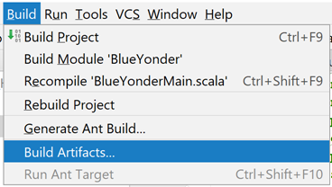

     Then click the **Build** action underneath the BlueYonder_DefaultArtifact artifact within the Build Artifact menu.

      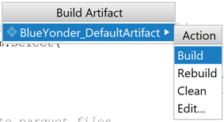


### Upload and execute the app

From a bash shell prompt for SCP, or command prompt for PSCP, upload the compiled JAR file to the local storage of your HDInsight cluster head node. As done earlier, replace **USERNAME** with the SSH user you provided when creating the cluster, and **SPARKCLUSTERNAME** with the name you provided earlier for your Spark cluster. When prompted, enter the password for the SSH user. Replace the `/path/to/BlueYonder/out/artifacts/BlueYonder_DefaultArtifact/default_artifact.jar` with the path to this file in the BlueYonder project.

    scp /path/to/BlueYonder/out/artifacts/BlueYonder_DefaultArtifact/default_artifact.jar USERNAME@SPARKCLUSTERNAME-ssh.azurehdinsight.net:default_artifact.jar

Example using PSCP:

    pscp "c:\path\to\BlueYonder\out\artifacts\BlueYonder_DefaultArtifact\default_artifact.jar" USERNAME@SPARKCLUSTERNAME-ssh.azurehdinsight.net:default_artifact.jar

Now, SSH into your Spark cluster and use the `HDFS` command to copy the file from your head node local storage to Azure Storage:

    hdfs dfs -put ./default_artifact.jar /example/jars/default_artifact.jar

It is preferable to store the application in Azure Storage so that it is still accessible across your cluster's lifecycle. Meaning, if you were to delete and recreate your cluster, your app will still be available to run.

Next, execute the following command to submit and run the uploaded app, replacing **SPARKCLUSTERNAME** with the Spark cluster name you specified earlier, and **STORAGENAME** with the name of your cluster's default storage account:

    spark-submit --class com.microsoft.examples.BlueYonderMain --master yarn-cluster --packages "com.microsoft.azure:spark-streaming-eventhubs_2.11:2.1.0,org.apache.hbase:hbase-common:1.3.1,org.apache.hbase:hbase-server:1.3.1" wasb://SPARKCLUSTERNAME@STORAGENAME.blob.core.windows.net/example/jars/default_artifact.jar

> Note that when submitting spark jobs that use Azure Storage as the JAR's source, you need to specify the `--master` URL as either `yarn` or `yarn-cluster`. Also notice that we're using the `--packages` switch as maven coordinates to our app's dependencies.

You should see output that is constantly scrolling, similar to the following snapshot:

```
...
...
17/08/06 18:36:19 INFO Client: Application report for application_1502027043716_0004 (state: ACCEPTED)
17/08/06 18:36:19 INFO Client:
         client token: N/A
         diagnostics: AM container is launched, waiting for AM container to Register with RM
         ApplicationMaster host: N/A
         ApplicationMaster RPC port: -1
         queue: default
         start time: 1502044578458
         final status: UNDEFINED
         tracking URL: http://hn1-spark.4tssacnxawrelhhk15p2yjjggf.xx.internal.cloudapp.net:8088/proxy/application_1502027043716_0004/
         user: sshuser
17/08/06 18:36:20 INFO Client: Application report for application_1502027043716_0004 (state: ACCEPTED)
17/08/06 18:36:21 INFO Client: Application report for application_1502027043716_0004 (state: ACCEPTED)
17/08/06 18:36:22 INFO Client: Application report for application_1502027043716_0004 (state: ACCEPTED)
17/08/06 18:36:23 INFO Client: Application report for application_1502027043716_0004 (state: ACCEPTED)
...
...
```

Let this run in the background. At this time, the data generator should still be running as well, sending simulated streaming data to your event hub. If it has finished running, execute it once more from the command prompt with this command:

    node app.js


### What the Spark app is doing

The `com.microsoft.azure.spark-streaming-eventhubs` library processes streaming data from Event Hubs, and acts as an input source through the `DataStreamReader` interface. The result is a stream of untyped `Dataframe`s, meaning that the schema of the `DataFrame` is not checked at compile time. The Event Hubs source is defined through the `format` property of the streaming `DataFrame` by setting the value to "eventhubs".

```scala
// Read the event hub data into a new stream:
val inputStream = spark.readStream.
    format("eventhubs").
    options(eventhubParameters).
    load()
```

The `inputStream` DataFrame represents an unbounded table containing the Event Hubs data, whose source definition was passed to the `options` property. We capitalize on the fact that most common operations on the `DataFrame` are supported for streaming. One of the columns of our unbounded table is "body", which contains the binary representation of the JSON-formatted data we sent to Event Hubs from our simulated sensors. To make it easier to extract that data, we cast the value to String format, then parse it using `get_json_object` to retrieve our telemetry properties. It is important to note that at this point, we're just setting up the data transformation. Data is not being received yet, because we have not started it.

```scala
var inputSelect = inputStream.select(
    get_json_object(($"body").cast("string"), "$.Temperature").alias("Temperature"),
    get_json_object(($"body").cast("string"), "$.TimeStamp").alias("TimeStamp"),
    get_json_object(($"body").cast("string"), "$.DeviceId").alias("DeviceId"))
```

At this point, we've set up the data transformations on our streaming data. What is left is to actually start receiving the data and processing it, sending it to our presentation/BI layer.

There are a few built-in output sinks you can choose from, such as:

1. **File sink**: Stores the output to a directory in various file formats.
2. **Console sink**: Used for debugging purposes, as we did within the `spark-shell` session earlier.
3. **Memory sink**: The output is stored in memory as an in-memory table, and should be used for debugging purposes only.
4. **Foreach sink**: Allows you to run arbitrary computation on the records in the output. This is what we are using for our custom sinks.

The project contains two custom Foreach sinks: **HBaseSink** for writing directly to an HBase table, and **OpenTSDBSink** that sends data to OpenTSDB via its HTTP API.

> If you wish to use the `Foreach` sink by implementing the `ForeachWriter` interface, the writer must be serializable. It is not enough to simply declare the writer in-line to the `writeStream` object, or as a separate class within your executing class. You must create a separate file for it, as we have done with the `HBaseSink` and `OpenTSDBSink` classes. Furthermore, your writer must do all of the initializataion within the overridden `open` method (such as opening connections, starting a transaction, etc.).

When we start receiving data, we first instantiate a new `OpenTSDBSink` class, passing in the OpenTSDB HTTP API URL and credentials, then pass that in to the `foreach` sink.

```scala
// Send data to OpenTSDB, using our custom OpenTSDBSink class:
val writer = new OpenTSDBSink(openTSDB_URL, creds)
inputSelect.writeStream.outputMode("append").foreach(writer).start().awaitTermination()
```

The `start()` method starts the streaming computation in the background, and `.awaitTermination()` prevents the process from exiting while the query is active.

When you look at the `OpenTSDBSink` class, you will see that it extends the `ForeachWriter` interface, news up a `DefaultHttpClient` and `HttpPost` object, sets up the telemetry payload (including converting the date/time entry to the required timestamp/epoch format), and POSTs the request to our hosted OpenTSDB service on the HBase cluster.

```scala
class OpenTSDBSink(url:String, usernamePassword:String) extends ForeachWriter[org.apache.spark.sql.Row] {
  var encoding:String = _
  var httpClient:DefaultHttpClient = _
  var post:HttpPost = _

  override def process(value: Row): Unit = {
    val temp = value(0)
    val time = value(1)
    val device = value(2)

    if (temp != null && time != null) {
      // Convert time to epoch (timestamp)
      val timestamp = Instant.parse(time.toString).getEpochSecond
      val body = f"""{
                    |        "metric": "sensor.temperature",
                    |        "value": "$temp",
                    |        "timestamp": $timestamp,
                    |        "tags": {"deviceid": "$device"}
                    |}""".stripMargin
      post.setEntity(new StringEntity(body))
      httpClient.execute(post)
    }
  }
  override def close(errorOrNull: Throwable): Unit = {
  }
  override def open(partitionId: Long, version: Long): Boolean = {
    encoding = Base64.getEncoder.encodeToString(usernamePassword.getBytes(StandardCharsets.UTF_8))
    httpClient = new DefaultHttpClient()
    post = new HttpPost(url)
    post.setHeader("Content-type", "application/json")
    post.setHeader("Authorization", "Basic " + encoding)

    true
  }

}
```

> This `OpenTSDBSink` class can easily be customized to send this streaming data to the Microsoft Power BI REST API, or any other BI, reporting, or visualization platform that exposes an HTTP endpoint.

The BlueYonderMain.scala file also contains commented code that demonstrates how to use the `file` sink to save Parquet-formatted files to the cluster's default Azure Storage account (as indicated by the `wasb:` paths). This opens up additional opportunities for working with the streaming data.

```scala
// Alternate method: output to parquet files
inputSelect.writeStream.outputMode("append").
    option("checkpointLocation", "wasb:///temp").
    format("parquet").
    option("path", "wasb:///StreamOutNew").
    start().awaitTermination()
```


## Business Intelligence using OpenTSDB

[OpenTSDB](http://opentsdb.net/) is a high performance, open source storage engine that allows users to 'Store and serve massive amounts of time series data without losing granularity.'.

OpenTSDB uses Apache HBase to store its data. The ARM template you used at the beginning of this article installed OpenTSDB on every HBase Region Server in your cluster.

The OpenTSDB service is installed as a service of Ambari, which effectively makes OpenTSDB a full Platform As A Service (PaaS) offering. No manual configuration, management or monitoring is required to keep the service running as the integration with Ambari ensures that these functions are performed without manual intervention. Additionally, if desired, the OpenTSDB daemons (TSDs) may be configured and monitored via the Ambari web interface.

The ARM template also installed an HTTP proxy on an Edge Node, which allows time-series collectors outside of the HBase cluster, such as our Spark Structured Streaming app, to be able to send metrics to the system. The OpenTSDB web UX is accessible via this proxy as well as through an Ambari View installed on the Ambari web interface.

> If you receive the following error when trying to display data on the OpenTSDB UI: `'gnuplot': No such file or directory`, you need to execute the following command from each node of your cluster (head nodes, worker nodes, and edge node): `sudo apt-get install gnuplot-x11`


### OpenTSDB in Ambari

When you provisioned the HBase cluster with the ARM template, a few Script Actions were executed that integrated OpenTSDB with Ambari. Log into the Ambari web interface by going to HTTPS://CLUSTERNAME.azurehdidnsight.net, where CLUSTERNAME is the name of your HBase cluster. You will need to input your admin username and password you specified at cluster creation.

When the dashboard loads, you will see OpenTSDB in the list of services. Click on the menu item to view a summary. Here you can view which nodes have OpenTSDB services running, and their status.

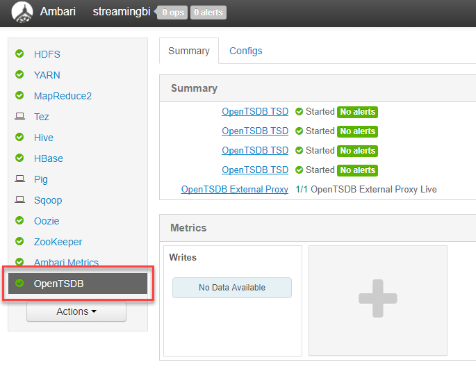

Click on the Configs tab to view basic and advanced configuration options.

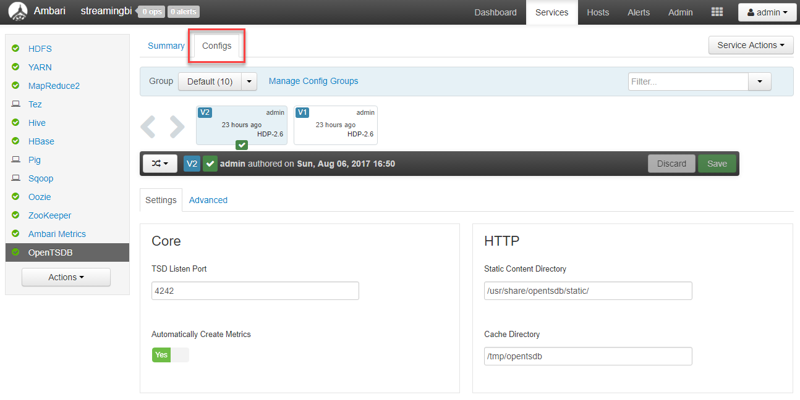

The advanced tab provides an easy interface for making changes to the OpenTSDB configs, compared to modifying the individual configuration files on each node.

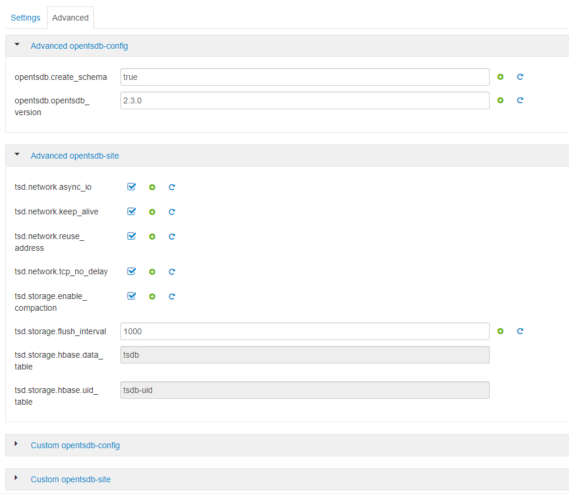

You can view the OpenTSDB interface by selecting OpenTSDB View from the list of available Ambari views.

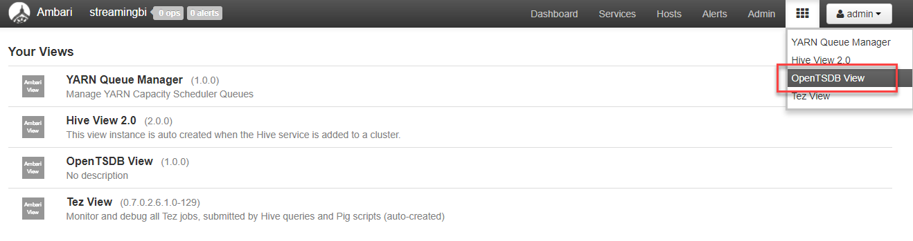

When you select the view, you will be prompted to enter the same admin credentials you used to connect to Ambari.


### Displaying telemetry data in OpenTSDB

The top of the OpenTSDB UI page contains a form through which you can specify the time series date range, metric, tags, chart positioning, etc.

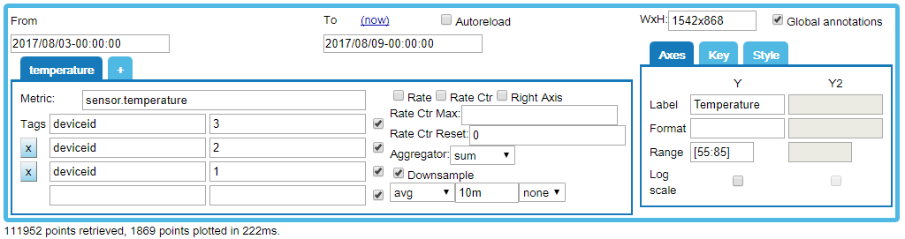

Configure the following options to display the telemetry data:

1. **From**: Enter the start date and time of your first device data entry.
2. **To**: Enter the end date of the series data. Remember, by default, the generated data begins at the start of the current day (12:01am), and ends at the end of the day. If you choose (now), you may not see all of the available data. Autoreload can be used to refresh at defined intervals. For now, leave this unchecked.
3. **Metric**: Enter **sensor.temperature**, which is the value we sent from the `OpenTSDBSink` writer in the Spark application.
4. **Tags**: Enter a tag for each temperature sensor device by Id:
    * key: **deviceid**, value: **1**
    * key: **deviceid**, value: **2**
    * key: **deviceid**, value: **3**
5. **Aggregator**: Set to sum.
6. **Downsample**: Check this box to reduce noise from all of the data points (one for every 10 seconds).

On the right-hand side of this form is a section containing 3 tabs: Axes, Key, and Style. Within the **Axes** tab, set the following values:

1. **Label** (Y): Set this to **Temperature**.
2. **Range** (Y): Set to [55:85]. This constrains the displayed Y-axis range to temperatures between 55 and 85 degrees fahrenheit.

Now select the **Key** tab and configure the following:

1. **Key location**: This places the key (or graph legend) in your desired location over top of the chart.
2. **Box**: Check this to place a box around the key.

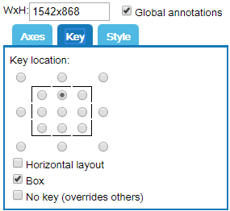

Configure other options as desired.

Once you have set the filter and display options, you should see a graph similar to the following, once an ample amount of data has been collected and stored:

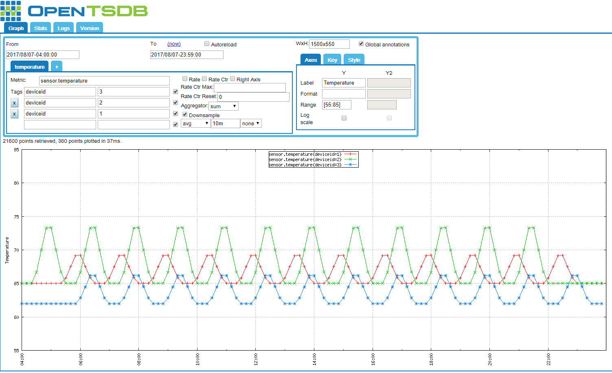

Notice that OpenTSDB automatically color-coded each of the device data series. With this visualization, you can quickly infer the differing flight schedules, ambient room temperatures, and general sense of crowd sizes in each of the rooms in which each sensor is located.

One thing we would like to know is what the overall average temperature of all devices looks like with respect to the current graph. To show this new data point, click the **+** symbol text to the **temperature** tab in the form you just modified. This allows us to add a new metric.

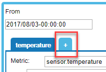

In the new metric form, enter the following:

3. **Metric**: Enter **sensor.temperature**.
4. **Tags**: Enter an asterisk (*) in the value field and check the group checkbox to the right. This ensures all devices are combined:
    * key: (blank), value: *
    * key: **deviceid**, value: (blank)
5. **Aggregator**: Set to avg (gets the average temperature for all devices).
6. **Downsample**: Check this box so reduce noise from all of the data points (one for every 10 seconds * 3).

You will now see a 4th line on the chart (in purple) for the average temperature of all devices.

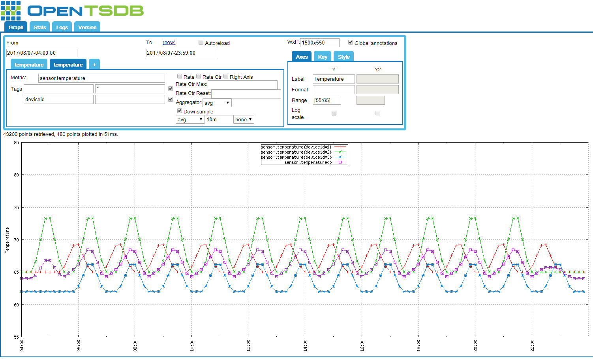

Now click and drag with your mouse to zoom in on a smaller time slice of data.

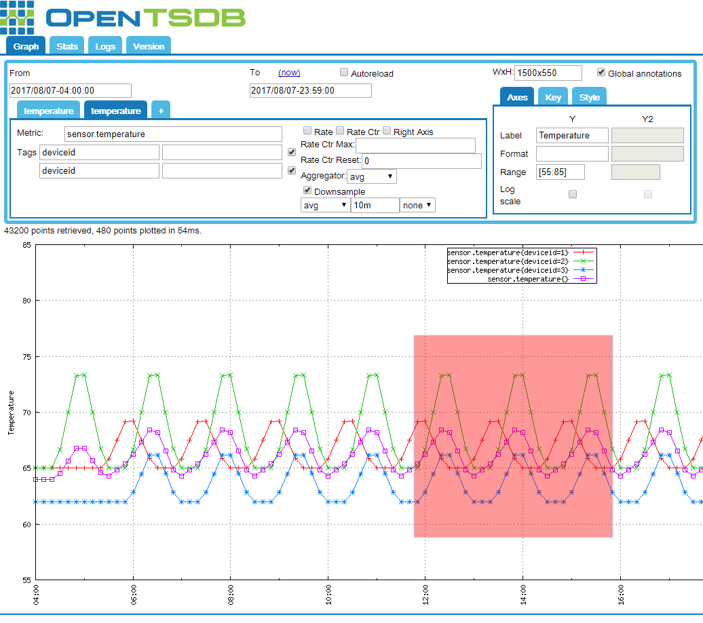

The page will be refreshed to display just the zoomed in time range. Notice that the From and To form values have been updated accordingly.

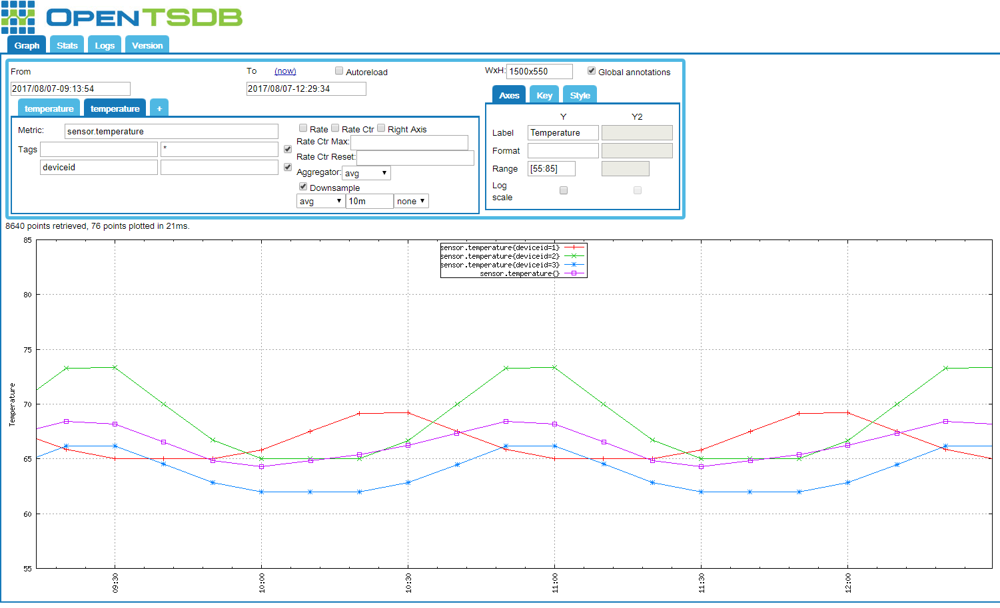

> Another thing to note is that each time you make a change to the chart values or displayed range, the page refreshes with a custom URL. This allows you to bookmark or save the displayed chart to share or view later.

The tabs at the top of the page allow you to view statistics, logs, and version information. When you click on the **Stats** tab, you will see interesting information about the number of data input requests received from the Spark app, how many failed or caused exceptions, if any, the number of graph requests, latency, and other interesting bits of information.

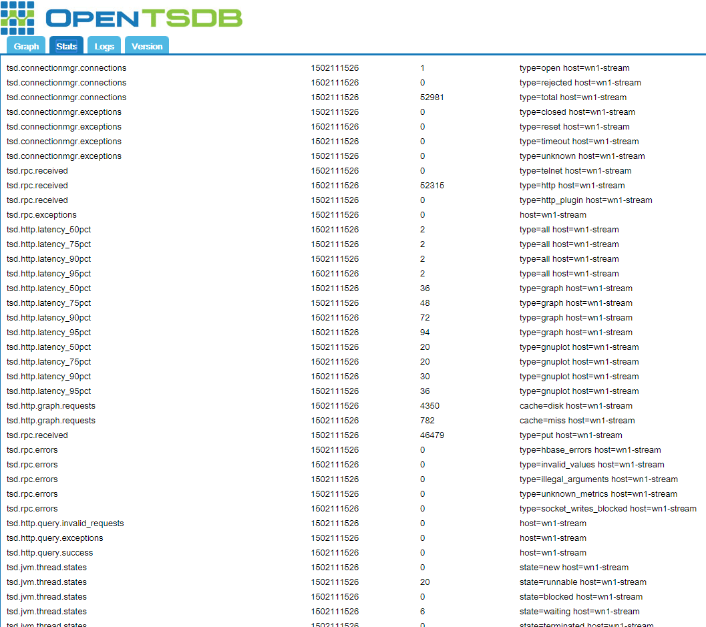

The **Logs** tab displays entries for every action in the chart's configuration, as well as other items of interest, such as incoming `put` requests to the OpenTSDB HTTP API. In the below screenshot, you can see `put` requests invoked by our running Spark app (highighted).

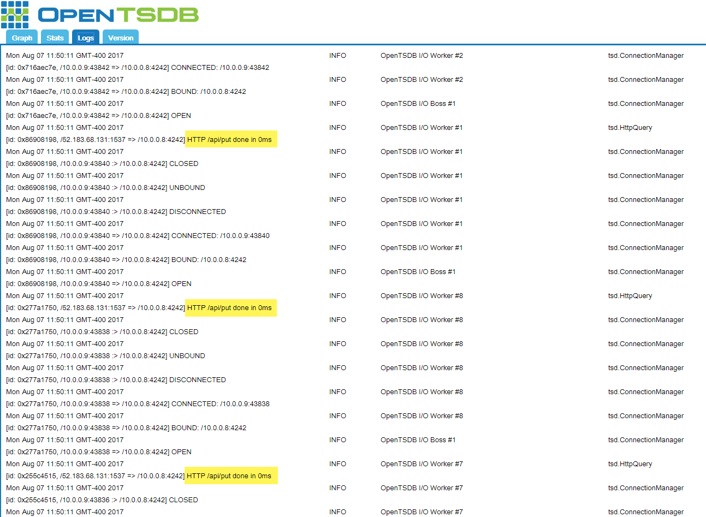

Learn more about [using the OpenTSDB GUI](http://opentsdb.net/docs/build/html/user_guide/guis/index.html).


## Optional steps to directly write to HBase

If you wish to write directly to an HBase table of your own choosing, you will need to follow the steps below **on a new set of clusters**, following [these instructions](hdinsight-hbase-provision-vnet.md), or using the ARM template [in this article](hdinsight-storm-sensor-data-analysis.md#create-a-storm-and-hbase-cluster).

> [!NOTE]
> If you choose to go this route, you will need to first provision a virtual network, then add both the Spark and HBase clusters to it so that the structured streaming app running on the Spark cluster can directly communicate with the HBase cluster using the HBase Java API.

To write to HBase from the Spark cluster, you must provide the Spark app with the configuration details of your HBase cluster. This example uses the **hbase-site.xml** file from the HBase cluster.

### Download the hbase-site.xml

If you wish to write your event data directly to HBase, you will need to copy the `hbase-site.xml` file to the Spark application's resource directory.

From a bash shell prompt, use SCP to download the **hbase-site.xml** file from the cluster. Alternately, if using Windows, you can use [PSCP](http://www.chiark.greenend.org.uk/~sgtatham/putty/download.html) from the command prompt. In the following example, replace **USERNAME** with the SSH user you provided when creating the cluster, and **BASENAME** with the base name you provided earlier. When prompted, enter the password for the SSH user. Replace the `/path/to/BlueYonder/src/main/resources/hbase-site.xml` with the path to this file in the BlueYonder project.

    scp USERNAME@hbase-BASENAME-ssh.azurehdinsight.net:/etc/hbase/conf/hbase-site.xml /path/to/BlueYonder/src/main/resources/hbase-site.xml

This command downloads the **hbase-site.xml** to the path specified.

Example using PSCP:

    pscp USERNAME@hbase-BASENAME-ssh.azurehdinsight.net:/etc/hbase/conf/hbase-site.xml c:\path\to\BlueYonder\src\main\resources\hbase-site.xml


### Create the HBase table

To store data in HBase, we must first create a table. Pre-create resources that the Spark Structured Streaming app needs to write to, as trying to create resources from inside the app can result in multiple instances trying to create the same resource. Learn more about HBase with [an Apache HBase example in HDInsight](hdinsight-hbase-tutorial-get-started-linux.md).

1. Use SSH to connect to the HBase cluster using the SSH user and password you supplied to the template during cluster creation. For example, if connecting using the `ssh` command, you would use the following syntax:
   
        ssh USERNAME@hbase-BASENAME-ssh.azurehdinsight.net
   
    In this command, replace **USERNAME** with the SSH user name you provided when creating the cluster, and **BASENAME** with the base name you provided. When prompted, enter the password for the SSH user.

2. From the SSH session, start the HBase shell.
   
        hbase shell
   
    Once the shell has loaded, you see an `hbase(main):001:0>` prompt.

3. From the HBase shell, enter the following command to create a table with a Device column family, to store the sensor data:
   
        create 'SensorData', 'Device'

4. Verify that the table has been created by using the following command:
   
        scan 'SensorData'
   
    This returns information similar to the following example, indicating that there are 0 rows in the table.
   
        ROW                   COLUMN+CELL                                       0 row(s) in 0.1900 seconds

5. Enter `exit` to exit the HBase shell:


### Modify the Spark Structured Streaming app to use the HBaseSink

Modify the `BlueYonderMain.scala` file in the Spark Structured Streaming app to use the `HBaseSink` class instead of the currently referenced `OpentTSDBSink` implementation.

```scala
// Alternate method 2: use the custom HBaseSink to write directly to HBase
val writer = new HBaseSink()

inputSelect.writeStream.outputMode("append").foreach(writer).start().awaitTermination()
```


## Next steps

* Learn more about [Structured Streaming](hdinsight-spark-structured-streaming-overview.md)
* Learn more about [connecting to and using Ambari](hdinsight-hadoop-manage-ambari.md) to manage your clusters