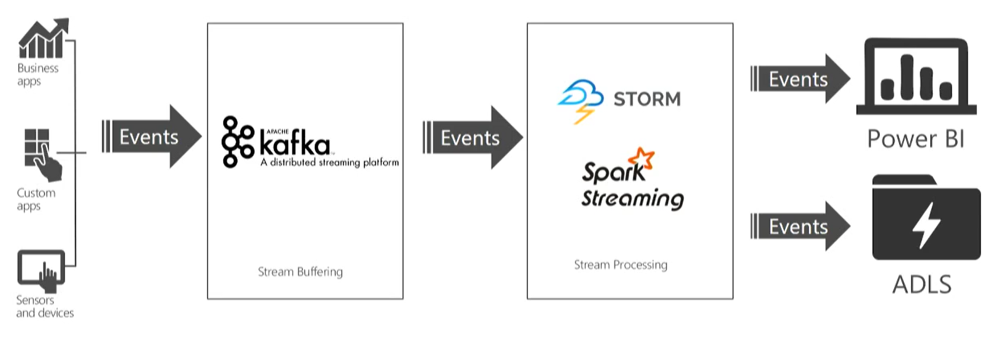
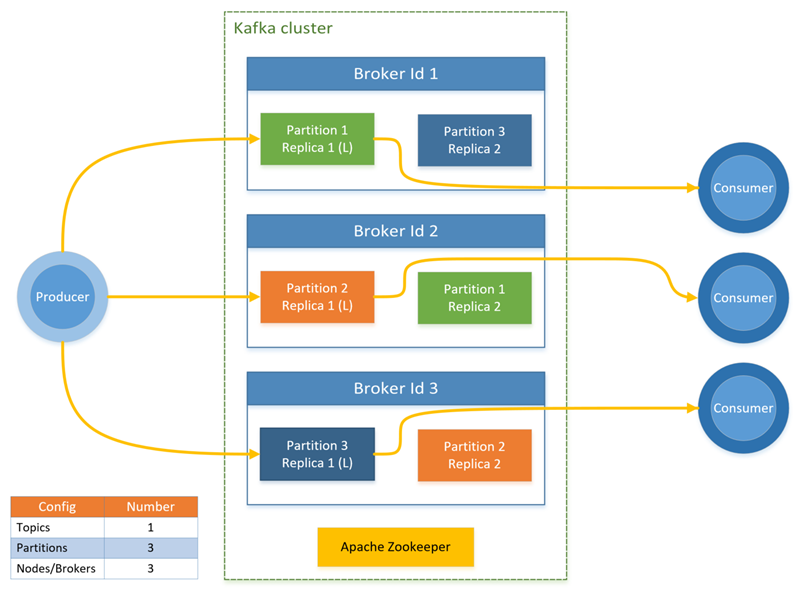
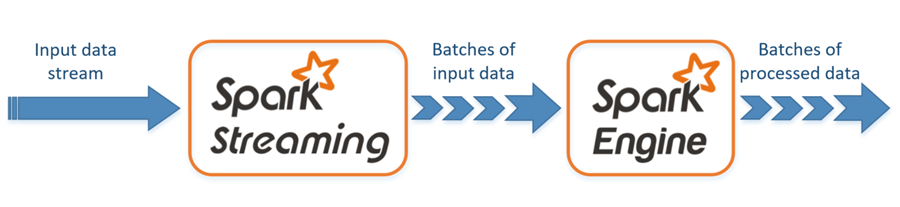

# Streaming at Scale

Many of today's Big Data solutions must act on data in motion at any given point in time. In other words, realtime streaming data. In most cases, this data is most valuable at its time of arrival, such as stock market data, anomaly data used for fraud detection, social networking information that detects trending topics, etc. These applications require transparently scaling their computation models to large clusters, ensuring that valuable information isn't lost when huge spikes of streaming data come rushing in. Being able to quickly scale your solution by adding nodes on demand can be the difference between missing out on incoming information and making a key decision.

To ease the process of scaling streaming platforms, such as Kafka, Apache Storm, or Spark Streaming, HDInsight offers an elegant scale model without the need to throttle your resources. Unlike running one of these streaming platforms on-premises, HDInsight does not require you to have intimate knowledge of scaling a cluster without disrupting any currently running pipelines. All of the necessary steps are handled for you when scaling is performed through the HDInsight utilities.

## What does a streaming architecture look like?

From a very high level, you have one or more data sources generating events (sometimes in the millions per second) that need to be ingested very quickly to avoid dropping any useful information. This is handled by the Stream Buffering, or event queuing, layer by a service such as [Kafka]() or [Event Hubs](). Once you collect your events, you can then analyze the data using any real-time analytics system within the Stream Processing layer, such as [Storm](), [Spark Streaming](), [Azure Stream Analytics](), or similar. This processed data can be stored in long-term storage systems, like [Azure Data Lake Store](), or displayed in real-time on a [Power BI]() dashboard or custom web page. 

When using Kafka as your ingest service, your options for stream processing are Spark and Storm.

Use the following button to deploy a new Azure virtual network, Kafka, and **Spark** clusters to your Azure subscription:

Alternately, deploy a new Azure virtual network with Kafka and **Storm** clusters:

There are other options when designing your streaming architecture by incorporating other Azure services that are not necessarily part of the HDInsight platform. The following diagram illustrates using [Event Hubs]() for ingest, while opening up additional processors, such as [Stream Analytics](), [EventProcessor Host](), [Service Fabric](), and [Azure Functions](). The rest of the article will focus on scaling with Kafka and Storm or Spark Streaming.

## What is Kafka?

Kafka provides high throughput, low-latency message queueing service, originally developed at LinkedIn, and is now part of the Apache suite of Open Source Software (OSS). It uses a publish and subscribe messaging model and stores streams of partitioned data safely in a distributed, replicated cluster. When needed, it scales linearly as throughput increases.

The diagram above shows a typical Kafka configuration that uses consumer groups, partitioning, and replication to offer parallel reading of events, as well as fault tolerance. Apache ZooKeeper is built for concurrent, resilient, and low-latency transactions, managing state in the Kafka cluster. Kafka stores records in *topics*. Records are produced by *producers*, and consumed by *consumers*. Producers retrieve records from Kafka *brokers*. Each worker node in your HDInsight cluster is a Kafka broker. A partition is created per consumer, allowing parallel processing of the streaming data. Replication is employed to spread the partitions across nodes, protecting against node (broker) outages. A partition denoted with an *(L)* is the leader for the given partition. Producer traffic is routed to the leader of each node, per state managed by ZooKeeper. Rebalancing Kafka partition replicas helps us achieve high availability (Fault Domain/Update Domain awareness). The [partition replica rebalancing tool](https://github.com/hdinsight/hdinsight-kafka-tools) (`rebalance_rackaware.py`) distributes replicas of partitions of a topic across brokers in a manner such that each replica is in a separate fault domain and update domain. The tool also distibutes the leaders such that each broker has approximately the same number of leaders for partitions.

There are several advantages to deploying Kafka on HDInsight. The [partition replica rebalancing tool](https://github.com/hdinsight/hdinsight-kafka-tools) can be used to automatically rebalance the replicas after scaling or applying updates. HDInsight is the only provider in the industry to host a managed Kafka environment, while providing a 99.9% uptime SLA. HDInsight also uses a two-dimensional matrix for implementing rack awareness by way of an [update domain, and fault domain](https://docs.microsoft.com/azure/architecture/resiliency/high-availability-azure-applications), as opposed to using a single dimensional unit.

## Apache Storm

Apache Storm is one of the stream processing engines we displayed in the first and second diagram at the top of this article. In summary, it is a distributed, fault-tolerant, open-source computation system that is optimized for processing streams of data in real time with Hadoop. The core unit of data for an event is in the form of a Tuple, which is an immutable set of key/value pairs. An unbounded sequence of these Tuples form a Stream, which is provided by a Spout. The Spout wraps a streaming data source (such as Kafka), and emits Tuples. A storm Topology is a sequence of transformations on these streams. A bolt implements one transformation.

All processing in topologies is done in bolts. Bolts can do anything from filtering, functions, aggregations, joins, talking to databases, and more. Bolts can do simple stream transformations. Doing complex stream transformations often requires multiple steps and thus, multiple bolts. As you can see in the diagram below, a bolt receives a stream of events from other bolts or spouts, and transforms it to emit an output stream. They are able to join multiple input streams, or split a single stream into multiple output streams. During execution, bolts can store or read state from a database or any state stored in the ZooKeeper node.

Storm offers several different levels of guaranteed message processing, including best effort, at least once, and exactly once through Trident. It guarantees every tuple will be fully processed. One of Storm's core mechanisms is the ability to track the lineage of a tuple as it makes its way through the topology in an extremely efficient way. Storm's basic abstractions provide an at-least-once processing guarantee, the same guarantee you get when using a queueing system. Messages are only replayed when there are failures.
Using Trident, which is an even higher level abstraction over Storm's basic abstractions, you can achieve exactly-once processing semantics.

## Spark Streaming

The other stream processing engine we displayed in the diagram was Spark Streaming. Since it is an extension to Spark, Spark Streaming allows you to reuse the same code that you use for batch processing, and even allows you to combine both batch and interactive queries in the same application. Unlike Storm, Spark Streaming provides stateful exactly-once processing semantics out of the box. When used in combination with the [Kafka Direct API](http://spark.apache.org/docs/latest/streaming-kafka-integration.html), which ensures that all Kafka data is received by Spark Streaming exactly once, it is possible to achieve end-to-end exactly-once gurantees. One of Spark Streaming's strengths is its fault-tolerant capabilities, recovering faulted nodes rapidly when multiple nodes are being used within the cluster.

Here is an overview of how Spark Streaming “divides and conquers” big data into data streams. As opposed to the way Storm works with processing data within topologies consisting of spouts and bolts, Spark Streaming receives live input data streams and divides the data into batches. These are then processed by the Spark engine to generate the final stream of results in batches. Spark is gaining popularity due to its ability to achieve Big Data tasks from one platform, such as data cleaning, ETL, streaming, machine learning, and interactive queries, by leveraging a common execution model.

Put another way, Apache Spark is a unified, open source, parallel data processing framework for Big Data analytics.

Apache Spark persists data in-memory and disk, if needed, to achieve up to 100x faster queries while processing large datasets in Hadoop. This makes Spark for Azure HDInsight ideal to speed up intensive big data applications.

Spark comprises of four components for the purposes of Big Data analytics:
* Spark SQL – interactive queries 
* Spark Streaming – stream processing 
* SparkMLlib – machine learning 
* GraphX – graph computation

## Scale

Although you can specify the number of nodes in your cluster during creation, you may want to grow or shrink the cluster to match workload. All HDInsight clusters allow you to [change the number of nodes in the cluster](https://docs.microsoft.com/azure/hdinsight/hdinsight-administer-use-management-portal#scale-clusters). Also, Spark clusters can be dropped with no loss of data since all the data is stored in Azure Storage or Data Lake Store.

### Scaling the Stream Buffering layer

There are advantages to decoupling technologies as we've shown in the first two diagrams. For instance, since Kafka is an event buffering technology, it is very IO-heavy and does not need a lot of processing power. The stream processors such as Spark Streaming, on the other hand, are very compute-heavy, requiring more powerful VMs by comparison. By having these technologies decoupled into different clusters, you can scale them independently and also use correctly sized VMs within those clusters for cost savings.

The two options we've shown for handling the stream buffering tasks, Event Hubs and Kafka, both use partitions, and consumers read from the those partitions. Scaling the input throughput means scaling up the number of partitions. Adding partitions means increasing parallelism. In Event Hubs, the partition count cannot be changed after deployment so it is important to start with the target scale in mind. With Kafka, it is possible to [add partitions](https://kafka.apache.org/documentation.html#basic_ops_cluster_expansion), even while it is processing data. Kafka provides a tool to reassign partitions, called `kafka-reassign-partitions.sh`. As mentioned earlier in this article, HDInsight provides a [partition replica rebalancing tool](https://github.com/hdinsight/hdinsight-kafka-tools), called `rebalance_rackaware.py`. Under the covers, this tool executes the `kafka-reassign-partitions.sh` tool, but does so in such a way that each replica is in a separate fault domain and update domain, making Kafka rack aware, increasing fault tolerance as well as rebalancing the partitions.

### Scaling the Stream Processing layer

Focusing on HDInsight for the topic of scaling the stream processors, both Apache Storm and Spark Streaming support adding worker nodes to their clusters, even while data is being processed.

To take advantage of new nodes added through scaling when using Storm, you need to rebalance any Storm topologies started before the cluster size was increased. This can be performed through the Storm web UI or the Command-line interface (CLI) tool. Refer to the [Apache Storm documentation](http://storm.apache.org/documentation/Understanding-the-parallelism-of-a-Storm-topology.html) for more details.

Apache Spark uses three key parameters for configuring its environment, depending on application requirements: `spark.executor.instances`, `spark.executor.cores`, and `spark.executor.memory`. An Executor is a process that is launched for a Spark application. It runs on the worker node and is responsible for carrying out the tasks for the application. The default number of executors and the executor sizes for each cluster is calculated based on the number of worker nodes and the worker node size. These are stored in the `spark-defaults.conf` on the cluster head nodes.

The three configuration parameters can be configured at the cluster level (for all applications that run on the cluster) or can be specified for each individual application as well. Detailed information on these settings and how to manage the configuration can be found within the [Managing resources for Apache Spark cluster on Azure HDInsight](https://docs.microsoft.com/azure/hdinsight/hdinsight-apache-spark-resource-manager) article.

## Next steps

Learn more about real-time analytics solutions with Storm and Apache Spark on HDInsight:

* [Get started with Apache Storm on HDInsight](https://docs.microsoft.com/azure/hdinsight/hdinsight-apache-storm-tutorial-get-started-linux)
* [Example topologies for Apache Storm on HDInsight](hdinsight-storm-example-topology.md)
* [Introduction to Spark on HDInsight](https://docs.microsoft.com/azure/hdinsight/hdinsight-apache-spark-overview)
* [Start with Apache Kafka on HDInsight](https://docs.microsoft.com/en-us/azure/hdinsight/hdinsight-apache-kafka-get-started)