# Submit Jobs from R Studio Server

## Overview

[R Studio Server](https://www.rstudio.com/products/rstudio-server/) is a popular, web-based integrated development environment (IDE) for developing and executing R scripts with R Server on an HDInsight cluster. It includes several features to speed up and ease development, such as a syntax-highlighting editor that supports direct code execution, a console for interactively running R commands, a workspace to view objects in the global environment, and much more.

To open R Studio Server from your HDInsight cluster in Azure, navigate to the Overview pane, and click on **R Server dashboards**.


From the cluster dashboard, click on **R Studio server**.

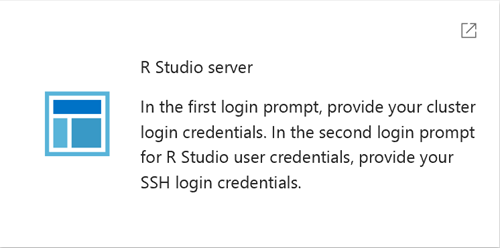

You will be prompted twice to enter a password. The first prompt is displayed as a popup by your browser, in which you need to enter your cluster login credentials.

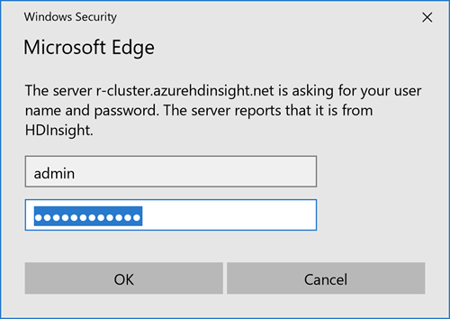

The second login prompt will ask for your R Studio user credentials. Supply the SSH login credentials here.

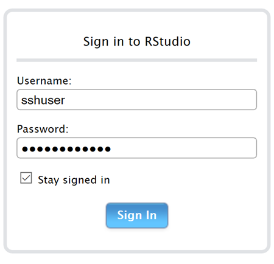

After successfully logging in, you should see the R Studio web interface.

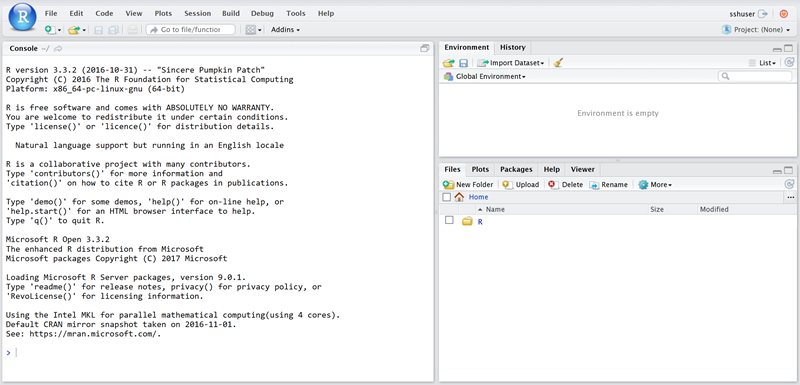

## Install R Studio Server

If the **R Studio Server** option is not available on the cluster dashboard, as outlined above, you must run the R Studio Server install script, following [these instructions](hdinsight-hadoop-r-server-install-r-studio).

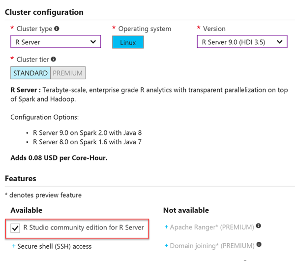

> Please note, R Studio community edition for R Server is automatically installed when you check the option to install it when provisioning your R cluster as shown in the screenshot above.

## Submit your first job from R Studio Server

1. From the R Studio Server web interface, click on the new icon, then R Script.

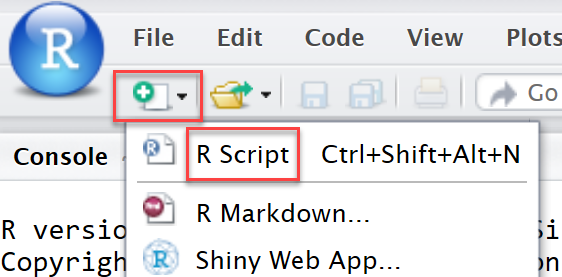

2. Enter the following code to install the *ggplot2* package, plot random data on the chart, build a linear regression model, and compare actuals to predictions. Refer to the detailed comments to understand each step.

```R
    # To install a new package, use install.packages()
    # Install the ggplot2 package for it's plotting capability.
    if (!require("ggplot2")){
    install.packages("ggplot2")
    }

    # Then load the package.
    library("ggplot2")
    search()
    # Notice that package:ggplot2 is now added to the search list.


    ### A Simple Regression Example   

    # Look at the data sets that come with the package.
    data(package = "ggplot2")$results
    # Note that the results in RTVS may pop up, or pop under, in a new window.

    # ggplot2 contains a dataset called diamonds. Make this dataset available using the data() function.
    data(diamonds, package = "ggplot2")

    # Create a listing of all objects in the "global environment". Look for "diamonds" in the results.
    ls()

    # Now investigate the structure of diamonds, a data frame with 53,940 observations
    str(diamonds)

    # Print the first few rows.
    head(diamonds) 

    # Print the last 6 lines.  
    tail(diamonds)

    # Find out what kind of object it is.
    class(diamonds)

    # Look at the dimension of the data frame.
    dim(diamonds)


    ### Plots in R       

    # Create a random sample of the diamonds data.
    diamondSample <- diamonds[sample(nrow(diamonds), 5000),]
    dim(diamondSample)

    # R has three systems for static graphics: base graphics, lattice and ggplot2.  
    # This example uses ggplot2

    # Set the font size so that it will be clearly legible.
    theme_set(theme_gray(base_size = 18))

    # In this sample you use ggplot2.
    ggplot(diamondSample, aes(x = carat, y = price)) +
    geom_point(colour = "blue")

    # Add a log scale.
    ggplot(diamondSample, aes(x = carat, y = price)) +
    geom_point(colour = "blue") +
    scale_x_log10()

    # Add a log scale for both scales.
    ggplot(diamondSample, aes(x = carat, y = price)) +
    geom_point(colour = "blue") +
    scale_x_log10() +
    scale_y_log10()

    ### Linear Regression in R 

    # Now, build a simple regression model, examine the results of the model and plot the points and the regression line.  

    # Build the model. log of price explained by log of carat. This illustrates how linear regression works. Later we fit a model that includes the remaining variables

    model <- lm(log(price) ~ log(carat) , data = diamondSample)       

    # Look at the results.     
    summary(model) 
    # R-squared = 0.9334, i.e. model explains 93.3% of variance

    # Extract model coefficients.
    coef(model)
    coef(model)[1]
    exp(coef(model)[1]) # exponentiate the log of price, to convert to original units

    # Show the model in a plot.
    ggplot(diamondSample, aes(x = carat, y = price)) +
    geom_point(colour = "blue") +
    geom_smooth(method = "lm", colour = "red", size = 2) +
    scale_x_log10() +
    scale_y_log10()


    ### Regression Diagnostics 

    # It is easy to get regression diagnostic plots. The same plot function that plots points either with a formula or with the coordinates also has a "method" for dealing with a model object.   

    # Look at some model diagnostics.
    # check to see Q-Q plot to see linearity which means residuals are normally distributed

    par(mfrow = c(2, 2)) # Set up for multiple plots on the same figure.
    plot(model, col = "blue") 
    par(mfrow = c(1, 1)) # Rest plot layout to single plot on a 1x1 grid


    ### The Model Object 

    # Finally, let's look at the model object. R packs everything that goes with the model, e.g. the formula and results into the object. You can pick out what you need by indexing into the model object.
    str(model)
    model$coefficients  # note this is the same as coef(model)

    # Now fit a new model including more columns
    model <- lm(log(price) ~ log(carat) + ., data = diamondSample) # Model log of price against all columns

    summary(model)
    # R-squared = 0.9824, i.e. model explains 98.2% of variance, i.e. a better model than previously

    # Create data frame of actual and predicted price

    predicted_values <- data.frame(
    actual = diamonds$price, 
    predicted = exp(predict(model, diamonds)) # anti-log of predictions
    )

    # Inspect predictions
    head(predicted_values)

    # Create plot of actuals vs predictions
    ggplot(predicted_values, aes(x = actual, y = predicted)) + 
    geom_point(colour = "blue", alpha = 0.01) +
    geom_smooth(colour = "red") +
    coord_equal(ylim = c(0, 20000)) + # force equal scale
    ggtitle("Linear model of diamonds data")
```

3. Click the Save button on top of the script window. When prompted, enter a name for your script, as well as location.

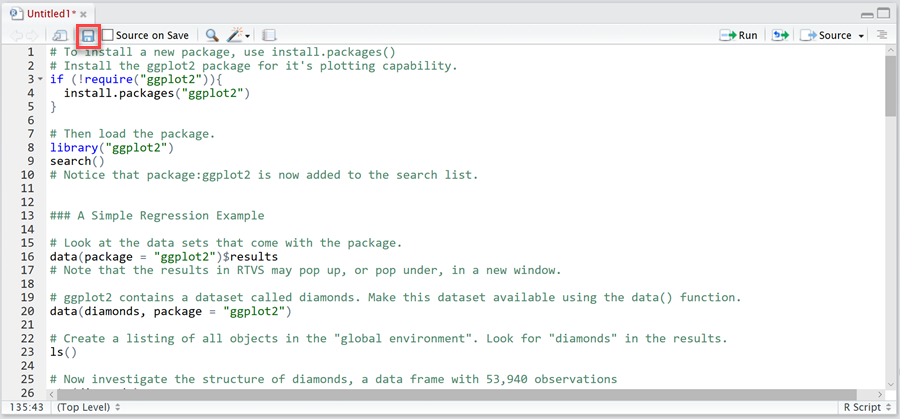

4. Execute entire script by entering `Ctrl+Alt+R` (`Command+Alt+R` on Mac), through the menu by going to **Code**, **Run Region**, **Run All**. As the job executes, you will see information output within the Console beneath your script.

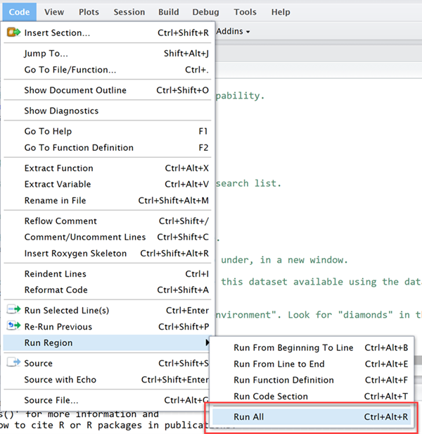

5. When execution is complete, the output of our graph will be displayed within the Plots tab. You may also view the environment data of the job within the Environment tab. Click on the table icon next to one of the data elements within the environment tab to view the data.

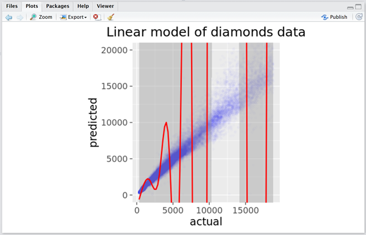
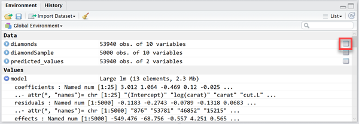
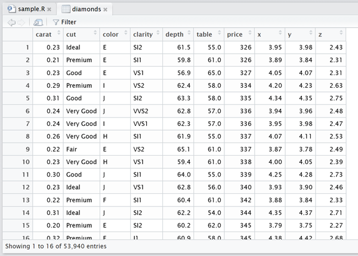

5. View a nicely formatted report that includes all of the R commands, in-line with the output of each segment, by going to **File**, **Compile Notebook...** in the menu. There are a few options in the dropdown menu within the Compile Notebook from R Script dialog window, including HTML. Below is a sample portion of the compiled notebook generated from the script executed in this exercise.

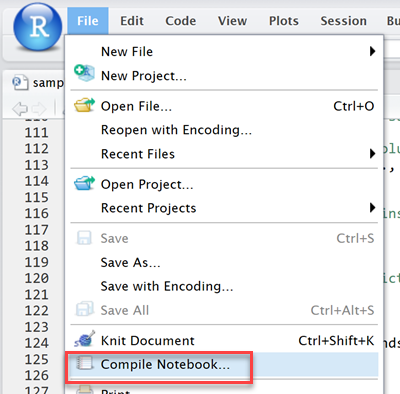
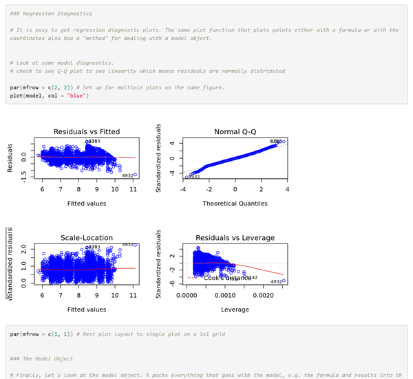

## See also

* Some overview link

### Scenarios


