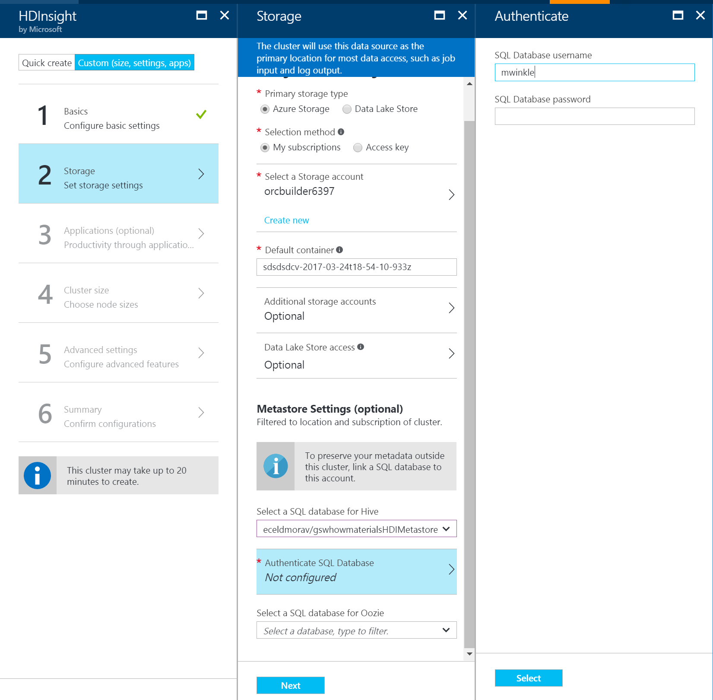

# Using External Metadata Stores

Hive Metastore is critical part of Hadoop architecture as it acts as a central schema repository which can be used by other access tools like Spark, Interactive Hive (LLAP), Presto, Pig, and many other Big Data engines.

In HDInsight, we use Azure SQL Database as the Hive Metastore. 

There are two ways you can setup Metastore for your HDInsight clusters

**HDInsight default Metastore** – If you don’t provide a custom Metastore option, HDInsight will provision Metastore with every cluster type. Here are some key considerations with default Metastore

* No additional cost. HDInsight provisions Metastore with every cluster type without any additional cost to you.
* Default Metastore is tied to the cluster life, when you delete the cluster your Metastore and metadata is also deleted
* You cannot share the Default Metastore with additional clusters.
* The default Metastore use Basic Azure SQL DB which gives you 5 DTU [Database Transaction limit]

This is generally good option for relatively simple workload where you don’t have multiple clusters and don’t need metadata preserved beyond the life cycle of the cluster.

**Custom** – HDInsight lets you pick custom Metastore. It’s a recommended approach for production clusters due to number reasons such as

* You bring your own Azure SQL Database as Metastore
* As the lifecycle of the Metastore is not tied to a cluster lifecycle, you can create and delete clusters without worrying about the metadata loss- meaning metadata like your Hive schemas will persist even when you delete and re-create the HDInsight cluster.
* Custom Metastore lets you attach multiple clusters and cluster types to the same Metastore. For example, a single Metastore can be shared across Interactive Hive, Hive and Spark clusters in HDInsight
* You pay for the cost of Metastore (Azure SQL DB) according to the performance level you choose.  
* You can scale up the metastore as needed.

Image – Typical shared custom Metastore scenario in HDInsight

Here are general HDinsight Hive Metastore best practices that you should consider

* Use a custom Metastore whenever possible, this will help you separate Compute (your running cluster) and Metadata (stored in the Metastore).
* Start with S2 tier which will give you 50 DTU and 250 GB of storage, you can always scale the database up in case you see bottlenecks.
* Ensure that the Metastore created for one HDInsight cluster version is not shared across different HDInsight cluster versions. This is due to different Hive versions has different schemas. Example – Hive 1.2 and Hive 2.1 clusters trying to use same Metastore.
* Back-up your custom Metastore periodically.
* Keep your Metastore and HDInsight cluster in same region.
* Monitor your Metastore for performance and availability with Azure SQL Database Monitoring tools (such as in the Azure Portal or by using Azure Log Analytics).

**Selecting a custom Metastore during cluster creation**

You can point your cluster to a pre-created Azure SQL Database during cluster creation, or you can configure it after the cluster is created. The option is under storage –> Metastore settings while creating a new Hadoop , Spark or Intractive Hive cluster from Azure portal

Additionally, You can add additional clusters to the Custom Metastore for Azure Portal as well as from Ambari configurations ( Hive –>Advanced)

As discussed above Hive Metastore is critical component of Hadoop and Spark architecture and picking up right Metastore strategy will certainly help you with right Architecture and user experience.

# Oozie Metastore
Apache Oozie is a workflow/coordination system that manages Hadoop jobs.  It supports Hadoop jobs for Apache MapReduce, Pig, Hive and others.  Oozie uses a Metastore to store details about current and completed worklflows. To increase performance when using Oozie, you can use Azure SQL Database as a custom metastore. The metastore can also provide access to Oozie job data after you delete your cluster.  

For instructions on creating an Oozie metastore with Azure SQL Database, see [Use Oozie for workflows](https://docs.microsoft.com/azure/hdinsight/hdinsight-use-oozie-linux-mac#create-the-database).

## See Next
* [Operationalize Data Pipelines with Oozie](hdinsight-operationalize-data-pipeline.md): Learn how to build a data pipeline that uses Hive to summarize CSV flight delay data, stage the prepared data in Azure Storage blobs and then use Sqoop to load the summarized data into Azure SQL Database. A Metastore is created for both Hive and Oozie.